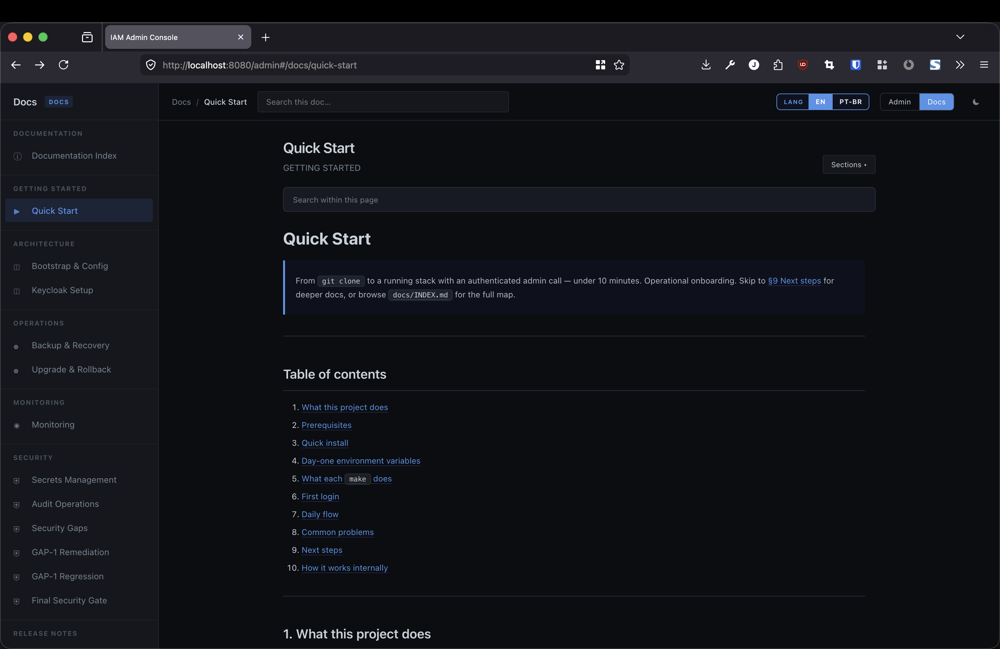
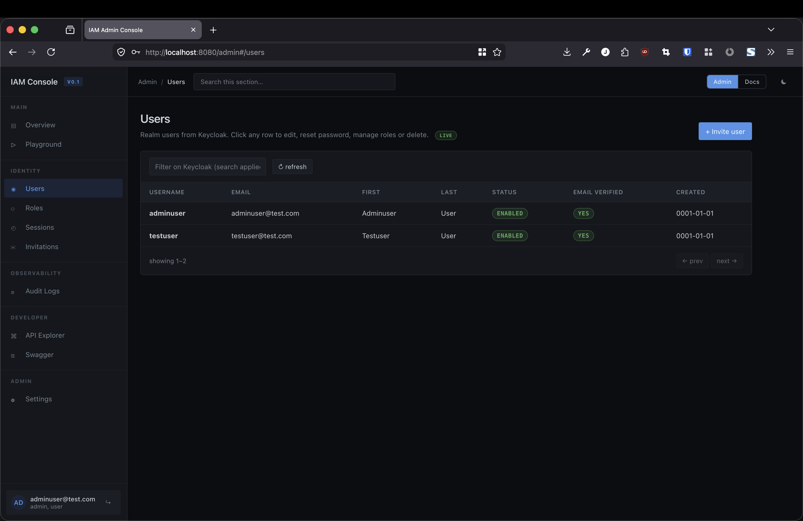
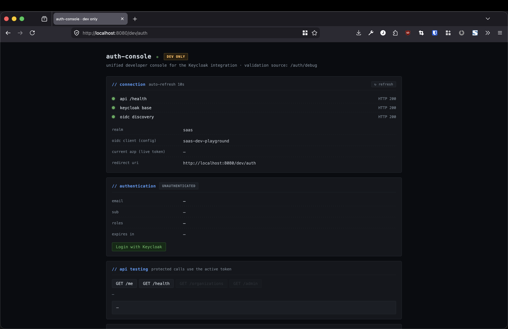
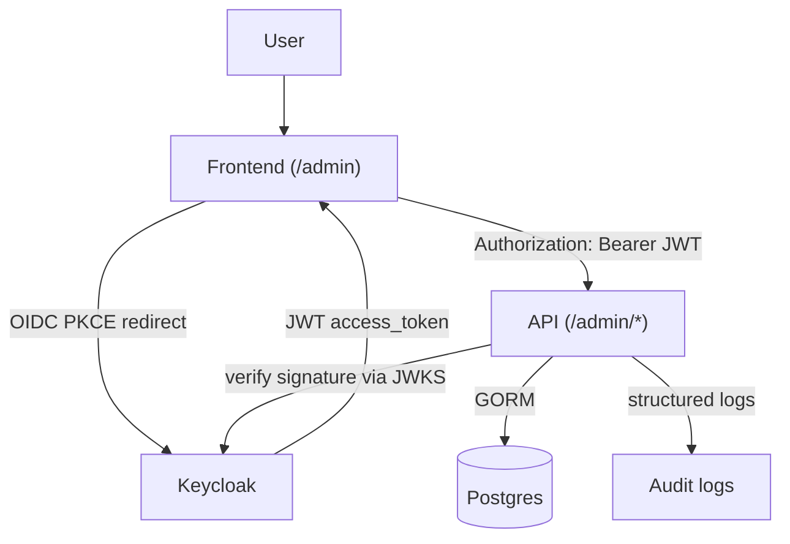

# Lightweight SaaS Backend

[](https://golang.org)
[](https://www.keycloak.org)
[](https://www.postgresql.org)
[](https://docs.docker.com/compose/)
[](LICENSE)
<!-- [](https://github.com/JoaoGabrielVianna/lightweight-saas-backend/actions/workflows/ci.yml) -->

> **Reusable IAM foundation for SaaS products** — authentication, RBAC, admin console, and operational runbooks out of the box.



- Authentication, RBAC, sessions, invites → delegated to Keycloak
- Admin console included → users, roles, sessions, docs
- Built-in docs platform → Markdown, Mermaid, PT-BR, search

---

## ✨ Features

| | |
|---|---|
| 🔐 Keycloak identity | OIDC + JWKS. Swap providers without touching business code. |
| 👤 Admin HTTP surface | 22 routes: users, roles, sessions, invitations CRUD. |
| 🖥 Static admin console | Dependency-free SPA at `/admin`. PKCE login, theme toggle. |
| 📚 Embedded docs viewer | Markdown, syntax highlight, TOC, search, Mermaid, PT-BR. |
| 🧪 Dev auth playground | Six-card token debug tool at `/dev/auth`. |
| 📊 Audit subsystem | Every mutation → structured event. 13 canonical actions. |
| ⚙️ Bootstrap pipeline | `config/project.json` → `.env` + realm export + schema. |
| 🩺 Day-one DX | `make doctor`, `make reset-dev`, `make ci`. |

**Built on:** Go 1.25 · Gin · PostgreSQL 15 · Keycloak 26 · GORM · Swagger/OpenAPI.

---

## 🖼 Product preview

### Admin console

*Users, roles, sessions, invitations — full CRUD with live RBAC enforcement.*

### Dev auth playground

*PKCE flow, live token introspection, `/auth/debug` JSON in one page.*

---

## ⚡ Quick start

```bash
git clone https://github.com/JoaoGabrielVianna/lightweight-saas-backend.git && cd lightweight-saas-backend
make doctor          # verify toolchain (Go, Docker, ports)
make init            # interactive bootstrap (writes config/project.json + .env)
make up              # build api, pull Keycloak, start the 5-container stack
make auth-test       # acquire a Keycloak token + call /me  → expect 200
```

If `auth-test` returns 200, open **`http://localhost:8080/admin`** to enter the console.

📖 Full guide: **[`docs/getting-started/QUICKSTART.md`](docs/getting-started/QUICKSTART.md)** (EN) · **[`docs/getting-started/QUICKSTART.pt-BR.md`](docs/getting-started/QUICKSTART.pt-BR.md)** (PT-BR)

---

## 🏗 Architecture



Keycloak identity links to local business users via `keycloak_sub`.

→ [`docs/architecture/bootstrap.md`](docs/architecture/bootstrap.md)

---

## 📚 Documentation

| Topic | Doc |
|---|---|
| Getting started | [`docs/getting-started/QUICKSTART.md`](docs/getting-started/QUICKSTART.md) (EN + PT-BR) |
| Architecture | [`docs/architecture/bootstrap.md`](docs/architecture/bootstrap.md) |
| Operations | [`docs/operations/MONITORING.md`](docs/operations/MONITORING.md) (+ backup, upgrade) |
| Security | [`docs/security/SECRETS_MANAGEMENT.md`](docs/security/SECRETS_MANAGEMENT.md) (+ gaps, validation) |
| Audit | [`docs/audit/AUDIT_OPERATIONS.md`](docs/audit/AUDIT_OPERATIONS.md) |
| Full index | [`docs/INDEX.md`](docs/INDEX.md) |

---

## 🔒 Security

- **Keycloak owns identity** — no password handling, no JWT signing in Go code.
- **Live-admin RBAC check** — stale-JWT admin tokens rejected after revocation (GAP-1 closed). See [`docs/security/SECURITY_REMEDIATION_GAP1.md`](docs/security/SECURITY_REMEDIATION_GAP1.md).
- **23 black-box guard probes** validated against the live stack. See [`docs/security/FINAL_SECURITY.md`](docs/security/FINAL_SECURITY.md).
- **Production secrets** documented per environment with rotation procedures. See [`docs/security/SECRETS_MANAGEMENT.md`](docs/security/SECRETS_MANAGEMENT.md).
- **Open gaps tracked transparently** in [`docs/security/SECURITY_GAPS.md`](docs/security/SECURITY_GAPS.md).

---

## 🎯 Current focus

- **Hardening** — closing the v0.2 post-tag backlog. See [`docs/roadmap/HARDENING_REPORT.md`](docs/roadmap/HARDENING_REPORT.md).
- **Documentation** — bilingual (EN + PT-BR) across every operator runbook. See [`docs/INDEX.md`](docs/INDEX.md).
- **Monitoring** — wiring collectors into `auth.SetEventHook` / `audit.SetDefault`. See [`docs/operations/MONITORING.md`](docs/operations/MONITORING.md).
- **DX** — `make doctor` / `make reset-dev` as a reliable day-one safety net. See [`docs/roadmap/KNOWN_LIMITATIONS.md`](docs/roadmap/KNOWN_LIMITATIONS.md).

---

## 🤝 Contributing

Issues and PRs welcome.

- Run `make ci` before submitting — mirrors the CI gate (`fmt-check + vet + build + test + swagger-check`).
- Conventional Commits preferred (`feat:`, `fix:`, `docs:`, `chore:`).
- Handler annotation change? Run `make docs && git add docs/` — otherwise `swagger-check` fails.
- For non-trivial changes, open an issue first.

---

## License

MIT — see [LICENSE](LICENSE).
