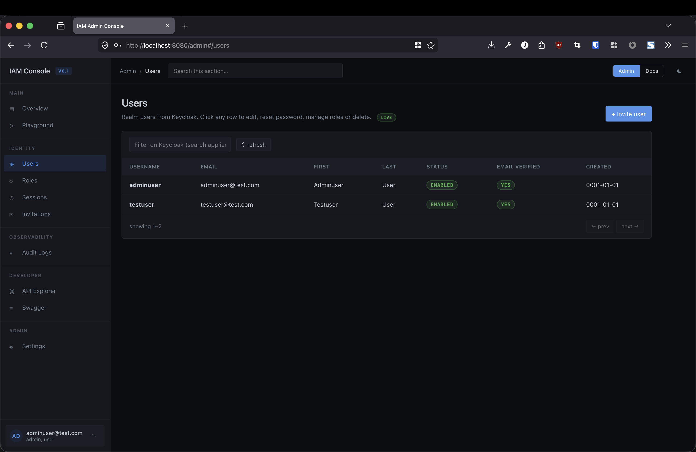
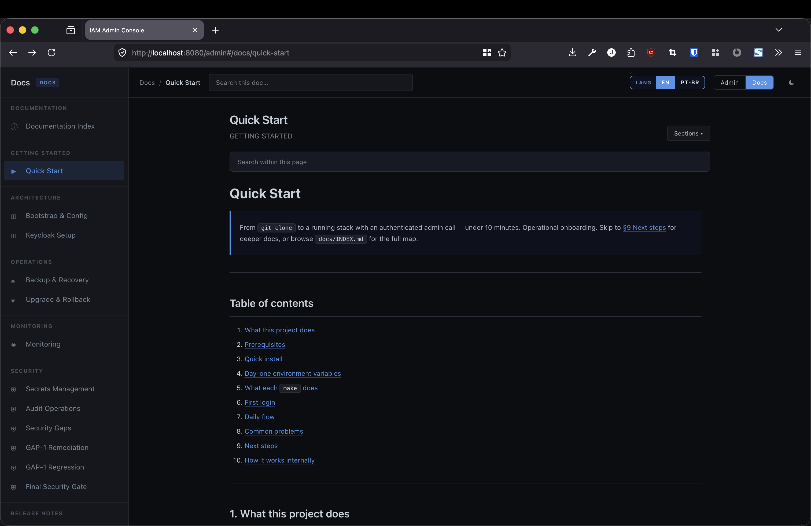

# LIGHTWEIGHT

[](https://golang.org)
[](https://www.keycloak.org)
[](https://www.postgresql.org)
[](https://docs.docker.com/compose/)
[](LICENSE)

> **LIGHTWEIGHT is a self-hosted control plane that puts one or more Keycloak
> realms behind a single workspace-scoped HTTP API, so your backends can manage
> users, roles, sessions and invitations with a narrow credential instead of
> Keycloak admin rights.**

```
        Your backend                     Another backend
              │                                │
              │ Authorization: Bearer lw_sk_…  │
              ▼                                ▼
        ┌──────────────────────────────────────────┐
        │              LIGHTWEIGHT                 │
        │   /v1/workspaces/{id}/users, roles, …    │
        └──────────────────────────────────────────┘
              │              │                 │
        Workspace A     Workspace B       Workspace C
              │              │                 │
        realm "acme"   realm "beta"     realm "gamma"
              └──────┬───────┘                 │
           one Keycloak installation    a different Keycloak
```

LIGHTWEIGHT is **not** your application backend. It stores no product data and
serves no product endpoints. It owns exactly one thing: the boundary between
your services and the identity provider behind them.

---

## What it solves

Giving an application direct Keycloak admin access has three costs that show up
later, not on the day you do it:

| Problem | What LIGHTWEIGHT does instead |
|---|---|
| A service that can create users can usually also rewrite the realm. Keycloak's admin roles are coarse. | A **project credential** carries an explicit scope set. `users:read` means users, read, and nothing else. |
| Every service learns the realm name, the admin client id and its secret. Rotating any of them is a coordinated redeploy. | A backend holds three values, none of which name a provider. Repoint the workspace and the backend keeps working, unchanged and unrestarted. |
| Two tenants on two realms means two configurations, two clients, two deploys. | One installation, many **workspaces**, each routed to its own realm at request time. |

It also gives you an operator console, a durable audit trail per workspace, and
encryption at rest for every provider credential it holds.

**Who it is for.** Teams that already run Keycloak, or are willing to, and have
more than one service or more than one tenant needing identity operations. If
you have one application and one realm and are happy giving it admin rights,
you do not need this yet. If you are handing out Keycloak admin credentials to
services, or copying realm configuration between deployments, you are the
audience.

---

## Core concepts

Five nouns. The whole product is these five and how they nest.

```
Workspace  ──has many──▶  Connection      exactly one is active
    │                          │
    │                          └──▶ one Keycloak realm
    │
    └──has many──▶  Project  ──has many──▶  Credential  ──carries──▶  Scopes
```

| Concept | What it is |
|---|---|
| **Workspace** | A tenant boundary, addressed as `ws_<uuid>`. Everything else hangs off it. |
| **Connection** | Stored coordinates for one Keycloak realm: base URL, realm, client id, and a client secret sealed with AES-256-GCM. A workspace may hold several; **exactly one can be active**, enforced by a partial unique index rather than by application code. |
| **Project** | A backend that consumes this API on behalf of one workspace, addressed as `prj_<uuid>`. |
| **Credential** | A machine token, `lw_sk_<lookup>_<secret>`. Shown once at creation, stored only as a digest. Revocable, optionally expiring. |
| **Scope** | What a credential may do. **9** exist: `users:read`, `users:write`, `roles:read`, `roles:write`, `sessions:read`, `sessions:revoke`, `invitations:read`, `invitations:write`, `audit:read`. |

A request arrives with a credential, LIGHTWEIGHT resolves the calling
workspace's active connection, opens the sealed secret, and talks to that
realm. Two workspaces pointed at two realms serve two disjoint sets of users
from the same process.

📖 [`WORKSPACES.md`](docs/WORKSPACES.md) · [`CONNECTIONS.md`](docs/CONNECTIONS.md) · [`PROJECTS.md`](docs/PROJECTS.md)

---

## Product preview


*The operator console: workspace switching, connection state, and full identity CRUD against the realm the selected workspace routes to.*


*The documentation in this repository, served from the console with search, Mermaid and a PT-BR toggle.*

---

## What is included

| | |
|---|---|
| 🔑 **Product API** | 47 routes under `/v1`: workspaces, connections, projects, credentials, and workspace-scoped users, roles, sessions, invitations and audit. |
| 🧭 **Operator console** | Dependency-free SPA at `/admin`. 18 views: workspace switching, connection verify/activate, project and credential management, audit, PKCE login. |
| 🔐 **Scoped machine auth** | `lw_sk_` credentials with 9 scopes. Every `/v1` route has an authorization classification, and the process refuses to boot if one does not. |
| 🧩 **Multi-realm routing** | A provider resolved per request from the calling workspace's active connection. Different realms, or entirely different Keycloak installations. |
| 🛡 **Secrets at rest** | AES-256-GCM with per-row AAD, a versioned keyring, and online key rotation. |
| 📊 **Audit** | Every control-plane mutation written in the same transaction as the change it records. 28 canonical actions, queryable per workspace. |
| 📦 **Go SDK** | Separate module, zero dependencies, published at `v0.1.0`. |
| 🧰 **Operator surface** | 32 gated routes: legacy single-realm `/admin/*`, SMTP and email-template settings for the installation's own realm. |
| 📚 **Embedded docs viewer** | Markdown, Mermaid, search, PT-BR, served from the console. |

Deliberately absent: billing, queues, file storage, and any product schema of
your own. See [`docs/FEATURES.md`](docs/FEATURES.md) for the line-by-line
inventory with a code reference per claim.

---

## Quick start

```bash
git clone https://github.com/JoaoGabrielVianna/lightweight-saas-backend.git
cd lightweight-saas-backend
./scripts/init.sh                        # writes .env, generates the keyring. Asks nothing.
docker compose --profile dev-idp up -d   # LIGHTWEIGHT + PostgreSQL + a throwaway Keycloak
curl -fsS localhost:8080/health/ready
```

Then open `http://localhost:8080/admin` and sign in as `adminuser` / `password`.

That is the **evaluation** stack. It bundles a disposable Keycloak so you can
see the product in one command. It is not how you run this in production.

---

## Getting started properly

**→ [`docs/getting-started/`](docs/getting-started/README.md) is the single entry point.**
It walks the whole journey and branches once, at the top:

| Your situation | Guide |
|---|---|
| **I already have Keycloak** and a realm I want managed | [Connect an existing Keycloak](docs/getting-started/KEYCLOAK_EXISTING.md) |
| **I need a Keycloak**, bundled or self-hosted | [Start with the bundled Keycloak](docs/getting-started/KEYCLOAK_BUNDLED.md) |

Both paths then converge on the same two documents:

1. [First workspace, connection, project and credential](docs/getting-started/FIRST_CREDENTIAL.md)
2. [Connect your backend](docs/getting-started/CONNECT_BACKEND.md)

---

## Connect your backend

An operator does the steps above once. A backend developer does none of them
and receives three values:

```bash
export LIGHTWEIGHT_URL=https://identity.example.com
export LIGHTWEIGHT_WORKSPACE_ID=ws_3f2504e0-4f89-41d3-9a0c-0305e82c3301
export LIGHTWEIGHT_API_KEY=lw_sk_…
```

There is deliberately nowhere to put a fourth. The backend never learns which
provider sits behind LIGHTWEIGHT, which realm this workspace routes to, or what
credential opens it.

**Go:**

```bash
go get github.com/JoaoGabrielVianna/lightweight-saas-backend/sdk/go@v0.1.0
```

```go
import lightweight "github.com/JoaoGabrielVianna/lightweight-saas-backend/sdk/go"

client, err := lightweight.NewClientFromEnv()
if err != nil {
    return err
}

page, err := client.Users.List(ctx, lightweight.UserListOptions{Max: 50})
```

> Ask for the **module version**, `@v0.1.0`. The git tag that publishes it is
> `sdk/go/v0.1.0`; those are different strings and only the first belongs in a
> `go get`. See [Release](docs/SDK_GO.md#release).

**Any other language:**

```bash
curl -sS -H "Authorization: Bearer $LIGHTWEIGHT_API_KEY" \
  "$LIGHTWEIGHT_URL/v1/workspaces/$LIGHTWEIGHT_WORKSPACE_ID/users?max=10"
```

The full endpoint reference is the OpenAPI document, served at `/swagger` and
committed at [`docs/swagger.yaml`](docs/swagger.yaml). It is generated from the
handlers, so it cannot drift.

📖 [Connect your backend](docs/getting-started/CONNECT_BACKEND.md) covers both
in full: create a user, assign a role, and handle `insufficient_scope` and
`429`. · [`sdk/go/README.md`](sdk/go/README.md) is the SDK reference.

---

## Architecture

One Go binary, 30 packages, PostgreSQL for state. The path every
workspace-scoped request takes:

```
HTTP router
  → authenticate the principal   (operator token, or lw_sk_ credential)
  → authorize                    (route classification + scope, or operator role)
  → resolve the workspace        (must exist, must not be archived)
  → find its active connection
  → open the sealed client secret
  → build the identity provider for that realm
  → Keycloak
```

The one thing worth knowing before reading code: a handler receives an
`identity.IdentityProvider` and has no way to ask which realm it points at.
Isolation between workspaces is structural, not a matter of remembering.

→ [`docs/ARCHITECTURE.md`](docs/ARCHITECTURE.md) for the layers, the ports and
the invariants · [`docs/MODULES.md`](docs/MODULES.md) per package.

---

## Production topology

**Supported today:** one instance, on one host, with `docker compose` and
PostgreSQL. Many workspaces, many realms, many projects, many Keycloak
installations. You bring the Keycloak.

**Not supported, and not claimed:**

- **Horizontal scaling.** Rate-limit buckets are in-process, so two replicas
  permit twice the configured rate ([TD-027](docs/TECH_DEBT.md#td-027)). Run one.
- **The bundled Keycloak in production.** The `dev-idp` compose profile exists
  for evaluation. It ships fixed credentials and is not upgrade-managed.
- **Private or self-signed certificate authorities.** LIGHTWEIGHT uses the
  container's system trust store and has no TLS configuration surface. See
  [the limitation](docs/getting-started/KEYCLOAK_EXISTING.md#tls-and-certificates).

📖 [`docs/operations/RUNNING.md`](docs/operations/RUNNING.md) is the operational
reference: the full configuration table, health probes, shutdown, backup, and
the production smoke procedure.

---

## Current releases

| Component | Version | Install |
|---|---|---|
| Server | **v0.4.1** | `git clone` + `docker compose` |
| Go SDK | **v0.1.0** | `go get github.com/JoaoGabrielVianna/lightweight-saas-backend/sdk/go@v0.1.0` |

**v0.4.1** is a patch over v0.4.0: the admin console now refuses to boot for an
authenticated session that does not carry the operator role, instead of drawing
a console whose every panel answers `403`. No API, configuration, or privilege
changed. See the [CHANGELOG](CHANGELOG.md).

---

## Security

- **Keycloak owns identity.** No password handling, no JWT signing in Go.
- **Asymmetric algorithms only.** `HS*` is rejected, blocking algorithm confusion.
- **Live-admin RBAC check.** Revoked admin roles stop working within the cache
  TTL rather than at token expiry. Fail-closed: a provider lookup failure is a
  503, never a fallback to the token's claim.
- **Provider credentials sealed at rest**, per-row AAD, versioned keyring,
  online rotation. See [`docs/SECRET_KEY_ROTATION.md`](docs/SECRET_KEY_ROTATION.md).
- **Open gaps tracked in the open** in [`docs/KNOWN_ISSUES.md`](docs/KNOWN_ISSUES.md).

Reporting a vulnerability: [`SECURITY.md`](SECURITY.md).

---

## Documentation

| I want to | Read |
|---|---|
| Install and reach a first API call | [`docs/getting-started/`](docs/getting-started/README.md) |
| Run it in production | [`docs/operations/RUNNING.md`](docs/operations/RUNNING.md) |
| Understand workspaces, connections, projects | [`WORKSPACES.md`](docs/WORKSPACES.md) · [`CONNECTIONS.md`](docs/CONNECTIONS.md) · [`PROJECTS.md`](docs/PROJECTS.md) |
| Call the API from Go | [`sdk/go/README.md`](sdk/go/README.md) |
| Call the API from anything else | [`docs/swagger.yaml`](docs/swagger.yaml) |
| Understand how it is built | [`docs/ARCHITECTURE.md`](docs/ARCHITECTURE.md) |
| Know what it is for, and what it deliberately is not | [`docs/PRODUCT_DIRECTION.md`](docs/PRODUCT_DIRECTION.md) |
| See what is next, and what is **not** promised | [`docs/ROADMAP.md`](docs/ROADMAP.md) |
| Know what is broken or missing | [`docs/KNOWN_ISSUES.md`](docs/KNOWN_ISSUES.md) · [`docs/TECH_DEBT.md`](docs/TECH_DEBT.md) |
| Contribute | [`CONTRIBUTING.md`](CONTRIBUTING.md) · [`docs/QUALITY_GATE.md`](docs/QUALITY_GATE.md) |
| Everything else | [`docs/INDEX.md`](docs/INDEX.md) |

---

## Contributing

```bash
make hooks-install   # once per clone
make ci              # mirrors the CI gate
```

`make ci` runs fmt, vet, lint, build, test, SDK checks, Swagger and docs. It
must pass. Conventional Commits preferred. Handler annotation changed? Run
`make docs && git add docs/`.

Start with [`CONTRIBUTING.md`](CONTRIBUTING.md); full criteria in
[`docs/QUALITY_GATE.md`](docs/QUALITY_GATE.md).

---

## License

MIT. See [LICENSE](LICENSE).
