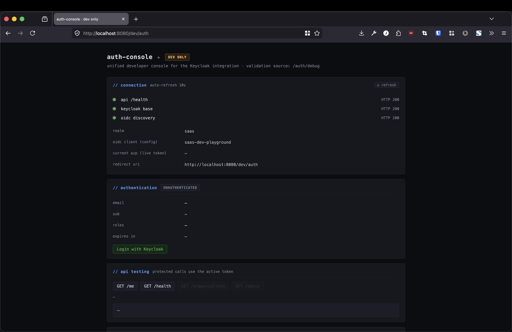
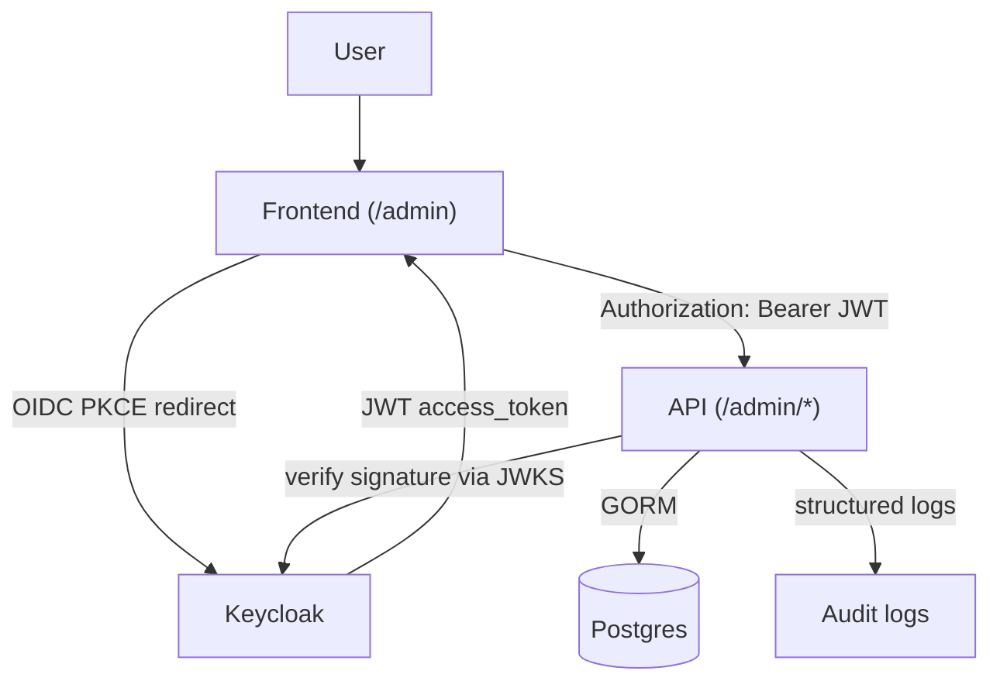

# Lightweight SaaS Backend

[](https://golang.org)
[](https://www.keycloak.org)
[](https://www.postgresql.org)
[](https://docs.docker.com/compose/)
[](LICENSE)
<!-- [](https://github.com/JoaoGabrielVianna/lightweight-saas-backend/actions/workflows/ci.yml) -->

> **Reusable IAM foundation for SaaS products** — authentication, RBAC, admin console, and operational runbooks out of the box.


- Authentication, RBAC, sessions, invites → delegated to Keycloak
- Admin console included → users, roles, sessions, docs
- Built-in docs platform → Markdown, Mermaid, PT-BR, search

---

## ✨ Features

| | |
|---|---|
| 🔐 Keycloak identity | OIDC + JWKS. Swap providers without touching business code. |
| 👤 Admin HTTP surface | 32 gated routes: users, roles, sessions, invitations, settings. |
| 🖥 Static admin console | Dependency-free SPA at `/admin`. 18 views, PKCE login, workspace switching, theme toggle. |
| 📚 Embedded docs viewer | Markdown, syntax highlight, TOC, search, Mermaid, PT-BR. |
| 🧪 Dev auth playground | Six-section token debug tool at `/dev/auth`. |
| 📊 Audit subsystem | Every mutation → structured event. 28 canonical actions. |
| ⚙️ Bootstrap pipeline | `config/project.json` → `.env` + realm export + schema. |
| 🩺 Day-one DX | `make doctor`, `make reset-dev`, `make ci`. |

**Built on:** Go 1.25 · Gin · PostgreSQL 15 · Keycloak 26 · GORM · Swagger/OpenAPI.

> **Scope.** This is an **IAM foundation**, not a complete SaaS backend: no
> billing, no queue, no file storage. It *is* multi-tenant — one installation
> serves many workspaces, each bound to its own identity provider — but tenancy
> here means "whose identity provider", not "whose rows in your schema". See
> [`docs/FEATURES.md`](docs/FEATURES.md) for exactly what exists and what does
> not. Current state, metrics and maturity:
> [`docs/PROJECT_STATUS.md`](docs/PROJECT_STATUS.md).

---

## 📐 Supported deployment

```
            ONE LIGHTWEIGHT INSTANCE  +  PostgreSQL
                          |
        ┌─────────────────┴─────────────────┐
    Workspace A                        Workspace B
        │                                   │
    Connection ──> Keycloak realm A     Connection ──> Keycloak realm B
        │                                   │
    Project  ──> lw_sk_ credential      Project  ──> lw_sk_ credential
        │                                   │
    your backend A                      your backend B
```

**Supported today:** a single instance on one host, `docker compose`, with
PostgreSQL. Many workspaces, many realms, many projects. Keycloak is your own
infrastructure; a throwaway one ships behind a profile for evaluation.

**Not claimed:** horizontal scaling. Rate-limit buckets are in-process, so two
replicas permit twice the configured rate. Run one.

---

## 🖼 Product preview

### Admin console

*Users, roles, sessions, invitations — full CRUD with live RBAC enforcement.*

### Dev auth playground

*PKCE flow, live token introspection, `/dev/auth/debug` JSON in one page.*

---

## ⚡ Quick start

Three different things people mean by "get started". Pick one.

### 🔍 Try it — one command, throwaway Keycloak included

Needs Docker. Nothing else — no Go toolchain, no answers to any questions.

```bash
git clone https://github.com/JoaoGabrielVianna/lightweight-saas-backend.git && cd lightweight-saas-backend
./scripts/init.sh                            # writes .env, generates the secrets keyring
docker compose --profile dev-idp up -d       # LIGHTWEIGHT + PostgreSQL + a disposable Keycloak
curl -fsS localhost:8080/health/ready         # {"status":"ready",...} — migrations done, serving
```

Then open **`http://localhost:8080/admin`** and sign in as `adminuser` / `password`.

The `dev-idp` profile is the *evaluation* stack: it brings a Keycloak you can
throw away, seeded with an operator account. It is not how you run this.

### 🏠 Self-host it — against a Keycloak you already run

```bash
./scripts/init.sh --keycloak-url https://sso.example.com \
                  --realm lightweight --console-client-id lightweight-console
docker compose up -d                          # no profile: PostgreSQL + LIGHTWEIGHT only
curl -fsS localhost:8080/health/ready
```

Before the first boot, your Keycloak needs one public client and one user with
the realm role `admin` — about five minutes of clicking, spelled out field by
field in **[`KEYCLOAK_SETUP.md §0`](docs/getting-started/KEYCLOAK_SETUP.md#0-what-you-must-create-in-keycloak)**.

📖 Then: **[`docs/operations/RUNNING.md`](docs/operations/RUNNING.md)** — the configuration
table, health probes, backup, and the smoke procedure that ends in a working
credential.

### 🛠 Develop it — the contributor stack

Needs Go 1.25, Docker, make. See
**[`docs/getting-started/QUICKSTART.md`](docs/getting-started/QUICKSTART.md)** (EN) ·
**[`.pt-BR`](docs/getting-started/QUICKSTART.pt-BR.md)** — and run `make doctor` first.

> `make init` is a **fork tool**, not an installer: it re-derives
> `config/project.json`, `.env.example` and the Keycloak realm export from
> prompts. Installing uses `./scripts/init.sh`, which asks nothing and needs no
> Go.

---

## 🔌 Integrating a backend

The steps above are the **operator's**. A backend developer consuming this
installation needs none of them — only three values.

**Operator, once:** create a Workspace → connect an identity provider → create a
Project → create a Project Credential, choosing its scopes. The credential's
secret is shown once, at creation, and is never recoverable.

**Backend, from then on:**

```bash
export LIGHTWEIGHT_URL=https://identity.example.com
export LIGHTWEIGHT_WORKSPACE_ID=ws_3f2504e0-4f89-41d3-9a0c-0305e82c3301
export LIGHTWEIGHT_API_KEY=lw_sk_…
```

```bash
go get github.com/JoaoGabrielVianna/lightweight-saas-backend/sdk/go@v0.1.0
```

> **Not published yet.** That is the verified installation command and it will
> work unchanged from the first SDK release onward, but `v0.1.0` does not exist
> on GitHub today. See [Release](docs/SDK_GO.md#release).

```go
import lightweight "github.com/JoaoGabrielVianna/lightweight-saas-backend/sdk/go"

client, err := lightweight.NewClientFromEnv()
if err != nil {
    return err
}

page, err := client.Users.List(ctx, lightweight.UserListOptions{Max: 50})
```

Three variables, and there is deliberately nowhere to put a fourth. The backend
never learns which identity provider sits behind LIGHTWEIGHT, which tenant of it
this workspace routes to, or what credential opens it — so an operator can
repoint the workspace and the backend keeps working, unchanged and unrestarted.

The equivalent curl, for telling an SDK problem apart from a configuration one:

```bash
curl -sS -H "Authorization: Bearer $LIGHTWEIGHT_API_KEY" \
  "$LIGHTWEIGHT_URL/v1/workspaces/$LIGHTWEIGHT_WORKSPACE_ID/users?max=10"
```

📖 **[`sdk/go/README.md`](sdk/go/README.md)** — the Go SDK · **[`docs/SDK_GO.md`](docs/SDK_GO.md)** — coverage matrix, gates, release

---

## 🏗 Architecture


```mermaid
flowchart TD
    User[User]
    Frontend["Frontend (/admin)"]
    Keycloak[Keycloak]
    API["API (/admin/*)"]
    Postgres[(Postgres)]
    Audit[Audit logs]

    User --> Frontend
    Frontend -->|OIDC PKCE redirect| Keycloak
    Keycloak -->|JWT access_token| Frontend
    Frontend -->|Authorization: Bearer JWT| API
    API -->|verify signature via JWKS| Keycloak
    API -->|GORM| Postgres
    API -->|structured logs| Audit
```

Keycloak identity links to local business users via `keycloak_sub`.

→ [`docs/architecture/bootstrap.md`](docs/architecture/bootstrap.md)

---

## 📚 Documentation

**Start here — the canonical documentation set:**

| Topic | Doc |
|---|---|
| **Current state, metrics, maturity** | [`docs/PROJECT_STATUS.md`](docs/PROJECT_STATUS.md) |
| **Architecture, request lifecycle** | [`docs/ARCHITECTURE.md`](docs/ARCHITECTURE.md) |
| **Modules** | [`docs/MODULES.md`](docs/MODULES.md) |
| **Feature inventory** | [`docs/FEATURES.md`](docs/FEATURES.md) |
| **Roadmap** · next milestone | [`docs/ROADMAP.md`](docs/ROADMAP.md) · [`docs/MILESTONE_v0.4.md`](docs/MILESTONE_v0.4.md) |
| **Technical debt** · risk register | [`docs/TECH_DEBT.md`](docs/TECH_DEBT.md) · [`docs/RISKS.md`](docs/RISKS.md) |
| **Known issues** | [`docs/KNOWN_ISSUES.md`](docs/KNOWN_ISSUES.md) |
| **Contributing** | [`docs/CONTRIBUTION_CHECKLIST.md`](docs/CONTRIBUTION_CHECKLIST.md) · [`docs/QUALITY_GATE.md`](docs/QUALITY_GATE.md) |
| **Health check** · release process | [`docs/HEALTH_CHECK.md`](docs/HEALTH_CHECK.md) · [`docs/RELEASE_CHECKLIST.md`](docs/RELEASE_CHECKLIST.md) |

Supporting material:

| Topic | Doc |
|---|---|
| Getting started | [`docs/getting-started/QUICKSTART.md`](docs/getting-started/QUICKSTART.md) (EN + PT-BR) |
| Running it in production | [`docs/operations/RUNNING.md`](docs/operations/RUNNING.md) — configuration matrix, health probes, shutdown, backup unit, smoke procedure |
| Bootstrap design | [`docs/architecture/bootstrap.md`](docs/architecture/bootstrap.md) |
| Operations | [`docs/operations/MONITORING.md`](docs/operations/MONITORING.md) (+ backup, upgrade) |
| Security | [`docs/security/SECRETS_MANAGEMENT.md`](docs/security/SECRETS_MANAGEMENT.md) (+ gaps, validation) |
| Audit | [`docs/audit/AUDIT_OPERATIONS.md`](docs/audit/AUDIT_OPERATIONS.md) |
| Full index | [`docs/INDEX.md`](docs/INDEX.md) |

---

## 🔒 Security

- **Keycloak owns identity** — no password handling, no JWT signing in Go code.
- **Asymmetric algorithms only** — `HS*` explicitly rejected, blocking algorithm-confusion attacks.
- **Live-admin RBAC check** — stale-JWT admin tokens rejected after revocation (GAP-1 closed). See [`docs/security/SECURITY_REMEDIATION_GAP1.md`](docs/security/SECURITY_REMEDIATION_GAP1.md).
- **Fail-closed authorization** — a Keycloak lookup failure returns 503, never a fallback to the JWT claim.
- **23 black-box guard probes** validated against the live stack in May 2026. See [`docs/security/FINAL_SECURITY.md`](docs/security/FINAL_SECURITY.md). Note these are archived manual runs, not an automated suite.
- **Production secrets** documented per environment with rotation procedures. See [`docs/security/SECRETS_MANAGEMENT.md`](docs/security/SECRETS_MANAGEMENT.md).
- **Open gaps tracked transparently** in [`docs/KNOWN_ISSUES.md`](docs/KNOWN_ISSUES.md) — including a rate-limit bypass and an unreviewed XSS surface.

---

## 🎯 Current focus

Ordered per [`docs/ROADMAP.md`](docs/ROADMAP.md). The theme for v0.1 is making
what already exists installable by someone who did not build it — no new
product surface.

- **First-run onboarding** — `make product-acceptance` installs the product from
  `.env.example` and drives clone → credential → SDK request against two realms.
  It is what keeps the documented path from silently rotting.
- **Single-instance only** — rate-limit buckets are in-process, so two replicas
  permit twice the configured rate ([TD-027](docs/TECH_DEBT.md#td-027)). HA is
  not a v0.1 claim.
- **Metrics + tracing** — wiring collectors into `auth.SetEventHook` /
  `audit.SetDefault`. See [`docs/operations/MONITORING.md`](docs/operations/MONITORING.md).
- **Open gaps** — mutation idempotency ([TD-036](docs/TECH_DEBT.md#td-036)) and
  provider-plane audit ([TD-038](docs/TECH_DEBT.md#td-038)).

---

## 🤝 Contributing

Issues and PRs welcome.

```bash
make hooks-install   # once per clone — pre-commit + pre-push checks
make ci              # mirrors the CI gate  (~5s)
```

- `make ci` runs fmt · vet · **lint** · build · test · swagger · docs. It must pass.
- Conventional Commits preferred (`feat:`, `fix:`, `docs:`, `chore:`).
- Handler annotation change? Run `make docs && git add docs/` — otherwise `swagger-check` fails.
- For non-trivial changes, open an issue first.

Start with [`docs/CONTRIBUTION_CHECKLIST.md`](docs/CONTRIBUTION_CHECKLIST.md) —
it is the tickable short form. Full criteria in
[`docs/QUALITY_GATE.md`](docs/QUALITY_GATE.md).

---

## License

MIT — see [LICENSE](LICENSE).
