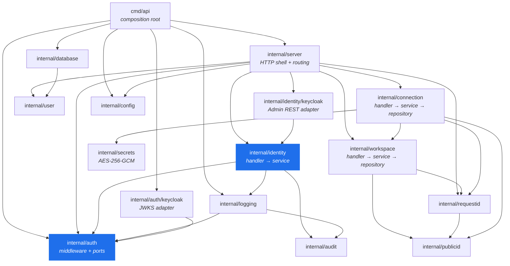
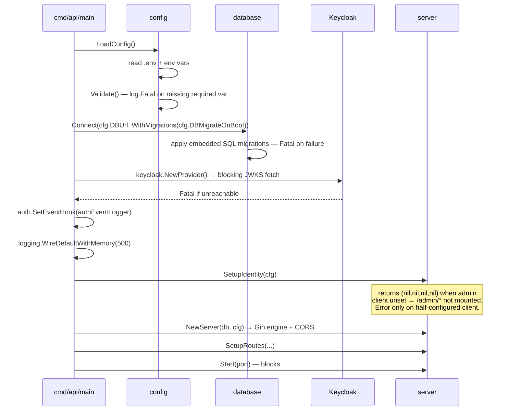
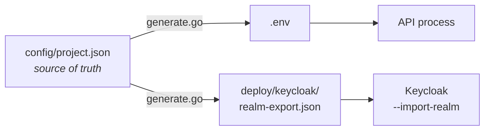
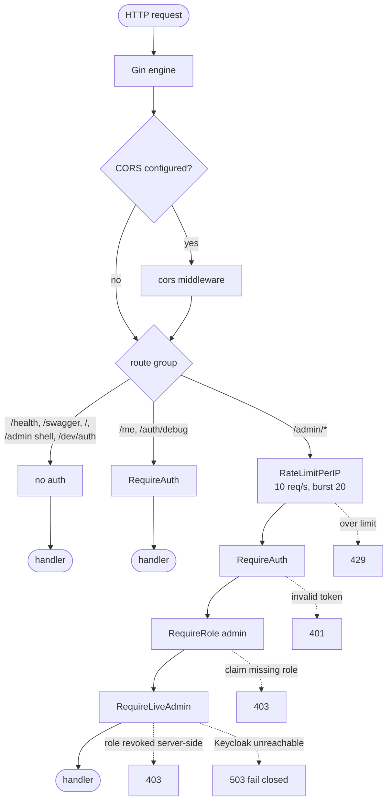
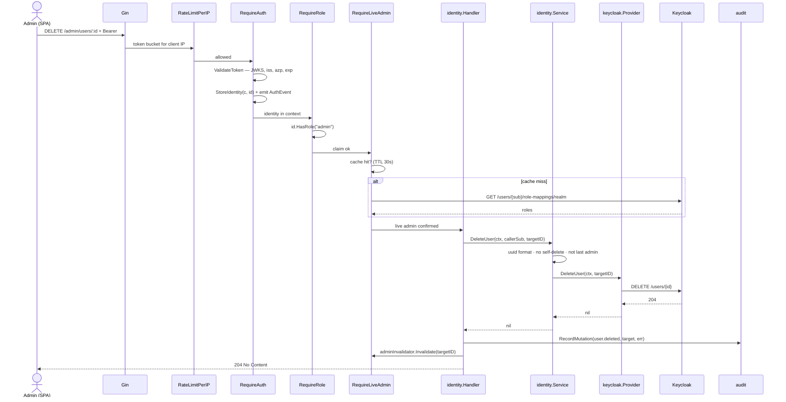
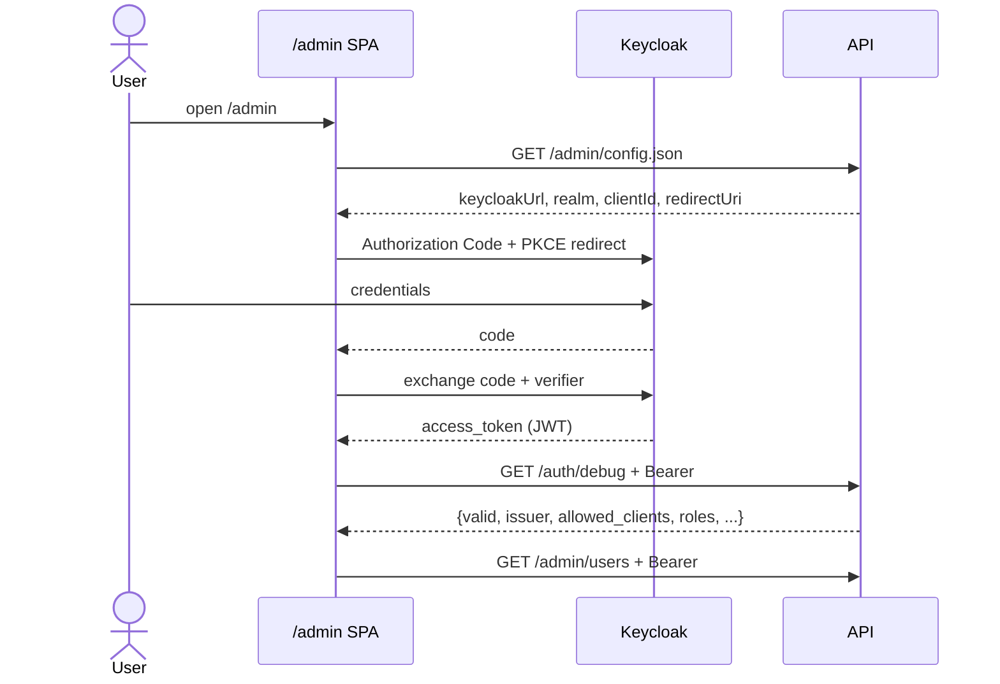
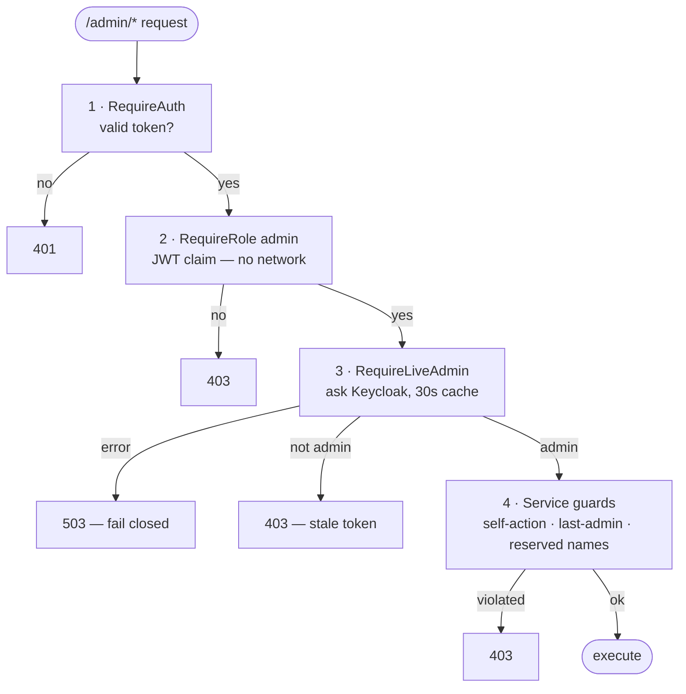
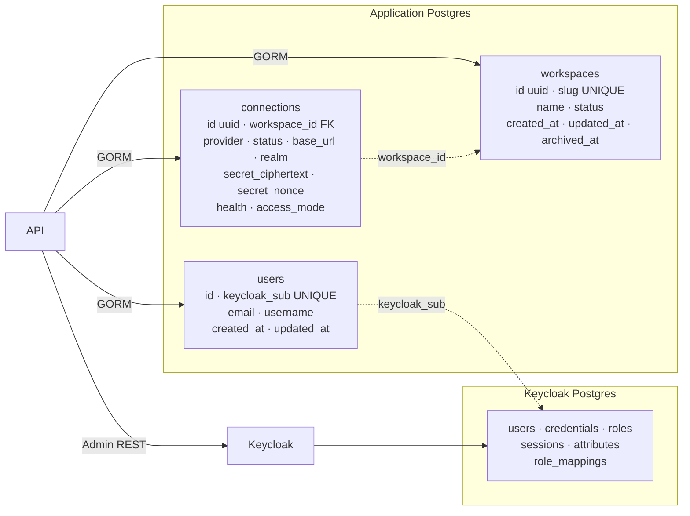
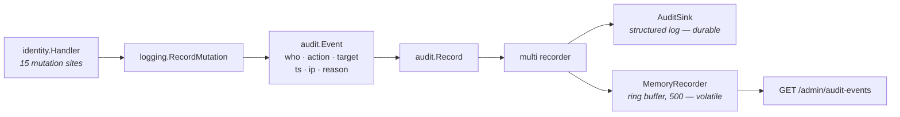
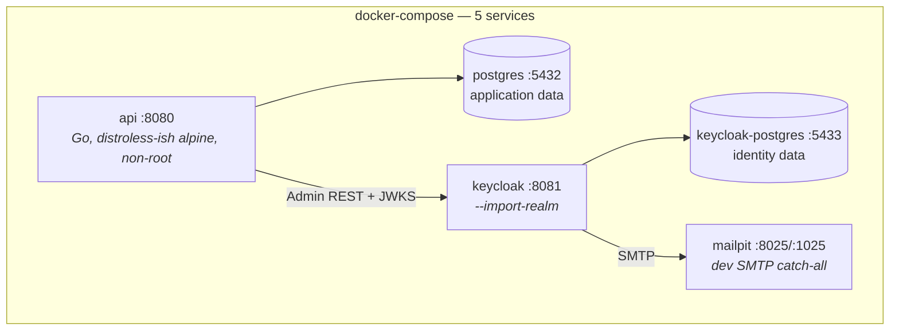

# Architecture

**Last updated:** 2026-07-26 · Companion to [PROJECT_STATUS.md](PROJECT_STATUS.md)

This document describes how the system is built and how a request travels
through it. It documents the architecture that **exists**, not an aspirational
one.

---

## 1. Architectural style

**Modular monolith, layered, with dependency inversion at the external
boundaries.**

A single Go module (`github.com/JoaoGabrielVianna/lightweight-saas-backend`,
Go 1.25.4), one deployable binary, 30 packages. Not microservices, not Clean
Architecture, not DDD — and the codebase never claims to be any of them.

What the design actually commits to:

1. **Two ports isolate the outside world.** Keycloak is reachable only through
   two interfaces. Swapping identity providers means writing new adapters, not
   touching handlers.
2. **Layers flow one way.** `handler → service → port → adapter`. No layer
   reaches backwards.
3. **Composition happens in exactly one place.** [cmd/api/main.go](../cmd/api/main.go)
   is the only file that knows how the graph is assembled.
4. **An anti-corruption layer keeps Keycloak's shapes out.** `kcUser`,
   `kcUserSession` and friends never escape `internal/identity/keycloak`.

### Package dependency graph



Note the direction: `identity → auth`, never the reverse. Handlers call
`auth.IdentityFrom(c)` to read the authenticated principal. The one place that
needed the opposite direction — the live-admin check — is resolved with an
adapter in the composition root rather than an import
([server.go](../internal/server/server.go), `adminCheckerFromProvider`):

```go
// Adapts identity.IdentityProvider → auth.AdminChecker without an
// auth→identity import cycle. Both packages already depend on this layer.
func adminCheckerFromProvider(p identity.IdentityProvider) auth.AdminChecker {
	return auth.AdminCheckerFunc(func(ctx context.Context, subject string) (bool, error) {
		roles, err := p.ListUserRoles(ctx, subject)
		...
	})
}
```

---

## 2. The two ports

Everything provider-specific sits behind these interfaces.

### `auth.AuthProvider` — request-path token validation

[internal/auth/provider.go](../internal/auth/provider.go)

```go
type AuthProvider interface {
	ValidateToken(ctx context.Context, raw string) (*Identity, error)
}
```

One method, called on every authenticated request. Implemented by
[`auth/keycloak.Provider`](../internal/auth/keycloak/provider.go) against the
realm JWKS.

### `identity.IdentityProvider` — admin operations

[internal/identity/provider.go](../internal/identity/provider.go)

23 methods across users, roles, sessions and invitations. Implemented by
[`identity/keycloak.Provider`](../internal/identity/keycloak/provider.go)
against the Keycloak Admin REST API.

The interface carries an explicit non-growth policy in its doc comment:
*"Adding a method here is a breaking change for every implementation — keep
the surface curated."*

**The two use different Keycloak clients with independent secrets**
(`KEYCLOAK_CLIENT_ID` vs `KEYCLOAK_ADMIN_CLIENT_ID`) so the low-privilege
token validator and the privileged service account never share a credential.

---

## 3. Layers and responsibilities

| Layer | Location | Owns | Must not |
|---|---|---|---|
| **Composition root** | [cmd/api/main.go](../cmd/api/main.go) | Building every dependency; fail-fast on misconfiguration | Contain business logic |
| **HTTP shell** | [internal/server/](../internal/server/) | Gin engine, route groups, middleware order, static asset mounting | Know Keycloak specifics |
| **Handler** | `*/handler.go` | Binding, request-shape validation, error → HTTP status, building the audit event from the request | Contain business rules; own a transaction |
| **Service** | `*/service.go` | Business rules: validation, normalization, self-protection guards, pagination clamping. For control-plane mutations, the TRANSACTION BOUNDARY | Know about HTTP or Gin |
| **Port** | `provider.go` interfaces | The contract | Have an implementation |
| **Adapter** | `*/keycloak/`, `repository.go` | Talking to the external system, translating its shapes | Leak external types upward |

The separation is real, not nominal. Example — the self-delete guard lives in
the service, not the handler ([identity/service.go](../internal/identity/service.go)):

```go
func (s *Service) DeleteUser(ctx context.Context, callerSubject, targetID string) error {
	if !uuidPattern.MatchString(targetID) { return ErrBadRequest }
	if callerSubject != "" && callerSubject == targetID {
		return fmt.Errorf("%w: cannot delete your own account", ErrForbidden)
	}
	...
}
```

The handler's only job is turning `ErrForbidden` into a 403.

---

## 4. Bootstrap and startup

Startup is deliberately fail-fast: every misconfiguration that can be detected
without traffic terminates the process before the listener opens.



Three distinct failure policies, chosen per case:

| Condition | Behaviour | Why |
|---|---|---|
| Missing `DB_URL`, `KEYCLOAK_URL`, `KEYCLOAK_REALM`, `KEYCLOAK_CLIENT_ID` | `log.Fatal` | Serving traffic with a half-configured auth stack is worse than not starting |
| JWKS unreachable at boot | `log.Fatal` | Surfacing this at boot beats serving 401s in production |
| Admin client credentials **both** unset | Warn, continue, omit `/admin/*` | Valid deployment shape: auth-only, no admin surface |
| Admin client **half** set (id without secret) | Return error → `log.Fatal` | Always an operator mistake |

### Configuration source of truth

[internal/bootstrap](../internal/bootstrap/) generates both `.env` and the
Keycloak realm export from `config/project.json`, so the API's configuration
and the realm's configuration cannot drift apart.



Validated against a JSON Schema in
[internal/bootstrap/schema/](../internal/bootstrap/schema/).

---

## 5. Request lifecycle

### Middleware chain by route group



**The middleware order is load-bearing:**

- **Rate limit sits before auth** so an unauthenticated flood cannot force
  JWT signature verification. Cheapest check first.
- **`RequireRole` sits before `RequireLiveAdmin`** so a non-admin is rejected
  from the JWT claim alone, with no Keycloak round-trip. The expensive live
  check only runs for tokens that claim they *should* pass.
- **One gate at the group level** rather than per-route. There is no route
  where someone can forget to add `RequireRole`.

### A mutating admin request, end to end

`DELETE /admin/users/:id`:



Two details worth internalising:

1. **The audit event is emitted on both success and failure.**
   [`logging.RecordMutation`](../internal/logging/gin_helpers.go) centralises
   the branch: on error it attaches `err.Error()` as `Reason`. Exactly one
   event per mutation attempt, always.

   **Control-plane mutations differ, and the difference is the point** (Slice 15,
   [TD-033](TECH_DEBT.md#td-033)). Their domain rows and their audit row live in
   the same PostgreSQL, so the SERVICE opens one transaction and writes both:

   ```
   handler   builds the event from the request (who, from where, request id)
   service   BEGIN → domain write → complete the event → audit insert → COMMIT
   handler   emits to the log and the ring; the durable row is already in
   ```

   A failed audit write rolls the mutation back. The handler's job shrinks to
   building the event and deciding what to do with the outcome — and the third
   outcome is the subtle one: when the mutation was rolled back BECAUSE the audit
   store failed, nothing is emitted, because the store that would receive it is
   the one that just failed.

   Provider mutations keep the original shape. A Keycloak write cannot be rolled
   back by a PostgreSQL transaction, so their audit row is best-effort and the
   response still succeeds — see [AUDIT.md §6](AUDIT.md#6-when-the-audit-write-fails)
   and [TD-038](TECH_DEBT.md#td-038).
2. **Cache invalidation is in-band.** Mutations that could change admin status
   call `Invalidate(subject)` immediately, so the 30 s TTL only ever bounds
   *out-of-band* changes made directly in the Keycloak admin UI.

---

## 6. Authentication



Validation steps in
[`auth/keycloak.Provider.ValidateToken`](../internal/auth/keycloak/provider.go):

| # | Check | Failure |
|---|---|---|
| 1 | Signature verified against realm JWKS | `ErrInvalidToken` |
| 2 | Algorithm ∈ `{RS,PS,ES}{256,384,512}` — **`HS*` excluded** | `ErrInvalidToken` |
| 3 | `iss` equals the configured realm issuer | `ErrInvalidToken` |
| 4 | `exp` present and in the future | `ErrTokenExpired` |
| 5 | `azp`, if present, is in the allow-list | `ErrInvalidToken` |
| 6 | `sub` present | `ErrMissingClaim` |

Roles are flattened from `realm_access.roles` and
`resource_access.<clientID>.roles` into `Identity.Roles`.

**Why `HS*` is excluded** — with a symmetric algorithm the verification key is
also the signing key, so anyone who can read it can mint tokens. Keycloak
always publishes asymmetric keys, so the restriction costs nothing.

**Error responses never leak the reason.** The wire gets
`401 {"error":"unauthorized"}`; the specific cause goes to the `AuthEvent`
stream only.

### Token introspection — two routes, one handler

| Route | Auth | Mounted | Purpose |
|---|---|---|---|
| `GET /auth/debug` | Required | Always, by `SetupRoutes` | Consumed by the admin console: `valid`, `issuer`, `allowed_clients`, `roles` |
| `GET /dev/auth/debug` | **None** | `DEV_PLAYGROUND_ENABLED=true` | Explains *why* a token was rejected |

The split exists because an authenticated route cannot diagnose an invalid
token — `RequireAuth` rejects it before the handler runs. Collapsing them into
one path caused [KI-001](KNOWN_ISSUES.md#ki-001).

---

## 7. Authorization

Four independent mechanisms, layered:



### Layer 3 — why it exists

`RequireRole` reads a claim that was frozen when the token was signed. Revoke
someone's admin role and their existing token stays privileged until `exp` —
up to an hour in a default realm. That was **GAP-1**.

[`CachedAdminChecker`](../internal/auth/admin_check.go) closes it:

- Positive **and** negative results cached, same TTL (30 s default,
  `ADMIN_LIVE_CHECK_TTL_SECONDS`). Negative caching stops a stale-admin token
  from triggering one Keycloak call per request.
- **On upstream error it returns the error, never a cached or claim-derived
  guess.** `RequireLiveAdmin` maps that to **503**. Fail closed is the whole
  point of the layer.
- In-band mutations invalidate immediately, so the TTL only bounds changes
  made directly in Keycloak's own admin UI.

### Layer 4 — business guards

In [identity/service.go](../internal/identity/service.go):

| Guard | Rule |
|---|---|
| Self-disable | `PATCH {enabled:false}` on yourself → 403 |
| Self-delete | `DELETE` your own user → 403 |
| Self-strip-admin | Removing `admin` from yourself → 403 |
| Last admin | Any operation emptying the enabled-admin set → 403 |
| Reserved roles | Cannot create/modify `admin`, `user`, `offline_access`, `uma_authorization`, `default-roles-*` |

`assertNotLastAdmin` fails closed: if it cannot enumerate admins because the
Admin API is unavailable, it refuses the operation rather than risk wiping the
last one.

---

## 8. Data layer



The service owns **three tables**, and none holds identity data: everything
identity-related lives in Keycloak and is reachable only over HTTP.

`connections` holds each workspace's identity-provider configuration. The
provider's client secret is sealed with AES-256-GCM before it is written and is
never returned by the API; at most one connection per workspace may be active,
enforced by a partial unique index. Nothing consumes a connection yet — the
Identity API still uses the process-level `KEYCLOAK_*` configuration. See
[CONNECTIONS.md](CONNECTIONS.md).

`workspaces` is the first table of the product domain. There is no foreign key
between it and `users` — a Workspace has no members yet, and will hold a
Connection to an identity provider rather than a set of people. Its invariants
are enforced by four CHECK constraints rather than by application code alone;
see [WORKSPACES.md](WORKSPACES.md).

- **`keycloak_sub` is the canonical key**, with a unique index enforcing it at
  the database level even under concurrent first-login races.
- **`FindByEmail` deliberately does not exist** — email is not a stable
  identity in OIDC; users can change it in Keycloak.
- Schema changes go through **versioned SQL migrations** embedded in the binary
  (`go:embed`) and applied at boot via `golang-migrate`. `AutoMigrate` is gone
  ([TD-005](TECH_DEBT.md#td-005), resolved) — see [MIGRATIONS.md](MIGRATIONS.md).

---

## 9. Audit subsystem

Provider-agnostic by construction: `internal/audit` imports neither Gin nor
Keycloak.



- **14 canonical actions**, all declared in
  [audit/event.go](../internal/audit/event.go) and all emitted. Declared count
  and emitted count match — verify with the commands in
  [PROJECT_STATUS.md](PROJECT_STATUS.md#metrics).
- The active recorder sits behind an `atomic.Pointer`, so `SetDefault` is safe
  concurrently with in-flight `Record` calls.
- A no-op recorder is installed at package init, so `audit.Record` is always
  safe to call — even before wiring, and in tests.
- **The ring buffer is a recency window, not history.** It is volatile and
  capped. The structured log is the durable trail. See
  [TD-008](TECH_DEBT.md#td-008).

---

## 10. Observability hooks

Two extension points exist and are currently wired only to the logger:

| Hook | Set in | Currently does | Designed for |
|---|---|---|---|
| [`auth.SetEventHook`](../internal/auth/events.go) | [main.go](../cmd/api/main.go) | Writes to the structured logger | Prometheus counters, OTel spans |
| [`audit.SetDefault`](../internal/audit/recorder.go) | [main.go](../cmd/api/main.go) | Fan-out: log sink + ring buffer | Database sink, SIEM shipper |

`AuthEvent` kinds: `token_validated`, `validation_failed`, `missing_header`,
`malformed_header`, `forbidden`. Denials from the live-admin check carry the
marker `"live admin check denied"` so stale-token rejections are
distinguishable from ordinary RBAC denials.

Adding metrics means writing a collector and registering it at these two
points — no middleware changes. See [TD-009](TECH_DEBT.md#td-009).

---

## 11. Frontend architecture

Two separate surfaces, both dependency-free vanilla JavaScript with **no build
step** — served straight from disk.

### Admin console — [web/admin/](../web/admin/)

```
static/js/
├── main.js            boot: router, PKCE callback, state hydration
├── lib/
│   ├── auth.js        PKCE flow, token storage, refreshDebug()
│   ├── api.js         fetch wrapper + 401 interceptor
│   ├── router.js      hash-based client-side routing
│   ├── state.js       minimal observable store
│   ├── markdown.js    docs renderer
│   ├── highlight.js   syntax highlighting
│   ├── locale.js      EN / PT-BR
│   └── dom.js         h() hyperscript helper
├── components/        sidebar · topbar · table · modal · toast · common
└── views/             14 views: users · user-detail · roles · sessions ·
                       overview · settings · email · email-templates ·
                       auditlogs · docs · swagger · playground · apiexplorer
```

The SPA depends on a **response contract** from `GET /auth/debug` —
`valid`, `issuer`, `allowed_clients`, `received_sub`, `received_azp`, `roles`,
`exp`, `expired`. Breaking it degrades the console silently rather than
loudly: this is exactly how [KI-001](KNOWN_ISSUES.md#ki-001)'s second symptom
went unnoticed. The contract is now pinned by
`TestAuthDebug_ReturnsSPAContract` in
[internal/server/server_test.go](../internal/server/server_test.go).

`devTools` and `apiExplorer` in `/admin/config.json` are bound to
`DEV_PLAYGROUND_ENABLED`, letting production serve the console while hiding
the dev-only views.

### Dev playground — [web/dev/](../web/dev/)

Standalone six-section token debugger. **Rule enforced in its own source:** the
UI must never decide token validity itself — every `valid` / `expired` /
`roles` value rendered comes from `/dev/auth/debug`.

---

## 12. Deployment topology



**Two hostnames for one Keycloak, deliberately:**

| Variable | Value in compose | Used for |
|---|---|---|
| `KEYCLOAK_URL` | `http://localhost:8081` | Expected `iss` claim — must match what browsers use to obtain tokens |
| `KEYCLOAK_JWKS_URL` / `KEYCLOAK_ADMIN_BASE_URL` | `http://keycloak:8080` | Server-to-server calls over the Docker network |

Getting these backwards is the single most common setup failure: tokens
minted at `localhost:8081` carry that issuer, and the API must expect exactly
that string.

**Dockerfile:** multi-stage, `CGO_ENABLED=0`, `-trimpath -ldflags="-s -w"`,
build cache mounts, runs as a non-root `app` user.

**Known gap:** the compose `api` service does not pass
`ADMIN_CONSOLE_ENABLED`, `ADMIN_CONSOLE_CLIENT_ID`, `CORS_ALLOWED_ORIGINS`, or
`ADMIN_LIVE_CHECK_TTL_SECONDS`, so the documented production recipe is not
reproducible with the shipped file — [TD-004](TECH_DEBT.md#td-004).

---

## 13. Extension guide

Where to add things, so the next change lands in the right layer.

| To add… | Do this |
|---|---|
| **A new admin endpoint** | Method on `IdentityProvider` → implement in `identity/keycloak` → business rules in `Service` → handler in `identity/handler.go` → route in [router.go](../internal/server/router.go) → `logging.RecordMutation` if it mutates → swagger annotation → `make docs` |
| **A new audit action** | Constant in [audit/event.go](../internal/audit/event.go) → emit via `RecordMutation`. Never rename an existing one — consumers depend on the string |
| **A different identity provider** | Implement both ports in a new subpackage. Do not touch handlers or services |
| **Metrics / tracing** | Register collectors at `auth.SetEventHook` and `audit.SetDefault`. No middleware changes needed |
| **A new business entity** | New package under `internal/` following `model → repository → service → handler`. **Resolve multi-tenancy first** — retrofitting `tenant_id` later touches every query |
| **A new config value** | Field on `Config` → read in `LoadConfig` → add to `Validate()` if required → **add to docker-compose `api.environment`** (see TD-004) → document in `.env.example` |

### Invariants — do not break these

1. `internal/audit` must not import Gin, Keycloak, or any transport package.
2. `internal/auth` must not import `internal/identity`. Use the
   `AdminChecker` seam in the composition root.
3. Adapters must not leak provider types (`kcUser`, …) above the port.
4. Every mutation handler emits exactly one audit event, on success **and**
   failure.
5. `RequireLiveAdmin` fails closed. Never add a fallback to the JWT claim.
6. `/auth/debug` is registered in exactly one place. A second registration
   panics Gin at boot — pinned by a test.
