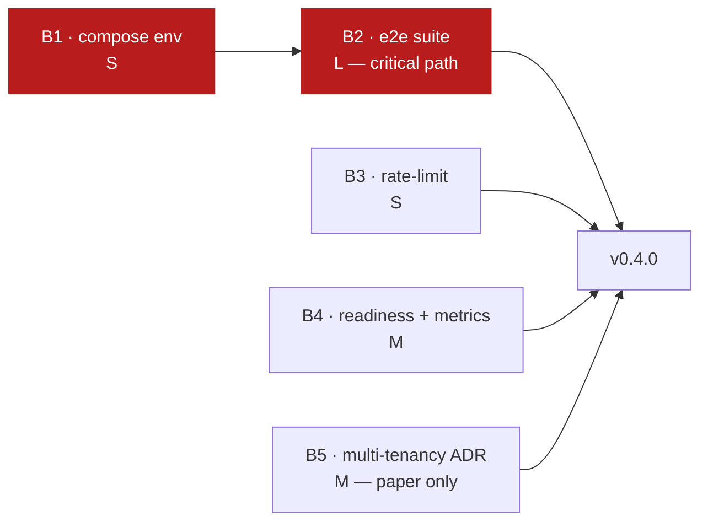

# Milestone Proposal — v0.4.0

**Status:** proposed · **Drafted:** 2026-07-27 · **Owner:** maintainer
**Theme:** *Trustworthy* — make the existing surface verifiable, observable and deployable.

> **Proposal, not a commitment.** Scope is negotiable until the milestone
> opens; the acceptance criteria are not.

---

## Why this milestone, and why now

v0.3 delivered production hardening. The 2026-07-26 audit then found that the
hardening could not be *trusted*: a boot-time crash had shipped six weeks
earlier and survived 19 commits and a green CI, because nothing verified the
system end to end.

The quality gates delivered on 2026-07-27
([V1-02](ROADMAP.md#v1-02--complete-the-ci-gate--delivered-2026-07-27)) raised
the floor — lint, coverage, integration and frontend tests, and documentation
consistency now all block. But they verify **units**. Nothing yet verifies that
the assembled system works.

v0.4 closes that gap and pays down the three risks that block everything after
it: [R-01](RISKS.md#r-01) (no e2e), [R-05](RISKS.md#r-05) (cannot observe),
[R-07](RISKS.md#r-07) (deployment not reproducible).

**No new product surface.** One new endpoint, which is a gap-filler, not a
feature.

---

## Objectives

| # | Objective | Closes |
|---|---|---|
| O1 | Prove the assembled system works, automatically, on every PR | [R-01](RISKS.md#r-01) |
| O2 | Make the shipped deployment artifact match the documented recipe | [R-07](RISKS.md#r-07) |
| O3 | Make production observable | [R-05](RISKS.md#r-05) |
| O4 | Close the two known security holes | [R-10](RISKS.md#r-10) |
| O5 | Decide multi-tenancy on paper before it gets more expensive | [R-02](RISKS.md#r-02) |

---

## Scope

### Blocking — the milestone does not ship without these

| # | Item | Roadmap | Est. | Rationale |
|---|---|---|---|---|
| **B1** | Fix docker-compose env wiring | [V1-03](ROADMAP.md#v1-03--fix-docker-compose-environment-wiring) | S | Blocks B2; the production recipe is currently not runnable |
| **B2** | End-to-end test suite | [V1-01](ROADMAP.md#v1-01--automated-end-to-end-test-suite) | **L** | The milestone's centre of gravity |
| **B3** | Close the rate-limit bypass | [V1-04](ROADMAP.md#v1-04--close-the-rate-limit-bypass) | S | Nullifies the only rate limit in the system |
| **B4** | Readiness probe + Prometheus metrics | [V1-05](ROADMAP.md#v1-05--metrics-and-tracing) | M | Hooks already exist; this is additive |
| **B5** | Multi-tenancy ADR (decision only, no code) | [V2-01](ROADMAP.md#v2-01--decide-and-implement-multi-tenancy) | M | Cost compounds with every table added first |

**B2 detail — what "end to end" must mean here:**

- Drives the real compose stack (Go + testcontainers, or Playwright).
- Covers the full auth flow: PKCE → JWT → JWKS → `/me` → `/admin/*`.
- ~~**Negatively** asserts every self-protection guard~~ — **delivered in
  Slice 14**, including the deliberately single-admin realm fixture this item
  asked for, so the last-admin path is finally demonstrated at runtime
  ([KI-018](KNOWN_ISSUES.md#ki-018) closed).
- Exercises **both** console flag configurations. `KI-001` broke one with a
  crash and the other with a silent UI regression; a suite that tests one
  configuration would have caught neither.
- Runs in CI as a fifth job.

### Optional — ship if B1–B5 land early

| # | Item | Roadmap | Est. |
|---|---|---|---|
| O-A | Versioned migrations | [V1-07](ROADMAP.md#v1-07--versioned-migrations) | M |
| O-B | Promote `errcheck` (20 findings) | [QUALITY_GATE.md](QUALITY_GATE.md#the-lint-ratchet--read-before-adding-a-linter) | S |
| O-C | Promote `staticcheck` (13 findings) | same | S |
| O-D | Security headers on `/admin` | [V1-09](ROADMAP.md#v1-09--security-hardening-pass) | S |
| O-E | Realm-wide session revocation | [V1-12](ROADMAP.md#v1-12--realm-wide-session-revocation) | S |
| O-F | Graceful shutdown | [TD-013](TECH_DEBT.md#td-013) | S |
| O-G | Community health files | [TD-017](TECH_DEBT.md#td-017) | S |

O-B and O-C are deliberately optional: they are mechanical, low-risk, and make
good filler, but neither closes a risk.

### Explicitly out of scope

| Item | Why not now |
|---|---|
| Multi-tenancy **implementation** | Decision first (B5). Implementing without e2e coverage is how cross-tenant leaks ship |
| Organizations, billing, storage, queue, webhooks | All depend on the multi-tenancy decision |
| Durable audit persistence | Depends on migrations (O-A). Slip to v0.5 |
| SPA framework migration | [R-09](RISKS.md#r-09) is score 9. Not this milestone |
| XSS review | Needs focused security time; pairs better with a dedicated pass |
| Distributed cache / horizontal scaling | No demand signal yet |

---

## Acceptance criteria

The milestone is complete when **all** of these are objectively true.

### Functional

- [ ] `make up && make test-e2e` passes from a clean clone
- [ ] The e2e suite runs as a CI job and fails the build when it fails
- [ ] Every self-protection guard has a negative e2e assertion
- [ ] Both console flag configurations are exercised in CI
- [ ] `curl -H 'X-Forwarded-For: <random>' …` no longer bypasses the rate limit
- [ ] `GET /ready` returns non-200 when PostgreSQL or Keycloak is unreachable
- [ ] `GET /metrics` exposes request counts, latency histogram, and auth-event counters

### Reproducibility

- [ ] `ADMIN_CONSOLE_ENABLED=true` + `DEV_PLAYGROUND_ENABLED=false` is reachable through `docker-compose.yml` alone
- [ ] `CORS_ALLOWED_ORIGINS` is settable through compose
- [ ] The production recipe in [PRODUCTION_DEPLOYMENT.md](operations/PRODUCTION_DEPLOYMENT.md) is executed verbatim during release validation and works

### Quality gates

- [ ] `make ci` green
- [ ] `make ci-full` green
- [ ] Coverage floor raised to **≥ 76%** (from 73%) — the e2e suite should move the number
- [ ] Zero **Critical** open issues in [KNOWN_ISSUES.md](KNOWN_ISSUES.md)
- [ ] Every new gate documented in [QUALITY_GATE.md](QUALITY_GATE.md)

### Documentation

- [ ] Multi-tenancy ADR merged as `AD-009` in [PROJECT_STATUS.md](PROJECT_STATUS.md#architectural-decisions), naming the chosen strategy **and the rejected alternatives with reasons**
- [ ] [ROADMAP.md](ROADMAP.md) reflects delivered items
- [ ] [RISKS.md](RISKS.md) re-scored; R-01/R-05/R-07 reduced with evidence
- [ ] `make check-docs` green
- [ ] [CHANGELOG.md](../CHANGELOG.md) `[0.4.0]` complete

---

## Risks to the milestone itself

| Risk | Impact | Prob. | Mitigation |
|---|---|---|---|
| **B2 is much larger than estimated.** E2E suites against a Keycloak-backed stack are notoriously slow to stabilise — realm seeding, token timing, container readiness | High | **High** | Timebox to two weeks. If it slips, ship the auth-flow subset plus the guard assertions and defer broader CRUD coverage. Partial e2e beats none |
| **E2E tests become flaky**, training everyone to ignore red builds — worse than having no suite | High | Medium | No `time.Sleep`: poll readiness. Every test provisions its own subjects (learned from L3). Quarantine on second flake, fix or delete within one week |
| **Metrics work expands into a full observability platform** | Medium | Medium | B4 is a readiness probe and a `/metrics` endpoint. Dashboards, alert rules and tracing are v0.5 |
| **The multi-tenancy ADR stalls** on an undecidable trade-off | Medium | Medium | Timebox to one week. If undecided, record the *decision criteria* and what evidence would settle it — that is still progress |
| **Coverage floor at 76% blocks the milestone** if e2e tests do not raise the aggregate as expected | Low | Medium | Measure before committing to the number; adjust the target in the same PR that lands B2 |
| **Bus factor** ([R-03](RISKS.md#r-03)) — single author, no reviewer | Medium | High | Not solvable inside a milestone. B5's ADR explicitly records rejected alternatives, which is the cheapest transferable knowledge |

---

## Sequencing

1. **B1 first** — small, and it blocks B2.
2. **B2 starts immediately after** and runs the length of the milestone.
3. **B3, B4, B5 run in parallel** with B2. None depends on it, and they give the
   milestone value even if B2 slips.
4. Pull optional items in only once B1–B5 are in review.

**Definition of done for the milestone:** every acceptance criterion ticked, and
[RELEASE_CHECKLIST.md](RELEASE_CHECKLIST.md) executed end to end.

---

## What success looks like

After v0.4, a contributor who has never seen this repository can:

1. Clone it, run `make up && make test-e2e`, and get a green result proving the
   whole system works.
2. Open a PR and have every mechanical standard checked automatically.
3. Deploy using the shipped compose file and the written runbook, without
   undocumented steps.
4. See whether production is healthy from a dashboard rather than by reading
   logs.
5. Read [PROJECT_STATUS.md](PROJECT_STATUS.md) and know the multi-tenancy
   direction before writing a line of schema.

That is the point at which the project can absorb contributors other than its
author — which is the precondition for everything in v1 and v2.

**Projected maturity after v0.4: 8.5/10** (from 8.0), capped below 9 by the
absent product domain and by [R-03](RISKS.md#r-03).
