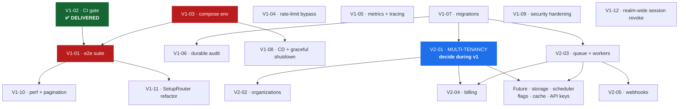

# Roadmap

**Last updated:** 2026-08-24 · Companion to
[PRODUCT_DIRECTION.md](PRODUCT_DIRECTION.md) and
[PROJECT_STATUS.md](PROJECT_STATUS.md)

**This document is about product direction and sequence.** What is *wrong* with
the product lives in [TECH_DEBT.md](TECH_DEBT.md) and
[KNOWN_ISSUES.md](KNOWN_ISSUES.md), and a debt entry does not appear here
merely because it exists. Debt earns a place on this page only when a planned
capability cannot ship without it.

---

## CURRENT — v0.4.x

**Shipped and published.** `v0.4.1` is the current server release; the Go SDK is
`v0.1.0`.

LIGHTWEIGHT is an installable identity control plane. One installation serves
many workspaces, each bound to its own Keycloak realm and resolved per request,
and a backend reaches it with three environment variables and no knowledge of
the provider behind them.

| Delivered | Where |
|---|---|
| Workspaces, addressed as `ws_<uuid>` | [WORKSPACES.md](WORKSPACES.md) |
| Connections: verify, activate, retire; client secret sealed AES-256-GCM under a rotatable keyring | [CONNECTIONS.md](CONNECTIONS.md) · [SECRET_KEY_ROTATION.md](SECRET_KEY_ROTATION.md) |
| Per-request multi-realm routing | [WORKSPACE_IDENTITY_RUNTIME.md](WORKSPACE_IDENTITY_RUNTIME.md) |
| Projects and `lw_sk_` credentials with 9 scopes | [PROJECTS.md](PROJECTS.md) |
| Workspace-scoped identity: users, roles, sessions, invitations | [WORKSPACE_IDENTITY_API.md](WORKSPACE_IDENTITY_API.md) |
| Durable, workspace-scoped audit trail, transactional with control-plane mutations | [AUDIT.md](AUDIT.md) |
| Workspace-aware operator console | [WORKSPACE_CONSOLE.md](WORKSPACE_CONSOLE.md) |
| Zero-dependency Go SDK, published | [SDK_GO.md](SDK_GO.md) |
| An install a stranger can complete | [getting-started/](getting-started/README.md) |
| Authorization evidenced end to end, in both directions | [security/AUTHORIZATION_MATRIX.md](security/AUTHORIZATION_MATRIX.md) |

**Supported topology: single instance.** Horizontal scaling is not supported and
not claimed; the reason is [TD-027](TECH_DEBT.md#td-027).

**v0.4.2** is a documentation release. It adds no capability. Its subject is
making the published documentation true — see the
[CHANGELOG](../CHANGELOG.md).

---

## NEXT — v0.5.0 · Identity Experience

> ### THE EXACT v0.5.0 SCOPE IS NOT YET FROZEN.
>
> What follows is a **direction**, recorded so the next design conversation
> starts from something. It is not a specification, not a commitment, and not a
> backlog. Nothing here has been designed, sized, or promised, and nothing here
> may be built ahead of that design.

**The intent, in one sentence:** make the identity-experience settings that
every installation needs reachable by someone who should not have to learn
Keycloak's admin console to change them.

**The problem it responds to.** LIGHTWEIGHT already removes the need for a
backend to hold Keycloak admin rights. It does not yet remove the equivalent
need for a *person*: an operator who wants to change the sender address on an
invitation email, or what the login page says, is sent to Keycloak. That is a
different console, a different vocabulary, and a level of access the task does
not warrant.

**Candidate areas**, in no committed order and with no committed shape:

| Area | The question it would answer |
|---|---|
| Email delivery and configuration | Where does mail come from, and did it arrive? |
| Email templates | What does an invitation actually say? |
| Authentication experience | What does a user see when signing in? |
| Login and registration customization | Which fields, which flows, in what language? |
| Branding | Whose product does this look like? |
| No-code configuration | Can an operator change it without a deploy? |
| Advanced validated customization | Can a power user go further without being able to break it? |

**What today's product already has in this area**, so the gap is measured
honestly: SMTP settings, an SMTP connection test, Keycloak email-template
customization and a custom FTL theme all exist, on the legacy `/admin/*`
surface, with no `/v1` equivalent and no dedicated tests. The FTL theme does not
survive container recreation ([KI-011](KNOWN_ISSUES.md#ki-011)). Why they were
left there is recorded in
[WORKSPACE_IDENTITY_API.md §7](WORKSPACE_IDENTITY_API.md#why-smtp-and-email-templates-are-deferred):
they are provider-specific realm settings rather than identity administration,
and migrating them means designing that seam.

### Explicitly NOT promised for v0.5.0

Listed because naming them keeps a brainstorm from hardening into a contract by
repetition. None of the following has been decided, and none should be treated
as intended:

- any HTML format, markup subset, or templating dialect
- any DSL
- any specific component or component model
- any schema, table, or migration
- any endpoint, route, or API shape
- any draft/publish or version-history model
- any preview or validation engine
- any rollback semantics
- any list of supported providers
- MFA
- any count of configurable pages or screens
- any new scope, role, or authorization vocabulary

These belong to the v0.5.0 design sprint, which has not happened.

**A constraint that design sprint inherits**, stated now because it is already
true: LIGHTWEIGHT configures and simplifies; **Keycloak remains the identity
provider and the runtime**. Anything in this area is a configuration surface
over Keycloak, not a reimplementation of it. See
[PRODUCT_DIRECTION.md § The boundary](PRODUCT_DIRECTION.md#the-boundary-with-keycloak).

---

## FUTURE — Audit and investigation

**No version. No date. Direction only.**

The durable audit trail answers "what happened to this workspace". The direction
is to evolve it toward **investigation**: making security-relevant events
visible and answerable, rather than only recorded.

The honest starting point is that the groundwork here is analysis, not code, and
some of it is already done and points at a real cost. Authorization refusals
deliberately do **not** reach the durable trail today, and
[TD-037](TECH_DEBT.md#td-037) carries the arithmetic for why: one misconfigured
backend retrying a `403` in a loop would outweigh the real history by roughly
four orders of magnitude in the same table, under a single age-based retention
policy. The entry names a separate security-event class with its own retention
as the eventual answer, and says plainly that doing it badly would degrade the
trail the product's audit story now rests on.

That analysis is a reason this is direction rather than a plan. It is listed
here so the direction is on record; it is not scheduled, and
[TD-037](TECH_DEBT.md#td-037) remains a debt entry rather than a roadmap item
until something schedules it.

---

## How this roadmap is maintained

Update it when a horizon actually moves, not when an idea is had. The release
checklist gate 2.7 requires shipped items to be marked delivered with a date;
that gate is human, and it was missed for `v0.4.0` and `v0.4.1`, which is why
the section below needed reconciling in `v0.4.2`.

Three documents, three jobs, and they should not blur:

| Document | Answers |
|---|---|
| [PRODUCT_DIRECTION.md](PRODUCT_DIRECTION.md) | What is this product for, and what is it deliberately not? |
| **This file** | What is done, what is next, in what order, and what is explicitly not promised |
| [TECH_DEBT.md](TECH_DEBT.md) · [KNOWN_ISSUES.md](KNOWN_ISSUES.md) | What is wrong with what exists |

---

# Historical — the v1 / v2 framing, as it stood before v0.4

> **This section is a record, not a plan.** It is the backlog as it was framed
> on 2026-07-26, when the project was an IAM foundation rather than a control
> plane, and "v1" and "v2" meant *product generations* rather than version
> numbers. v0.4.0 changed enough that the framing no longer describes the
> product, and the CURRENT / NEXT / FUTURE sections above supersede it.
>
> It is kept, with its headings unchanged, for two reasons: the reasoning behind
> each item is still worth reading, and thirteen documents link to these anchors
> — including [CHANGELOG.md](../CHANGELOG.md), which is immutable history.
>
> Delivery status below was reconciled against the code on 2026-08-24. Where an
> item shipped, it says so; where it did not, it says that too.

## Status of the v1 items, reconciled 2026-08-24

| Item | Status | Evidence |
|---|---|---|
| V1-01 · e2e suite | **Delivered** 2026-08-09 / 08-10 | [TD-003](TECH_DEBT.md#td-003), [TD-031](TECH_DEBT.md#td-031); `e2e` and `browser-e2e` CI jobs |
| V1-02 · CI gate | **Delivered** 2026-07-27 | Already recorded below |
| V1-03 · compose env wiring | **Delivered** 2026-08-09 | [TD-004](TECH_DEBT.md#td-004) |
| V1-04 · rate-limit bypass | **NOT delivered** | [KI-004](KNOWN_ISSUES.md#ki-004) is open; `clientIP` still reads `X-Forwarded-For` unconditionally and no trusted-proxy setting exists among the 41 declared variables |
| V1-05 · metrics and tracing | **Partially delivered** 2026-08-09 | `/metrics` and the readiness probe shipped; tracing did not — [TD-009](TECH_DEBT.md#td-009) |
| V1-06 · durable audit trail | **Delivered** 2026-08-10 | [TD-008](TECH_DEBT.md#td-008) |
| V1-07 · versioned migrations | **Delivered** 2026-07-28 | [TD-005](TECH_DEBT.md#td-005) |
| V1-08 · deployment automation | **Partially delivered** | Graceful shutdown shipped ([TD-013](TECH_DEBT.md#td-013)); no CD pipeline, no Kubernetes manifests, no Helm chart, no IaC |
| V1-09 · security hardening | **NOT delivered** | [KI-003](KNOWN_ISSUES.md#ki-003) and [KI-005](KNOWN_ISSUES.md#ki-005) are open; there is no `.github/dependabot.yml` |
| V1-10 · perf and pagination | **NOT delivered** | [TD-007](TECH_DEBT.md#td-007), [KI-013](KNOWN_ISSUES.md#ki-013) |
| V1-11 · `SetupRouter` refactor | **Delivered** 2026-08-09 | [TD-006](TECH_DEBT.md#td-006) |
| V1-12 · realm-wide session revocation | **NOT delivered** | [KI-006](KNOWN_ISSUES.md#ki-006); `DELETE /admin/sessions` does not exist |

**V2-01 · multi-tenancy** needs its own note, because it is the one item the
reconciliation could not answer with a yes or a no. v0.4.0 shipped workspaces:
one installation, many tenants, each bound to its own realm and resolved per
request, with isolation proven across real realms. In substance that is the
"Keycloak realm per tenant" strategy from the table below, implemented. What was
never written is the ADR the milestone asked for by name, so the decision exists
in code and not on paper. [TD-010](TECH_DEBT.md#td-010) is the entry that tracks
the gap, and it is a documentation debt now rather than an architectural one.

**V2-02, V2-03, V2-04, V2-05 and the Future table** below remain unstarted, and
none of them is currently on the direction above. They are kept as the record of
what was once considered.

---

## v1 — Make it safely operable

**Theme:** everything already built should be verifiable, observable, and
deployable without manual steps. No new product surface.

**Exit criteria:** an operator can deploy from the shipped compose file, watch
the service in a dashboard, prove a release did not regress, and answer "who
did what" from durable storage.

### V1-01 · Automated end-to-end test suite

| | |
|---|---|
| **Priority** | **P0** |
| **Impact** | High — this is the gap that let [KI-001](KNOWN_ISSUES.md#ki-001) ship and survive six weeks |
| **Depends on** | **V1-03** — an e2e suite drives the compose stack, so the compose file must first carry the real production configuration |
| **Unblocks** | Confident refactoring of everything else in v1 |
| **Risk** | [R-01](RISKS.md#r-01) — the highest-scoring risk on the register |

Convert the manual evidence in [evidence/](evidence/) into a reexecutable suite
(Go + testcontainers, or Playwright against compose). The authorization guards
this item called out — self-delete, self-disable, self-strip-admin,
last-admin — were delivered in Slice 14 against a deliberately single-admin
realm ([KI-018](KNOWN_ISSUES.md#ki-018) closed; see
[security/AUTHORIZATION_MATRIX.md](security/AUTHORIZATION_MATRIX.md)).

Must also cover **both** console flag configurations — `KI-001` broke one with
a crash and the other with a silent UI regression, and neither was caught.

*Why P0:* every other item on this roadmap is a change to working code. Without
regression detection, each one carries the same risk that produced KI-001.

### V1-02 · Complete the CI gate — **DELIVERED 2026-07-27**

| | |
|---|---|
| **Priority** | ~~P0~~ — done |
| **Impact** | Medium-High |
| **Depends on** | Nothing |
| **Unblocks** | Trustworthy green builds — every item below now lands on an enforced gate |

Delivered:

- `golangci-lint` **installed and blocking** in CI, config in
  [`.golangci.yml`](../.golangci.yml). 9 linters enabled green; `errcheck` and
  `staticcheck` deferred with counts and a promotion procedure
  ([QUALITY_GATE.md](QUALITY_GATE.md#the-lint-ratchet--read-before-adding-a-linter)).
- Integration suite (`-tags=integration`) runs in CI against a real PostgreSQL
  service container.
- Admin console suites (`node --test`, 30 cases) run in CI.
- Coverage floor enforced at 73% by [`scripts/check_coverage.sh`](../scripts/check_coverage.sh).
- Documentation gates: `check-links` and `check-metrics` now block on broken
  links and on any published number that disagrees with the code.
- Local enforcement via `make hooks-install` (pre-commit + pre-push).

Closes [TD-011](TECH_DEBT.md#td-011) and the CI half of
[TD-003](TECH_DEBT.md#td-003). The **e2e half of TD-003 remains open as V1-01** —
running existing tests in CI is not the same as having end-to-end coverage.

### V1-03 · Fix docker-compose environment wiring

| | |
|---|---|
| **Priority** | **P0** |
| **Impact** | Medium-High — the documented production recipe is currently not runnable |
| **Depends on** | Nothing |
| **Unblocks** | V1-08 (deployment automation) |

Propagate `ADMIN_CONSOLE_ENABLED`, `ADMIN_CONSOLE_CLIENT_ID`,
`CORS_ALLOWED_ORIGINS`, `ADMIN_LIVE_CHECK_TTL_SECONDS` to the `api` service.
See [TD-004](TECH_DEBT.md#td-004).

### V1-04 · Close the rate-limit bypass

| | |
|---|---|
| **Priority** | **P1** |
| **Impact** | Medium — the only rate limit in the system is currently bypassable |
| **Depends on** | Nothing |

Honour `X-Forwarded-For` only from configured trusted proxies (Gin's
`SetTrustedProxies`); otherwise use `RemoteAddr`. See
[KI-004](KNOWN_ISSUES.md#ki-004).

### V1-05 · Metrics and tracing

| | |
|---|---|
| **Priority** | **P1** |
| **Impact** | High for operations |
| **Depends on** | Nothing — the hooks already exist |
| **Unblocks** | Meaningful alerting; capacity planning |

Register Prometheus collectors and OpenTelemetry spans at
[`auth.SetEventHook`](../internal/auth/events.go) and
[`audit.SetDefault`](../internal/audit/recorder.go). Expose `/metrics`. The
architecture already anticipates this — no middleware changes required.

Also add a real readiness probe: `/health` currently checks nothing
([KI-012](KNOWN_ISSUES.md#ki-012)).

### V1-06 · Durable audit trail

| | |
|---|---|
| **Priority** | **P1** |
| **Impact** | High — required for any compliance conversation |
| **Depends on** | V1-07 (migrations) for the table |

Add a database sink alongside the log sink, with retention. Extend
`GET /admin/audit-events` with filtering and pagination over the durable store;
keep the ring buffer as the fast recency window.

### V1-07 · Versioned migrations

| | |
|---|---|
| **Priority** | ~~**P1**~~ **Done 2026-07-28** |
| **Impact** | Medium now, **High** the moment a second table exists |
| **Depends on** | Nothing |
| **Unblocks** | V1-06, all of v2 |

**Done.** `AutoMigrate` is replaced by versioned SQL migrations run through
`golang-migrate`, embedded in the binary with `go:embed` and applied at boot
(`DB_MIGRATE_ON_BOOT`, default true). The `000001_baseline` migration reproduces
the `AutoMigrate` schema exactly and is idempotent, so installations that
predate it are adopted with no manual step. See
[MIGRATIONS.md](MIGRATIONS.md) and [TD-005](TECH_DEBT.md#td-005).

### V1-08 · Deployment automation

| | |
|---|---|
| **Priority** | **P2** |
| **Impact** | Medium |
| **Depends on** | V1-03 |

A CD pipeline and either Kubernetes manifests or a Helm chart. Add graceful
shutdown (`http.Server` + `signal.Notify` + `Shutdown`) — currently absent, so
in-flight requests are dropped on every deploy.

### V1-09 · Security hardening pass

| | |
|---|---|
| **Priority** | **P2** |
| **Impact** | Medium |
| **Depends on** | Nothing |

- Security headers on the `/admin` shell — CSP, HSTS, `X-Frame-Options`,
  `X-Content-Type-Options` ([KI-003](KNOWN_ISSUES.md#ki-003))
- Dedicated XSS review of the SPA's DOM construction
  ([KI-005](KNOWN_ISSUES.md#ki-005))
- Dependency scanning (Dependabot or equivalent)

### V1-10 · Performance and consistency cleanup

| | |
|---|---|
| **Priority** | **P2** |
| **Impact** | Medium — degrades with realm size |
| **Depends on** | V1-01 (so the refactor is verifiable) |
| **Risk** | [R-06](RISKS.md#r-06) |

- Fix the N+1 in `ListSessions` with bounded concurrent fan-out and an
  aggregate timeout
- Make pagination uniform across every `List*` — four endpoints do not paginate
  at all ([TD-007](TECH_DEBT.md#td-007))
- Make hard-cap truncation visible in the response instead of silently
  reporting success on partial data ([KI-013](KNOWN_ISSUES.md#ki-013))

> Realm-wide session revocation used to live in this item. It was moved out to
> **V1-12**: it is a new endpoint, not a cleanup, and bundling a feature into a
> refactor bucket is how features quietly never ship.

### V1-11 · Refactor `SetupRouter` to a dependency struct

| | |
|---|---|
| **Priority** | **P2** |
| **Impact** | Low functionally, Medium for maintainability |
| **Depends on** | V1-01 |
| **Risk** | [R-08](RISKS.md#r-08) |

Eight positional parameters have already caused one test-suite break
(`e2a3bcd`). See [TD-006](TECH_DEBT.md#td-006).

### V1-12 · Realm-wide session revocation

| | |
|---|---|
| **Priority** | **P2** |
| **Impact** | Medium for operations — this is the "panic button" when a token is suspected leaked |
| **Depends on** | Nothing |

Add `DELETE /admin/sessions` (no path parameter) and lift the admin console's
`coming-soon` flag on the Sessions tab. Closes
[KI-006](KNOWN_ISSUES.md#ki-006) / GAP-3 / L6.

Split out of V1-10 on 2026-07-27. It is the only genuinely *new* endpoint in
v1, and it is small — roughly one provider method, one service guard, one
handler, one route, one audit action.

---

## v2 — Make it a SaaS backend

**Theme:** build the product domain. Nothing in this section exists today.

**Exit criteria:** multiple isolated customer organizations can be served from
one deployment, with asynchronous work and billing.

### V2-01 · Decide and implement multi-tenancy

| | |
|---|---|
| **Priority** | **P0 for v2 — and the decision itself should be made during v1** |
| **Impact** | **Highest on this roadmap.** Determines the data model, every query, and every handler |
| **Depends on** | V1-07 (migrations) |
| **Unblocks** | V2-02, V2-03, V2-04, and effectively every product feature |

Today there is **no tenancy at all** — see
[FEATURES.md §12](FEATURES.md#12-not-started--product-domain) for the evidence.

Three viable strategies; pick deliberately and write an ADR:

| Strategy | Isolation | Operational cost | Fits when |
|---|---|---|---|
| `tenant_id` column + row-level security | Logical | Low | Many small tenants |
| Schema per tenant | Strong logical | Medium | Tens to hundreds of tenants |
| Keycloak realm per tenant | Strongest | High | Few large enterprise tenants |

Whichever is chosen must cover: tenant resolution middleware (subdomain? header?
token claim?), a tenant-scoped request context, query scoping that fails closed,
and cross-tenant access tests.

**Do not defer this past v1.** Every feature built without a tenant boundary
becomes a feature that must be migrated into one.

### V2-02 · Organizations and teams

| | |
|---|---|
| **Priority** | P1 for v2 |
| **Impact** | High |
| **Depends on** | V2-01 |

Organization entity, membership, per-org roles, invitation flows scoped to an
organization. Note this partially overlaps Keycloak Organizations (Keycloak 26)
— evaluate before building it locally.

### V2-03 · Job queue and workers

| | |
|---|---|
| **Priority** | P1 for v2 |
| **Impact** | High |
| **Depends on** | V1-07 |
| **Unblocks** | V2-04, V2-05, asynchronous email |

A Postgres-backed queue (River, or Asynq if Redis is acceptable) plus a worker
entrypoint under `cmd/`. Move email dispatch off the request path — it is
currently synchronous and blocks on a Keycloak round-trip.

### V2-04 · Billing

| | |
|---|---|
| **Priority** | P2 for v2 |
| **Impact** | High for commercialization |
| **Depends on** | V2-01, V2-03 |

Stripe integration: plans, subscriptions, webhook ingestion (needs V2-03 for
reliable processing), usage metering, entitlement checks in authorization.

### V2-05 · Outbound webhooks

| | |
|---|---|
| **Priority** | P2 for v2 |
| **Impact** | Medium |
| **Depends on** | V2-03 |

Subscription registry, HMAC-signed payloads, exponential-backoff retry, delivery
log. The audit event stream is the natural source — the `Recorder` interface is
already the right seam.

---

## Future — scale and ecosystem

Valuable, but blocked or low-leverage until v2 lands.

| Item | Priority | Impact | Depends on |
|---|---|---|---|
| Object storage / uploads (S3-compatible, presigned URLs) | P2 | Medium | V2-01 |
| Scheduler / cron jobs | P3 | Medium | V2-03 |
| Runtime feature flags (replacing build-time bootstrap flags) | P3 | Medium | V2-01 |
| Distributed cache (Redis) — shared live-admin cache across replicas | P3 | Medium | Horizontal scaling need |
| API keys for machine-to-machine access | P3 | Medium | — |
| Granular permissions / ABAC policies | P3 | Medium | V2-02 |
| Social OAuth (Google) — wire the existing bootstrap flag | P3 | Low | — |
| Backchannel logout (closes limitation F2) | P3 | Low-Medium | — |
| GraphQL API | P3 | Low | — |
| Notifications (in-app, push) | P3 | Low | V2-03 |
| Full-text search | P3 | Low | — |

---

## Dependency graph

---

## Sequencing recommendation

> **Superseded.** This was the plan as of 2026-07-27 and is preserved as the
> record of how v0.4 was sequenced. For what comes next, read
> [NEXT](#next--v050--identity-experience) above. Items 2, 3, 5 and 7 were
> carried out; item 4 (V1-04) was not, and item 6's ADR was never written.

Revised 2026-07-27 after V1-02 shipped.

1. ~~**V1-02**~~ — ✅ delivered. Every item below now lands on an enforced gate.
2. **V1-03 next**, and it is now on the critical path: V1-01's e2e suite drives
   the compose stack, so the compose file has to carry the real production
   configuration first. Small change, unblocks the largest one.
3. **V1-01 immediately after V1-03.** It is the highest-scoring risk on the
   register ([R-01](RISKS.md#r-01)) and gates the confidence of everything else.
4. **V1-04** can run in parallel with either — small, security-relevant, no
   dependencies.
5. **V1-07 before V1-06**, and both before any v2 work. ✅ V1-07 shipped
   2026-07-28, while the schema was still one table — the cheap moment.
   Migrations are a prerequisite for every new table.
6. **Make the V2-01 multi-tenancy decision during v1**, even if implementation
   waits. Write the ADR early; the decision constrains v1's schema work and its
   cost compounds with every table added before it.
7. Treat **V1-05** as continuous rather than a milestone — add collectors as
   surfaces stabilize.

That sequence was scoped in [MILESTONE_v0.4.md](MILESTONE_v0.4.md), which
shipped as `v0.4.0` and is now a historical record rather than a plan.

## Validation log

This roadmap is re-validated for duplication, dependency errors and stale
priorities at each milestone boundary.

**2026-07-27 review** — findings and corrections:

| Finding | Action |
|---|---|
| V1-02 was complete but still listed as P0 open | Marked **delivered**, scope recorded |
| V1-01 listed "Depends on: Nothing", but an e2e suite drives the compose stack | Dependency **V1-03 → V1-01** added; sequencing revised |
| V1-10 (a cleanup bucket) contained realm-wide session revocation, a new endpoint | Split out as **V1-12** — features bundled into refactor buckets quietly never ship |
| No item referenced the risk register | `Risk` rows added linking to [RISKS.md](RISKS.md) |
| Cross-references checked | All V1-01…V1-12 and V2-01 are referenced from TECH_DEBT or KNOWN_ISSUES; V2-02…V2-05 correctly are not (they are new capability, not debt) |
| Duplicate scope | None found beyond the V1-10/V1-12 split above |

## Maintenance

See [How this roadmap is maintained](#how-this-roadmap-is-maintained) at the top
of the document. The rule has not changed: when an item ships, mark it delivered
with the date and what was actually built, and do not delete it. Keep
[PROJECT_STATUS.md](PROJECT_STATUS.md#roadmap-summary) in sync — it holds the
one-paragraph version.
