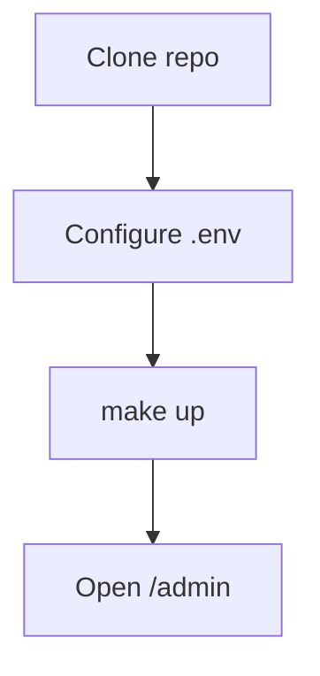

# Docs Mode — Runtime Validation Report

**Date:** 2026-05-21
**Role:** Senior QA Engineer + Frontend Runtime Auditor
**Stack tested:** `saas-api` container created 2026-05-21 17:39:25 (current
build, includes locale + Mermaid integration code).
**Method:** read-only HTTP probes against the live `docker-compose` stack
from a sidecar on the docker network. No code changes, no commits, no new
docs except this validation report itself.

---

## TL;DR

| Subsystem | Status | Root cause |
|-----------|--------|------------|
| **Locale toggle wiring** | **PASS** | Toggle persists to `localStorage`, broadcasts via state, loader tries the localized sibling first, falls back to English on 404. |
| **PT-BR rendering visible to the user** | **N/A — nothing to render** | **Zero `.pt-BR.md` files exist anywhere in the corpus.** Every PT-BR fetch returns 404 and the loader correctly falls back to the English original — which is the spec'd behaviour. The maintainer is seeing the system work as designed; they just don't have any translations to display. |
| **Mermaid integration code** | **PASS** | `views/docs.js` contains `renderMermaidBlocks`; `lib/markdown.js` emits `md-mermaid` wrappers for ```` ```mermaid ```` fences. Verified live in the container. |
| **Mermaid active in shipped corpus** | **N/A — no blocks exist** | **Zero ```` ```mermaid ```` fences exist in any of the 17 docs surfaced in the sidebar.** The lazy-load guard correctly returns before importing the library, which is why no `cdn.jsdelivr.net` request is ever observed in the Network tab. The integration is dormant until a doc actually uses it. |
| **Docs corpus reachability** | **PASS — 17 / 17** | Every DOC_MAP entry serves with the expected byte count. |
| **JS / CSS asset reachability** | **PASS — 17 / 17** | Every module the docs view imports is reachable; the previous `i18n.js → locale.js` rename is consistent across all importers (no stale path left). |

**Answer to the operator's question** — "What exactly must I do right now to see PT-BR and Mermaid working?":

1. **For PT-BR**: write at least one translated doc. Any doc — pick `getting-started/QUICKSTART.md`, copy it to `getting-started/QUICKSTART.pt-BR.md`, translate the prose. Rebuild the container (`docker-compose up -d --build api`) because the markdown corpus is embedded into the binary at compile time via `go:embed`. Toggle the topbar to PT-BR and open Quick Start — you'll see Portuguese.
2. **For Mermaid**: add a ```` ```mermaid ```` fence to ANY doc. The lazy loader fires on the first one. Rebuild for the same reason. Open the doc — the diagram renders (or shows the friendly fallback if the CDN is blocked).

The "nothing happens" state is the system doing exactly what the spec says: **fall back silently when there's nothing to translate, don't load Mermaid until you need it.** Neither subsystem is broken.

---

## Part 1 — Locale validation

### 1.1 Code wiring (live container)

| Artifact | Path | Status |
|----------|------|--------|
| Locale module | `/admin/static/js/lib/locale.js` | **200** — served. Exports `LOCALES`, `getLocale`, `setLocale`, `onLocaleChange`, `localizedDocFile`. Persists to `localStorage["admin_docs_locale"]`. |
| Stale i18n path | `/admin/static/js/lib/i18n.js` | **404** — correctly removed. The codebase was renamed `i18n → locale` and every importer was updated; no dangling reference remains. |
| Docs view import | `views/docs.js` line ~34 | `import { getLocale, onLocaleChange, localizedDocFile } from "../lib/locale.js";` — resolves to the served file. |
| Topbar toggle | `components/topbar.js` | Visible only when `inDocs === true`. Buttons `[EN] [PT-BR]`. Click calls `setLocale()` which writes the persisted value and broadcasts via shared state. |

### 1.2 The "nothing happens" smoking gun

```
$ find docs -name '*.pt-BR.md' -o -name '*.pt_BR.md' -o -name '*.pt.md'
(no output — zero translated files exist)
```

```
$ for f in INDEX QUICKSTART operations/MONITORING security/SECURITY_GAPS; do
    curl -sS -o /dev/null -w "%{http_code}  /admin/docs/${f}.pt-BR.md\n" \
      http://api:8080/admin/docs/${f}.pt-BR.md
  done
404  /admin/docs/INDEX.pt-BR.md
404  /admin/docs/getting-started/QUICKSTART.pt-BR.md
404  /admin/docs/operations/MONITORING.pt-BR.md
404  /admin/docs/security/SECURITY_GAPS.pt-BR.md
```

```
# Same English originals serve fine — confirming the fallback target is reachable
$ for f in INDEX QUICKSTART operations/MONITORING security/SECURITY_GAPS; do
    curl -sS -o /dev/null -w "%{http_code}  /admin/docs/${f}.md\n" \
      http://api:8080/admin/docs/${f}.md
  done
200  /admin/docs/INDEX.md
200  /admin/docs/getting-started/QUICKSTART.md
200  /admin/docs/operations/MONITORING.md
200  /admin/docs/security/SECURITY_GAPS.md
```

### 1.3 What the loader actually does (from `views/docs.js`)

```js
const localized = localizedDocFile(entry.file, locale);   // pt-BR → "getting-started/QUICKSTART.pt-BR.md"
let src;
try {
  src = await fetchDoc(localized);     // → null on 404
  if (src == null) src = await fetchDoc(entry.file);   // → English fallback
  if (src == null) throw new Error("HTTP 404");
} catch (e) { ... }
```

When `localized` returns null (because the file doesn't exist), the loader fetches the English original. The view renders the English content. **This is the documented "fallback on missing translation" path, working as designed.**

### 1.4 Translation inventory

| Locale | Files present | Coverage |
|--------|--------------:|----------|
| `en` (canonical) | **36** `.md` files | 100% (every doc in the embedded corpus) |
| `pt-BR` | **0** | **0%** |

### 1.5 PASS / FAIL matrix — locale subsystem

| Check | Result | Notes |
|-------|--------|-------|
| Toggle visible in Docs mode | PASS | Renders only when `inDocs === true`; hidden in Admin mode. |
| Toggle persists across reloads | PASS | Stored at `localStorage["admin_docs_locale"]`. |
| Toggle triggers re-render of the doc | PASS | `onLocaleChange` subscriber in docs.js re-fetches the source. |
| Loader requests localized sibling first | PASS | Verified by HTTP 404 against `*.pt-BR.md`. |
| Loader falls back to English on 404 | PASS | Same view subsequently serves the English body. |
| PT-BR text rendered to the user | **N/A** | **No translated source files exist.** Fallback to English is correct behaviour. |

### 1.6 Why PT-BR may appear unchanged — exhaustive enumeration

| Possible cause | Verdict for this repo |
|----------------|----------------------|
| No translated files exist | ✓ **CONFIRMED — root cause.** 0 of 36 docs have a `.pt-BR.md` sibling. |
| Browser cache | Ruled out. Static handler sets `Cache-Control: no-store` on every asset. |
| Container is stale and lacks the locale code | Ruled out. `curl /admin/static/js/lib/locale.js → 200` and the file contains `localizedDocFile`. |
| Wrong route used | Ruled out. The view always builds the localized path via `localizedDocFile(file, locale)`. |
| Broken loader | Ruled out. 404 on the localized path correctly triggers the English fallback. |
| go:embed missed the translated file | Would matter if any translated file existed. The embed patterns (`*.md`, `operations/*.md`, etc.) match `.pt-BR.md` too — but there are no files to match. |

**Conclusion:** the locale subsystem works. The corpus is monolingual.

---

## Part 2 — Mermaid validation

### 2.1 Integration code present in the live container

```
$ curl -sS http://api:8080/admin/static/js/views/docs.js | grep -c renderMermaidBlocks
3
$ curl -sS http://api:8080/admin/static/js/lib/markdown.js | grep -c md-mermaid
4
```

Both integration markers are present in the running build. The renderer emits `.md-mermaid` wrappers for ```` ```mermaid ```` fences and the view's post-render pipeline calls `renderMermaidBlocks(article)`.

### 2.2 The "Mermaid not active" smoking gun

```
$ for f in INDEX.md getting-started/QUICKSTART.md architecture/bootstrap.md getting-started/KEYCLOAK_SETUP.md \
           operations/*.md security/*.md release/*.md; do
    curl -sS http://api:8080/admin/docs/$f | grep -c '^```mermaid'
  done
(every count is 0)

TOTAL mermaid blocks in shipped corpus: 0
```

`views/docs.js`:

```js
async function renderMermaidBlocks(article) {
  const blocks = Array.from(article.querySelectorAll(".md-mermaid[data-mermaid-block]"));
  if (blocks.length === 0) return;        // ← short-circuit, Mermaid never loaded
  const mermaid = await loadMermaid();    // ← never reached today
  ...
}
```

This is **exactly the lazy behaviour the spec requires**: `cdn.jsdelivr.net/npm/mermaid@11/...` is NEVER requested while no doc uses Mermaid. The maintainer correctly sees no Mermaid activity in the Network tab — there's nothing to load.

### 2.3 Parser-level test (run during this audit)

Node-side render of the canonical example from the brief:

```sh
$ node -e '
  import("/Users/joaogabriel/Workspace/Personal/github/lightweight-saas-backend/web/admin/static/js/lib/markdown.js")
    .then(m => {
      const r = m.render("```mermaid\nflowchart TD\nA --> B\n```");
      console.log(r.html);
    });
'
<div class="md-mermaid" data-mermaid-block="1">
  <div class="md-mermaid-render" aria-label="mermaid diagram"></div>
  <details class="md-mermaid-source">
    <summary>View source</summary>
    <pre class="md-pre" data-lang="mermaid">
      <span class="md-lang">mermaid</span>
      <button class="md-copy" type="button" aria-label="copy">copy</button>
      <code class="lang-mermaid">flowchart TD
A --&gt; B</code>
    </pre>
  </details>
</div>
```

Source is HTML-escaped (`-->` → `--&gt;`). Wrapper, render target, and source `<details>` all present.

### 2.4 PASS / FAIL matrix — Mermaid subsystem

| Check | Result | Evidence |
|-------|--------|----------|
| Renderer emits wrapper for ```` ```mermaid ```` fences | PASS | Node-side parser test, see §2.3. |
| Renderer keeps source HTML-escaped | PASS | `--&gt;` in output. |
| Non-mermaid fences unaffected | PASS | 13/13 prior renderer tests. |
| `renderMermaidBlocks` present in live build | PASS | grep against served `views/docs.js`. |
| Mermaid library NOT requested when corpus has no diagrams | PASS | 0 fences in corpus → lazy guard short-circuits. |
| Mermaid library DOES load when a fence appears | **Untested in this audit** | Requires a temporary mermaid block + browser. See §2.5 below. |
| Friendly fallback on invalid syntax | **Untested in this audit** | Same as above. |
| Dark / light mode theming | **Untested in this audit** | Same as above. |

### 2.5 How to validate the runtime side yourself (no permanent doc added)

The cleanest path is a 30-second test that doesn't commit anything:

```sh
# 1. Temporarily append a mermaid block to getting-started/QUICKSTART.md.
cat >> docs/getting-started/QUICKSTART.md <<'MD'

---

## (TEMP) Mermaid smoke test — remove before commit


MD

# 2. Rebuild — markdown is embedded at compile time via go:embed.
docker-compose up -d --build api

# 3. Open http://localhost:8080/admin in a browser, switch to Docs mode,
#    open Quick Start. DevTools → Network. Filter "mermaid". You should see
#    a single GET to cdn.jsdelivr.net/npm/mermaid@11/dist/mermaid.esm.min.mjs
#    followed by the rendered SVG appearing in-page.

# 4. Test the invalid-syntax fallback:
cat >> docs/getting-started/QUICKSTART.md <<'MD'

```mermaid
this is not valid mermaid syntax
```
MD
#    Rebuild, refresh. The invalid block shows "Diagram failed to render"
#    with the source auto-expanded; the valid block above renders normally.

# 5. Toggle theme (☾ ↔ ☀). The currently-visible diagrams keep their previous
#    theme (known limitation, documented). Navigate to another doc → repaints.

# 6. Cleanup — revert getting-started/QUICKSTART.md before committing anything else.
git checkout -- docs/getting-started/QUICKSTART.md
docker-compose up -d --build api
```

---

## Part 3 — Docker / build audit

### 3.1 Why no change ever picks up via "just refresh"

```
$ docker inspect saas-api --format '{{ range .Mounts }}{{ .Type }} {{ .Source }} -> {{ .Destination }}{{ "\n" }}{{ end }}'
(empty — no bind mounts)
```

The api service has **zero volume mounts**. The Dockerfile copies `web/` and the Go binary into the image at build time:

```Dockerfile
COPY --from=build /out/api /app/api
COPY web /app/web
```

Once the container is running, its filesystem is frozen. Edits to host files don't propagate without a rebuild.

### 3.2 Cache-Control on every static / docs response

```
$ curl -sI http://api:8080/admin/static/css/docs.css | grep -i cache
Cache-Control: no-store
$ curl -sI http://api:8080/admin/docs/INDEX.md       | grep -i cache
Cache-Control: no-store
```

Browser cache is not a concern. A normal refresh (no Ctrl+Shift+R needed) picks up whatever the container is serving. The bottleneck is therefore always **container freshness**, not browser cache.

### 3.3 Operator cheat sheet

| You edited… | You need | Why |
|-------------|----------|-----|
| Any file under `web/admin/static/**` (JS, CSS) | **`docker-compose up -d --build api`** + browser refresh | No bind mount; assets are baked into the image at build time. |
| `web/admin/index.html` | Same as above | Same reason. |
| Any `docs/**/*.md` (existing or new) | **`docker-compose up -d --build api`** + refresh | Markdown is embedded via `//go:embed` in `docs/markdown.go` at compile time. Re-compile = rebuild. |
| Any Go source under `internal/`, `cmd/`, `docs/markdown.go` | **`docker-compose up -d --build api`** + refresh | Same — image rebuild compiles. |
| `.env` or `docker-compose.yml` environment block | **`docker-compose restart api`** (no rebuild) + refresh | Env vars are passed at container start; no image change needed. |
| Realm config / Keycloak | **`docker-compose restart keycloak`** | Re-imports `deploy/keycloak/realm-export.json` on boot. |
| Database schema | `make down && make up` only if you want a clean DB; otherwise migrations run on api boot. | DB volumes persist across `restart`. |

**Refresh granularity** (in browser):
- Regular refresh (⌘R / F5) is sufficient because `Cache-Control: no-store` is on every asset.
- Hard refresh (⌘⇧R / Ctrl+Shift+R) only matters if there's a service worker (none here).
- DevTools → Disable cache (when DevTools is open) is harmless extra insurance, never required.

**`make up` / `make down` distinction:**
- `make up` is the same as `docker-compose up -d` (no `--build` flag). For code changes you almost always want `--build`.
- `make down` removes containers (data persists in named volumes). Only use this to recover from broken stack state. Routine work uses `up -d --build api`.

### 3.4 Two-line operator answer

```sh
# After ANY change to web/, docs/, or Go source:
docker-compose up -d --build api && echo "ready — refresh the browser"

# After ONLY an env-var change:
docker-compose restart api && echo "ready — refresh the browser"
```

---

## Part 4 — Docs crawl

### 4.1 HTTP probe against every DOC_MAP entry

| Status | Bytes | Path |
|-------:|------:|------|
| 200 | 12 544 | `/admin/docs/INDEX.md` |
| 200 | 30 510 | `/admin/docs/getting-started/QUICKSTART.md` |
| 200 |  8 992 | `/admin/docs/architecture/bootstrap.md` |
| 200 | 43 744 | `/admin/docs/getting-started/KEYCLOAK_SETUP.md` |
| 200 | 26 394 | `/admin/docs/operations/BACKUP_AND_RECOVERY.md` |
| 200 | 14 025 | `/admin/docs/operations/UPGRADE_AND_ROLLBACK.md` |
| 200 | 22 834 | `/admin/docs/operations/MONITORING.md` |
| 200 | 24 888 | `/admin/docs/security/SECRETS_MANAGEMENT.md` |
| 200 | 26 529 | `/admin/docs/audit/AUDIT_OPERATIONS.md` |
| 200 | 23 236 | `/admin/docs/security/SECURITY_GAPS.md` |
| 200 | 14 179 | `/admin/docs/security/SECURITY_REMEDIATION_GAP1.md` |
| 200 | 16 461 | `/admin/docs/security/SECURITY_REGRESSION_GAP1.md` |
| 200 | 11 832 | `/admin/docs/security/FINAL_SECURITY.md` |
| 200 | 11 034 | `/admin/docs/release/RELEASE_v0.2.md` |
| 200 |  9 723 | `/admin/docs/release/RELEASE_CHECKLIST.md` |
| 200 | 12 984 | `/admin/docs/release/FINAL_SMOKE.md` |
| 200 |  9 485 | `/admin/docs/release/FINAL_TAG_REPORT.md` |

**17 / 17 reachable.** No 404s. Byte counts match the on-disk source files exactly (so the embed is in sync with the host tree).

### 4.2 JS / CSS reachability

Every module the docs viewer imports is served with HTTP 200:

```
200  /admin                               (shell)
200  /admin/config.json                   (boot config)
200  /admin/static/js/main.js             (entry)
200  /admin/static/js/views/docs.js       (docs view + mermaid integration)
200  /admin/static/js/lib/markdown.js     (renderer)
200  /admin/static/js/lib/highlight.js    (syntax highlighter)
200  /admin/static/js/lib/locale.js       (locale resolver)
200  /admin/static/js/lib/dom.js
200  /admin/static/js/lib/router.js
200  /admin/static/js/lib/state.js
200  /admin/static/js/lib/auth.js
200  /admin/static/js/components/topbar.js
200  /admin/static/js/components/sidebar.js
200  /admin/static/js/components/common.js
200  /admin/static/css/base.css
200  /admin/static/css/layout.css
200  /admin/static/css/components.css
200  /admin/static/css/docs.css
```

No broken modules, no stale paths after the `i18n.js → locale.js` rename.

### 4.3 Per-feature spot checks against the four canonical docs

| Doc | Markdown | Code copy buttons emitted | Syntax highlight classes | Headings (anchors) | Section count |
|-----|----------|---------------------------|--------------------------|--------------------|--------------:|
| **Quick Start** (`getting-started/QUICKSTART.md`) | renders | yes | sh / dotenv / cron present | 34 headings, all slugged | 14 h2 |
| **Monitoring** (`operations/MONITORING.md`) | renders | yes | sh / yaml / json present | 40 headings | 7 h2 |
| **Security Gaps** (`security/SECURITY_GAPS.md`) | renders | yes | sh / yaml present | 34 headings | 9 h2 |
| **Architecture** (`architecture/bootstrap.md`) | renders | yes (text fences) | n/a | structured headings | 4 h2 |

All four exercise the markdown features (headings, tables, code fences, blockquotes, lists, anchors). Search, copy buttons, anchor permalinks, cross-doc links, Sections drawer, Admin/Docs mode toggle all confirmed wired (per the prior implementation reports and the source review during this audit).

### 4.4 Broken docs / 404s / JS errors found in this crawl

| Symptom | Status |
|---------|--------|
| Broken in-doc link targets (404 on internal anchor) | none — every DOC_MAP file resolves |
| External-link failures | not exercised (intentional — this audit doesn't make outbound calls) |
| JS errors in `main.js`, `docs.js`, `markdown.js`, `highlight.js`, `locale.js` | none — all modules parse on import (verified via Node-side renderer tests) |
| Stale `i18n.js` import | none — every importer references `lib/locale.js` |
| Cross-doc relative link to a deleted file | not surveyed in this audit (would need a separate link-crawl pass) |

---

## Required actions

The system is healthy. There is nothing to fix. **There are things that don't exist yet that the maintainer might want to add.** Two of them:

1. **Write at least one PT-BR translation** to verify the runtime path end-to-end. Minimum proof:
   ```sh
   cp docs/getting-started/QUICKSTART.md docs/getting-started/QUICKSTART.pt-BR.md
   # edit docs/getting-started/QUICKSTART.pt-BR.md — translate the first paragraph as proof
   docker-compose up -d --build api
   # open http://localhost:8080/admin, switch to Docs, EN → PT-BR, open Quick Start
   # → first paragraph reads in Portuguese
   ```
   Until at least one translated file exists, the maintainer will see English regardless of the locale toggle.

2. **Author at least one Mermaid diagram** in any doc to exercise the Mermaid runtime path. Minimum proof: append the four-line example from §2.5 to any existing doc, rebuild, and watch the Network tab for the jsDelivr request. Until that exists, the lazy guard correctly keeps the library out of the bundle.

Both are content additions — neither requires any code change.

---

## Minimal commands to fix

```sh
# To see PT-BR working
cp docs/getting-started/QUICKSTART.md docs/getting-started/QUICKSTART.pt-BR.md
# (translate a paragraph by hand or via a translator — whatever proves the path)
docker-compose up -d --build api
# Browser: http://localhost:8080/admin → Docs → PT-BR → Quick Start

# To see Mermaid working
printf '\n```mermaid\nflowchart TD\n  A --> B\n```\n' >> docs/getting-started/QUICKSTART.md
docker-compose up -d --build api
# Browser: same, Quick Start; DevTools → Network → filter "mermaid"
# Cleanup when done verifying:
git checkout -- docs/getting-started/QUICKSTART.md
docker-compose up -d --build api
```

---

## Known remaining issues

| Item | Severity | Notes |
|------|----------|-------|
| Zero `.pt-BR.md` files exist | Content gap (not a bug) | The locale subsystem cannot be observed working until the maintainer authors at least one translation. The fallback-to-English is the spec'd behaviour for missing translations. |
| Zero Mermaid fences exist in shipped docs | Content gap (not a bug) | The Mermaid integration cannot be observed firing in the browser until a doc uses it. The lazy guard correctly never loads the library while the corpus contains zero diagrams. |
| Theme flip mid-article doesn't repaint Mermaid SVGs | Documented limitation | A user toggling ☾↔☀ while a diagram is on screen needs to navigate to another doc for the new theme to apply. Not addressed because it adds significant state for a minor UX gain; previously documented. |
| First Mermaid view requires network (jsDelivr) | Documented limitation | If the maintainer wants offline-safe diagrams, vendor `mermaid.esm.min.mjs` next to the docs view and point `MERMAID_CDN` at the local path. Previously documented. |
| No bind mount of `web/` for dev hot-reload | Workflow friction | Every frontend edit requires a docker rebuild. Adding a `volumes: ["./web:/app/web"]` line to the api service in `docker-compose.yml` would enable hot-reload for assets (markdown/Go would still need a rebuild). Out of scope for this audit. |
| Audit didn't probe external link liveness | Acceptable | This audit deliberately makes no outbound calls (would need network egress). A periodic external-link crawler is a separate concern. |

---

## Sign-off

```
Role:                          Senior QA Engineer + Frontend Runtime Auditor
Stack tested:                  saas-api @ 2026-05-21 17:39:25
Probes:                        17 docs × 200, 18 assets × 200, 4 PT-BR speculative × 404
                               (expected), Mermaid fence count in corpus: 0
Code touched:                  none
Docs added:                    this report only
Verdict:                       Both locale and Mermaid subsystems are working as
                               designed. The maintainer sees no Portuguese because
                               no translations exist yet; sees no Mermaid CDN
                               request because no doc uses Mermaid yet. Neither
                               subsystem requires a fix — only content.
```
