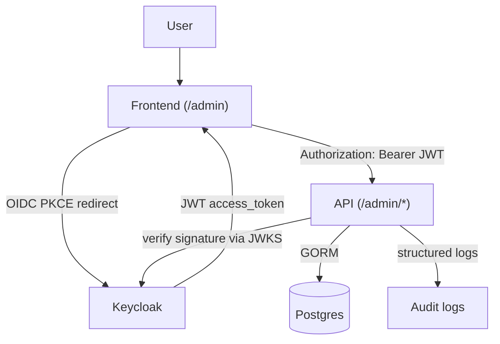

# Quick Start

> From `git clone` to a running stack with an authenticated admin call — under 10 minutes.
> Operational onboarding. Skip to [§9 Next steps](#9-next-steps) for deeper docs, or browse [`docs/INDEX.md`](../INDEX.md) for the full map.

---

## Table of contents

1. [What this project does](#1-what-this-project-does)
2. [Prerequisites](#2-prerequisites)
3. [Quick install](#3-quick-install)
4. [Day-one environment variables](#4-day-one-environment-variables)
5. [What each `make` does](#5-what-each-make-does)
6. [First login](#6-first-login)
7. [Daily flow](#7-daily-flow)
8. [Common problems](#8-common-problems)
9. [Next steps](#9-next-steps)
10. [How it works internally](#10-how-it-works-internally)

---

## 1. What this project does

A reusable Go backend with identity delegated to Keycloak (OIDC). Ships a `/admin/*` HTTP surface (users, roles, sessions, invitations), a static admin SPA at `/admin`, and a 5-container dev stack via `docker-compose`. No password handling in Go — Keycloak owns it. Current release: v0.2.0 "Identity Management".

---

## 2. Prerequisites

| Tool             | Required | Version     | Used for                       |
|------------------|----------|-------------|--------------------------------|
| Go               | yes      | 1.25+       | Building the API binary        |
| Docker           | yes      | 24+         | Running the stack              |
| docker compose   | yes      | v2 plugin   | `docker-compose.yml`           |
| Make             | yes      | GNU make    | Driving every workflow         |
| Git              | yes      | any         | Cloning + your own workflow    |
| curl + jq        | yes      | any         | `make auth-test` + smoke calls |

Verify in one command: `make doctor`. It probes every binary, checks Docker is running, inspects current stack state, and warns on port conflicts on `8080 / 8081 / 5432 / 5433 / 8025 / 1025`. Safe — reads only.

---

## 3. Quick install

| Command | What it does | Expected result |
|---------|--------------|-----------------|
| `git clone <your-fork-url> my-saas && cd my-saas` | Clone + cd into the working tree. | You are in `my-saas/`. |
| `make doctor` | Probes toolchain + Docker + port conflicts. | `OK` per row, no port conflicts. |
| `make init` | Interactive — writes `config/project.json` + `.env`. | Prompts answered; `.env` exists at repo root. |
| `make up` | Builds api image, pulls Keycloak, starts 5 containers. | ~60s on first run (~10s after). `docker ps` shows 5 services healthy. |
| `make auth-test` | Acquires a token + calls `/me`. | HTTP 200 + JSON `{id, keycloak_sub, email, ...}`. |

If `make auth-test` returns 200, installation is done. Open `http://localhost:8080/admin` to enter the admin console.

---

## 4. Day-one environment variables

`.env` lives at repo root (gitignored), regenerated from `config/project.json`. Edit `project.json` for **non-secret** values. Edit `.env` directly for **secrets** — preserved across `make regen`.

| Variable | Used for | Example | Required? | Impact if wrong |
|---|---|---|---|---|
| `KEYCLOAK_URL` | Public Keycloak URL clients reach; API derives expected `iss` from it. | `http://localhost:8081` | yes | Every token rejected with `invalid issuer`. |
| `KEYCLOAK_REALM` | Realm the API trusts. | `saas` | yes | Token validation fails. |
| `KEYCLOAK_CLIENT_ID` | Primary OIDC client; matches `realm-export.json`. | `saas-backend` | yes | Login flows fail. |
| `KEYCLOAK_CLIENT_SECRET` | Confidential client secret. **Rotate before production.** | `saas-backend-secret` (DEV) | yes | Token exchange fails. |
| `KEYCLOAK_ALLOWED_CLIENT_IDS` | CSV whitelist matched against the `azp` claim. | `saas-backend,saas-dev-playground` | yes | Token rejected `azp ... is not in the allowed-client set`. |
| `DB_URL` | Postgres DSN. The api container overrides this to `postgres:5432` inside the docker network. | `localhost:5432` (host) | yes | API panics at boot. |
| `DEV_PLAYGROUND_ENABLED` | Mounts `/dev/auth` + the `/admin` console. | `true` (DEV) / `false` (PROD) | no | `/admin` and `/dev/auth` return 404 when `false`. |
| `KEYCLOAK_ADMIN_PASSWORD` | Bootstrap KC admin password. **Rotate before production.** | `admin` (DEV ONLY) | yes | Cannot access KC admin UI at `http://localhost:8081`. |

Full reference (every variable + every default): [`KEYCLOAK_SETUP.md §2`](KEYCLOAK_SETUP.md).

---

## 5. What each `make` does

| Command | Description | When to use | Dangerous? |
|---|---|---|---|
| `make doctor` | Probes toolchain + Docker + port conflicts. Reads only. | Before anything, or when something is off. | safe |
| `make init` | Interactive — writes `config/project.json` + `.env`. | First clone, or restructuring config. | safe |
| `make regen` | Non-interactive — regenerates `.env`, `realm-export.json`, JSON schema from `project.json`. | After editing `config/project.json`. | safe |
| `make up` | Builds api, starts the full 5-container stack. | Daily — start working. | safe (preserves volumes) |
| `make up-infra` | Starts everything **except** the API. | When iterating Go code locally with `go run ./cmd/api`. | safe |
| `make stop` | Pauses containers; resume with `make start`. | Pause without losing state. | safe |
| `make start` | Resumes from `make stop`. | After `make stop`. | safe |
| `make down` | Stops + removes containers; volumes survive. | Free RAM/CPU between sessions; data preserved. | safe |
| `make auth-test` | Gets a token + calls `/me`. Pure smoke. | Verify the stack is healthy end-to-end. | safe |
| `make test` / `test-race` / `test-cover` | Go unit tests (plain / `-race` / coverage). | Before commit. | safe |
| `make ci` | `fmt-check + vet + build + test + swagger-check`. | Mirror CI locally before pushing. | safe |
| `make logs` | Tails all service logs (Ctrl-C to exit). | Investigation. | safe |
| `make realm-reset` | Wipes Keycloak's DB; KC re-imports realm on next boot. | After editing realm-bound `project.json` fields. | ⚠ **destructive — KC users/sessions lost** |
| `make purge` | Wipes containers + volumes + network + api image + `bin/`. Prompts y/N. | Nuclear reset. | ⚠ **DATA LOSS** |
| `make reset-dev` | `purge` + rebuild + start. Prompts y/N. | Stack wedged beyond `make doctor`. | ⚠ **DATA LOSS** |

---

## 6. First login

Two users are seeded by the realm import:

| Username    | Password   | Realm roles      |
|-------------|------------|------------------|
| `testuser`  | `password` | `user`           |
| `adminuser` | `password` | `admin`, `user`  |

`adminuser` is your first admin — no extra step.

**Test via curl:**

```bash
TOKEN=$(curl -fsS -X POST http://localhost:8081/realms/saas/protocol/openid-connect/token \
  -d 'client_id=saas-backend' -d 'client_secret=saas-backend-secret' \
  -d 'grant_type=password' -d 'username=adminuser' -d 'password=password' \
  | jq -r .access_token)

curl -fsS http://localhost:8080/admin/users -H "Authorization: Bearer $TOKEN" | jq
```

Expected: HTTP 200 + paged user list.

**Or via the admin console UI:** open `http://localhost:8080/admin` → Sign in (Playground) as `adminuser/password` → Users → full CRUD available.

**Promote another user to admin:** via this API (`Users → click user → Roles → assign admin`) or via Keycloak's own admin UI at `http://localhost:8081 → realm "saas" → Users → pick user → Role mapping → Assign role → admin`.

---

## 7. Daily flow

**Standard loop** — full stack in Docker:

```bash
make up           # idempotent; rebuilds api image, restarts api container
make logs         # tail everything; Ctrl-C to exit
# ... edit code ...
make up           # apply changes
make auth-test    # smoke
```

**Faster Go iteration** — API on host, infra in Docker:

```bash
make up-infra                  # postgres + keycloak + mailpit
go run ./cmd/api               # API on the host, instant edit-reload
```

In this mode `.env`'s `DB_URL` points at `localhost:5432` (the host port binding), so no compose override is needed.

**Common verification calls** (with `$TOKEN` from §6):

| Endpoint | Use |
|----------|-----|
| `GET /health` | Liveness probe (no auth, no DB ping). |
| `GET /me` | Your local user row (JIT-created on first protected call). |
| `GET /auth/debug` | What the API sees in your token. **DEV-only** (gated by `DEV_PLAYGROUND_ENABLED`). |
| `GET /admin/users` | Admin list users. |
| `GET /swagger/index.html` | Interactive API spec. |

---

## 8. Common problems

| Error | Likely cause | How to fix |
|---|---|---|
| `make up` exits — port already in use | Something else on `8080/8081/5432/5433/8025/1025`. | `make doctor` reports which port. Stop the conflicting process. |
| API logs `invalid issuer` | Token's `iss` ≠ API's `KEYCLOAK_URL`. | Set `KEYCLOAK_URL` to what **clients** type in a browser. Restart api. |
| API logs `azp 'xyz' is not in the allowed-client set` | Token's client not whitelisted. | Add `xyz` to `KEYCLOAK_ALLOWED_CLIENT_IDS`. Restart api. |
| API logs `failed to fetch JWKS` | API can't reach KC. | In Docker, `KEYCLOAK_JWKS_URL` must point at `http://keycloak:8080/...`. `make logs`. |
| `make auth-test` → 401 `invalid_grant` | Wrong password, or Direct Access Grants disabled on `saas-backend`. | Check `.env.SEED_USER_PASSWORD`; KC admin → `saas-backend` → enable Direct Access Grants. |
| `/admin/*` returns 403 with a valid token | User lacks the `admin` realm role. | KC admin → user → Role mapping → assign `admin`. |
| Realm changes in `project.json` don't take effect | KC only imports on **first** boot of a fresh DB. | `make realm-reset` (wipes KC DB, re-imports). |
| Token validates but `/me` returns 500 | DB unreachable or migration failed. | `make logs` → GORM errors. `make reset-dev` clears DB if you can afford to. |
| Stack is "wedged" | Stale KC realm + JWKS + corrupt volume. | `make reset-dev` (prompts y/N first). |

Long-tail: [`KEYCLOAK_SETUP.md §9`](KEYCLOAK_SETUP.md).

---

## 9. Next steps

| Topic | Doc |
|-------|-----|
| Full Keycloak setup, env-var reference, prod hardening | [`getting-started/KEYCLOAK_SETUP.md`](KEYCLOAK_SETUP.md) |
| Bootstrap design — config-as-source-of-truth, `make regen` mechanics | [`architecture/bootstrap.md`](../architecture/bootstrap.md) |
| Operator runbook: backup, restore, disaster recovery | [`operations/BACKUP_AND_RECOVERY.md`](../operations/BACKUP_AND_RECOVERY.md) |
| Monitoring + alerting + log shapes | [`operations/MONITORING.md`](../operations/MONITORING.md) |
| Upgrade and rollback procedures | [`operations/UPGRADE_AND_ROLLBACK.md`](../operations/UPGRADE_AND_ROLLBACK.md) |
| Audit subsystem — events, wiring, "who did what" runbook | [`audit/AUDIT_OPERATIONS.md`](../audit/AUDIT_OPERATIONS.md) |
| Production secrets management + rotation | [`security/SECRETS_MANAGEMENT.md`](../security/SECRETS_MANAGEMENT.md) |
| Active security gaps + threat model | [`security/SECURITY_GAPS.md`](../security/SECURITY_GAPS.md) |
| Release notes for v0.2.0 | [`release/RELEASE_v0.2.md`](../release/RELEASE_v0.2.md) |
| Full document map | [`INDEX.md`](../INDEX.md) |

---

## 10. How it works internally



**Two identity concepts, one boundary.** Keycloak owns auth identity (`sub`, opaque UUID); your API owns business identity (`users.id`, uint). They link via `users.keycloak_sub` (unique-indexed). On the first protected request for a given `sub`, the API JIT-creates the local row; subsequent requests return the same `users.id`. Foreign keys stay stable forever.

**Source of truth.** `config/project.json` regenerates `.env`, `realm-export.json`, and the JSON schema via `make regen`. Keycloak re-imports the realm on first boot of a fresh DB. No business code in the Go API ever sees a password — the API verifies JWT signatures via JWKS and trusts the claims.

Full design + regeneration mechanics: [`architecture/bootstrap.md`](../architecture/bootstrap.md).
