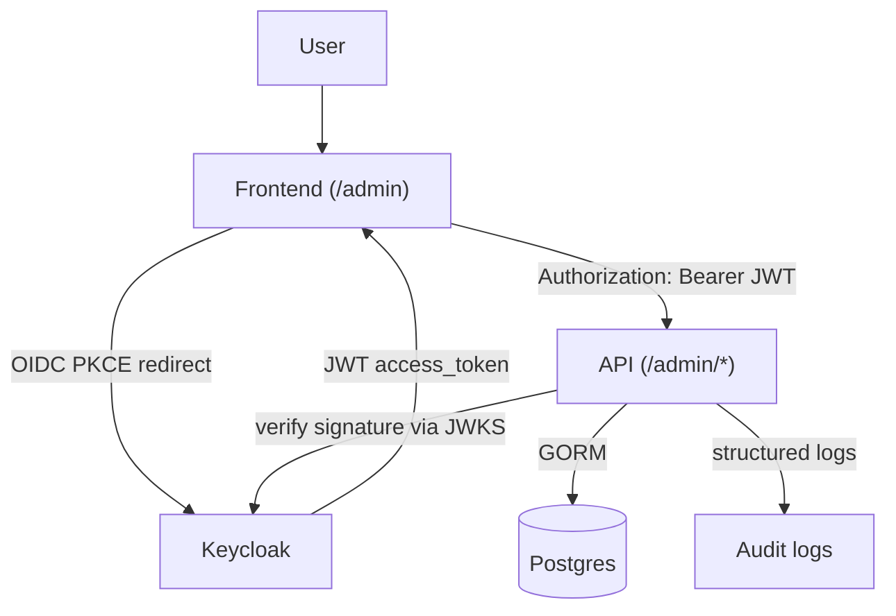

# Quick Start

> **Audience:** engineers cloning this repository to use it as the base for their own SaaS product. Goal: from zero to a running stack, a token in your terminal, and an authenticated admin call against `/admin/users` — in ~10 minutes.
>
> Linear path. For depth, follow the cross-links into [`KEYCLOAK_SETUP.md`](KEYCLOAK_SETUP.md), [`architecture/bootstrap.md`](../architecture/bootstrap.md), and the rest of [`INDEX.md`](../INDEX.md).

---

## Table of contents

1. [What this project is](#1-what-this-project-is)
2. [Architecture](#2-architecture)
3. [Requirements](#3-requirements)
4. [Installation](#4-installation)
5. [Environment variables](#5-environment-variables)
6. [Docker](#6-docker)
7. [Keycloak](#7-keycloak)
8. [Bootstrap](#8-bootstrap)
9. [First admin](#9-first-admin)
10. [Running locally](#10-running-locally)
11. [Deploying to a VPS](#11-deploying-to-a-vps)
12. [Integrating another frontend](#12-integrating-another-frontend)
13. [Troubleshooting](#13-troubleshooting)
14. [Security notes](#14-security-notes)

---

## 1. What this project is

Reusable Go backend foundation for SaaS-style products with **identity delegated to Keycloak** (or any future OIDC provider — see [`KEYCLOAK_SETUP.md §1`](KEYCLOAK_SETUP.md#1-overview)).

**In the box:** Go 1.25 + Gin API · PostgreSQL 15 (app + KC) · Keycloak 26 (realm/client/roles/seed users imported from [`deploy/keycloak/realm-export.json`](../../deploy/keycloak/realm-export.json)) · Mailpit dev SMTP (UI at `http://localhost:8025`) · admin-only `/admin/*` HTTP surface wrapping the KC Admin API · static SPA admin console at `http://localhost:8080/admin` (dev-gated) · `make init` / `make regen` bootstrap that keeps `.env`, the realm export, and the JSON schema in lockstep with [`config/project.json`](../../config/project.json).

**Out of the box (by design):** no `/login` or `/register` — Keycloak owns identity. No password handling, MFA, bcrypt, password-reset plumbing in Go. No multi-tenancy primitives wired yet (`multi_tenant` flag reserved for future).

**Who this is for:** you want an OIDC-backed Go API today, with an admin plane and sane local-dev story, that you can clone, rename, and grow into your product. Not a turnkey hosted IAM — a starter kit you own end-to-end.

---

## 2. Architecture

Request flow:



**Two identity concepts, one boundary:**

| Concept           | Owned by | Identifier            | Lives in                |
|-------------------|----------|-----------------------|-------------------------|
| Auth identity     | Keycloak | `sub` (UUID, opaque)  | Keycloak's realm DB     |
| Business identity | Your API | `users.id` (uint)     | `users` table (app DB)  |

The link is one column: `users.keycloak_sub` (unique-indexed). On the first protected request for a given `sub`, the API JIT-creates the local row. Subsequent requests return the same `users.id` — your foreign keys stay stable forever.

Full diagram + rationale: [`KEYCLOAK_SETUP.md §1`](KEYCLOAK_SETUP.md#1-overview).

---

## 3. Requirements

| Tool            | Version    | Used for                       |
|-----------------|------------|--------------------------------|
| Go              | 1.25+      | Building the API binary        |
| Docker          | 24+        | Running the stack              |
| docker compose  | v2 plugin  | `docker-compose.yml`           |
| curl, jq        | any        | `make auth-test`, smoke tests  |
| make            | GNU make   | Driving everything             |
| git             | any        | Cloning + your workflow        |

Verify in one command:

```bash
make doctor
```

Probes every binary, checks Docker is running, inspects current stack state, warns on port conflicts (8080, 8081, 5432, 5433, 1025, 8025). Doesn't start anything; safe to run anytime.

---

## 4. Installation

```bash
git clone <your-fork-url> my-saas-backend
cd my-saas-backend
make doctor                # verify toolchain
make init                  # interactive — writes config/project.json + .env
make up                    # build api, pull keycloak, start the stack
```

`make up` takes ~60s on first run (image pulls + KC realm import). Subsequent boots ~10s.

**Verify it worked:**

```bash
make auth-test
```

Expected: a token acquired from KC via password grant against seeded `testuser`, then `GET /me` returns:

```json
{
  "id": 1,
  "keycloak_sub": "fbe56e3a-3bd2-4ed3-8ff1-37c655f3fbdc",
  "email": "testuser@test.com",
  "username": "testuser",
  "created_at": "2026-05-21T08:14:48Z",
  "updated_at": "2026-05-21T08:14:48Z"
}
```

If 200, installation done. Open `http://localhost:8080/admin` for the admin console.

If something failed, jump to [§13 Troubleshooting](#13-troubleshooting) or re-run `make doctor` (prints next steps for common failures).

---

## 5. Environment variables

Configuration lives in `.env` (gitignored), regenerated from [`config/project.json`](../../config/project.json) by `make init` / `make regen`.

Edit `config/project.json` for **non-secret** project description (name, realm, client id, ports, seed users). Edit `.env` directly for **secrets** (`KEYCLOAK_CLIENT_SECRET`, `KEYCLOAK_ADMIN_PASSWORD`, `SEED_USER_PASSWORD`) — preserved across regenerations.

**Minimum to understand on day one:**

| Variable                  | What it controls                                                | Default                       |
|---------------------------|-----------------------------------------------------------------|-------------------------------|
| `KEYCLOAK_URL`            | Public-facing KC URL — drives expected token `iss`              | `http://localhost:8081`       |
| `KEYCLOAK_REALM`          | Realm name the API trusts                                       | `saas`                        |
| `KEYCLOAK_CLIENT_ID`      | Primary OIDC client; matches `realm-export.json`                | `saas-backend`                |
| `KEYCLOAK_CLIENT_SECRET`  | Confidential client secret. **Rotate before production.**       | `saas-backend-secret` (DEV)   |
| `KEYCLOAK_ALLOWED_CLIENT_IDS` | Comma-separated whitelist matched against `azp` claim       | `saas-backend,saas-dev-playground` |
| `DB_URL`                  | Postgres DSN; in docker net, api uses `postgres:5432`           | `localhost:5432` (host)       |
| `DEV_PLAYGROUND_ENABLED`  | Mounts `/dev/auth` playground and the `/admin` console          | `true` (local) / `false` (prod) |
| `KEYCLOAK_ADMIN_PASSWORD` | Bootstrap KC admin password. **Rotate before production.**      | `admin` (DEV ONLY)            |

Full reference: [`KEYCLOAK_SETUP.md §2`](KEYCLOAK_SETUP.md#2-environment-variables).

> ⚠ `KEYCLOAK_URL` is the URL **clients** use. The API uses it to derive expected `iss`. If clients see `localhost:8081` but you set the API's `KEYCLOAK_URL=http://keycloak:8080`, every token is rejected `invalid issuer`. The shipped `docker-compose.yml` handles the split correctly.

---

## 6. Docker

Five containers, one compose file ([`docker-compose.yml`](../../docker-compose.yml)):

| Container                | Image                            | Host port      | Purpose                        |
|--------------------------|----------------------------------|----------------|--------------------------------|
| `saas-api`               | built from `./Dockerfile`        | `8080`         | Go API                         |
| `saas-postgres`          | `postgres:15-alpine`             | `5432`         | App DB (your business data)    |
| `saas-keycloak`          | `quay.io/keycloak/keycloak:26.0` | `8081`         | Identity provider              |
| `saas-keycloak-postgres` | `postgres:15-alpine`             | `5433`         | Keycloak's internal DB         |
| `saas-mailpit`           | `axllent/mailpit:v1.20`          | `8025`, `1025` | Dev SMTP catch-all + web UI    |

**Lifecycle commands** — pick by intent. Preservation spectrum:

| Command           | Effect                                                  | Data |
|-------------------|---------------------------------------------------------|------|
| `make up`         | Build + start full stack                                | preserves volumes |
| `make up-infra`   | Everything **except** the API (run Go on host)          | preserves volumes |
| `make stop`       | Pause containers; resume with `make start`              | preserves all |
| `make start`      | Resume from `make stop`                                 | preserves all |
| `make down`       | Stop + remove containers; volumes survive               | preserves data |
| `make purge`      | Wipe containers, volumes, network, api image, `bin/`    | **DATA LOSS** (prompts y/N) |
| `make reset-dev`  | One-shot: `purge` + rebuild + start                     | **DATA LOSS** (prompts y/N) |
| `make logs`       | Tail logs from all services                             | — |

When something breaks: `make doctor` first, then `make reset-dev` if nothing else helps. Full table: [`architecture/bootstrap.md`](../architecture/bootstrap.md#stack-lifecycle-commands).

**Mailpit:** open `http://localhost:8025` for every email KC sends (invitations, password resets, verify-email). The realm export points KC at `mailpit:1025` automatically.

---

## 7. Keycloak

**Admin UI:** `http://localhost:8081` · **Default admin:** `admin` / `admin` (rotate before prod — see [§14](#14-security-notes)).

**Auto-imported on first boot** from [`deploy/keycloak/realm-export.json`](../../deploy/keycloak/realm-export.json):

```
realm "saas"
├── clients
│   ├── saas-backend           (confidential — your API's client)
│   ├── saas-backend-admin     (service-account — used by /admin/*)
│   └── saas-dev-playground    (public + PKCE — for the dev playground)
├── realm roles
│   ├── admin                  (gates /admin/* in the API)
│   └── user                   (default role for new sign-ups)
├── seed users
│   ├── testuser  / password   → roles: [user]
│   └── adminuser / password   → roles: [admin, user]
└── SMTP server: mailpit:1025
```

**Where this comes from:** [`config/project.json`](../../config/project.json) is the source of truth. Edit → `make regen` → `realm-export.json` rebuilt. KC re-imports with `--import-realm`. Force a fresh import: `make realm-reset` (wipes KC's DB).

**Token flow** in plain terms:

```
client ───POST /realms/saas/protocol/openid-connect/token──► keycloak
client ◄─── access_token (JWT, RS256, signed by realm key) ─── keycloak
client ───GET /me  Authorization: Bearer <jwt>─────────────► api
api    ───fetches JWKS once, caches, refreshes on kid miss──► keycloak
api    ◄── 200 { id, keycloak_sub, email, ... } ────────── client
```

No business code in the Go API ever sees a password. The API only verifies signatures and trusts claims.

---

## 8. Bootstrap

`config/project.json` turns into:

```
config/project.json
        ├──► .env                              (gitignored)
        ├──► .env.example                      (committed, annotated)
        ├──► config/project.schema.json        (JSON Schema mirror)
        └──► deploy/keycloak/realm-export.json (committed)
```

```bash
make init      # interactive — prompts then regenerates
make regen     # non-interactive — uses current project.json
```

**Anti-patterns** to avoid (silently overwritten by `make regen`):

- Hand-editing `.env` for non-secret values — change `project.json` instead.
- Hand-editing `realm-export.json` — change `project.json` + regenerate.
- Hand-editing `.env.example` — it's generated.

**Worked example — renaming realm `saas` → `acme`:** edit `auth.realm` in `project.json`, `make regen`, `make realm-reset` (deletes old realm), `make up`, `make auth-test`.

Full design + customization: [`architecture/bootstrap.md`](../architecture/bootstrap.md).

---

## 9. First admin

After `make up`:

| Username    | Password   | Realm roles   |
|-------------|------------|---------------|
| `testuser`  | `password` | `user`        |
| `adminuser` | `password` | `admin, user` |

`adminuser` is your first admin — no extra step.

**Verify admin access:**

```bash
TOKEN=$(curl -fsS -X POST http://localhost:8081/realms/saas/protocol/openid-connect/token \
  -H "Content-Type: application/x-www-form-urlencoded" \
  -d 'client_id=saas-backend' -d 'client_secret=saas-backend-secret' \
  -d 'grant_type=password' -d 'username=adminuser' -d 'password=password' \
  | jq -r .access_token)

curl -fsS http://localhost:8080/admin/users -H "Authorization: Bearer $TOKEN" | jq
```

**Or via the admin console UI:** open `http://localhost:8080/admin` → Sign in (Playground) as `adminuser/password` → Users → full CRUD.

**Promote another user to admin:** either via this API (`Users → click user → Roles → assign admin`) or via Keycloak admin UI (`http://localhost:8081 → realm "saas" → Users → pick user → Role mapping → Assign role → admin`).

For a brand-new tenant with no admins yet, edit `config/project.json` to add the seed user, then `make regen && make realm-reset`.

---

## 10. Running locally

**Standard daily loop** — full stack in Docker:

```bash
make up           # bring stack up (idempotent)
make logs         # tail everything; Ctrl-C to exit
# ... edit code ...
make up           # rebuilds api image, restarts api container
make auth-test    # smoke test
```

**Faster Go dev loop** — API on host, infra in Docker:

```bash
make up-infra                                  # postgres + keycloak + mailpit
go run ./cmd/api                               # API on host, picks up edits instantly
```

In this mode `DB_URL` in `.env` points at `localhost:5432` (the host binding), so no compose override is needed.

**Common verification calls:**

```bash
curl -fsS http://localhost:8080/health                                                       # liveness
curl -fsS http://localhost:8080/me -H "Authorization: Bearer $TOKEN" | jq                    # your local user row
curl -fsS http://localhost:8080/auth/debug -H "Authorization: Bearer $TOKEN" | jq            # what API sees in token (DEV-ONLY)
curl -fsS http://localhost:8080/admin/users -H "Authorization: Bearer $TOKEN" | jq           # admin list
open http://localhost:8080/swagger/index.html                                                # interactive API spec
```

**Tests:**

```bash
make test          # all unit tests
make test-race     # with -race
make test-cover    # coverage report
make ci            # full CI gate: fmt-check + vet + build + test + swagger-check
```

---

## 11. Deploying to a VPS

This is the **floor**, not a blessed prod runbook. Full hardening checklist: [`KEYCLOAK_SETUP.md §10`](KEYCLOAK_SETUP.md#10-production-considerations).

**Minimum changes from dev defaults:**

1. **Rotate every dev secret** in your VPS secret store / `.env`: `KEYCLOAK_ADMIN_PASSWORD`, `KEYCLOAK_CLIENT_SECRET`, `KEYCLOAK_ADMIN_CLIENT_SECRET` (service account for `/admin/*`), `SEED_USER_PASSWORD` (and **remove seeded users entirely** — drop `seed_users` from `config/project.json`, regen, realm-reset before first prod boot), `POSTGRES_PASSWORD`, `KC_DB_PASSWORD`.

2. **Disable dev surfaces:** `DEV_PLAYGROUND_ENABLED=false` removes `/dev/auth` **and** the `/admin` console at the route level. The HTTP `/admin/*` API surface stays — gated only by `admin` realm role.

3. **Disable Direct Access Grants** on `saas-backend` in Keycloak (the password grant `make auth-test` uses). Browsers use Authorization Code + PKCE; servers use client credentials. Nothing legitimate needs DAG in production.

4. **Set `KEYCLOAK_URL` to your real hostname** (`KEYCLOAK_URL=https://auth.example.com`) and update `KEYCLOAK_ALLOWED_CLIENT_IDS` to drop `saas-dev-playground`.

5. **Run Keycloak in `start` mode** (not `start-dev`); pre-build image with `start --optimized`. Edit `docker-compose.yml` → `keycloak.command`. Set `KC_HOSTNAME=auth.example.com`, remove `KC_HOSTNAME_STRICT=false`.

6. **Terminate TLS in front.** Caddy example:
   ```
   api.example.com   { reverse_proxy localhost:8080 }
   auth.example.com  { reverse_proxy localhost:8081 }
   ```

7. **Backups.** Two postgres volumes (`postgres_data`, `keycloak_postgres_data`) hold everything. Snapshot via provider tooling, or `pg_dump` on a schedule. See [`operations/BACKUP_AND_RECOVERY.md`](../operations/BACKUP_AND_RECOVERY.md).

8. **Drop mailpit** (dev-only). Point KC's SMTP at a real provider (Postmark, SES, Resend) via the realm's SMTP config — or override in realm export and `make regen`.

9. **Resource limits.** Add `deploy.resources.limits` blocks per service. Keycloak 26 wants ≥ 1 GB RAM.

**What NOT to ship:** populated `seed_users[]` · `DEV_PLAYGROUND_ENABLED=true` · Direct Access Grants on `saas-backend` · the default `admin`/`admin` KC bootstrap · any `.env` value still matching dev defaults in [`.env.example`](../../.env.example).

---

## 12. Integrating another frontend

For a React / Vue / Svelte / native app calling this API:

**1. Register a new public client** in Keycloak with PKCE: `http://localhost:8081 → realm "saas" → Clients → Create client`.
   - Client ID: e.g. `my-spa-frontend`
   - Client authentication: **off** (public)
   - Valid redirect URIs: your SPA callback — e.g. `http://localhost:3000/auth/callback`
   - Web origins: `http://localhost:3000` (for CORS preflight on the KC side)
   - Standard flow: **on**, Direct access grants: **off**
   - Advanced → PKCE: `S256`

**2. Whitelist the new client id** so this API accepts its tokens:

```dotenv
# .env
KEYCLOAK_ALLOWED_CLIENT_IDS=saas-backend,saas-dev-playground,my-spa-frontend
```

Or more durably, set in `config/project.json` under `auth.allowed_client_ids` and `make regen`. The `azp` claim on every token must appear in this list — **no wildcard**.

**3. Implement PKCE in your frontend.** OIDC discovery at `http://localhost:8081/realms/saas/.well-known/openid-configuration`. Most libraries (`oidc-client-ts`, `keycloak-js`, `@auth0/auth0-spa-js` pointed at generic OIDC) handle PKCE automatically given Authority `http://localhost:8081/realms/saas`, your client ID, redirect URI, scope `openid profile email`.

**4. Call this API with the token:**

```js
const res = await fetch("http://localhost:8080/me", {
  headers: { Authorization: `Bearer ${accessToken}` },
});
```

**5. Cross-origin caveat.** **This repo does not ship CORS middleware on the Go API.** A SPA at `http://localhost:3000` calling the API at `http://localhost:8080` triggers a browser preflight that the API won't answer with `Access-Control-Allow-Origin`. Pick one:

- **Same-origin serving** — bundle your SPA into a path under the API itself (mirrors what the included `/admin` console does). No CORS needed.
- **Reverse proxy** — Caddy/nginx/Traefik routing both `/api/*` and `/` to the same public hostname. Same-origin from the browser.
- **Add CORS middleware to the API** — small change in [`internal/server/router.go`](../../internal/server/router.go); pick a gin-cors library, scope `AllowOrigins` to your SPA origins. Out of scope for this Quick Start — it's a code change.

The Keycloak side does need CORS configured (the "Web origins" field in step 1) so the token exchange from your SPA succeeds. That's a KC admin-UI setting, not a Go change.

**Reference implementations** in this repo:
- `/admin` console — full PKCE against `saas-dev-playground`, served same-origin: [`web/admin/static/js/lib/auth.js`](../../web/admin/static/js/lib/auth.js).
- Standalone dev playground at `/dev/auth` (same-origin): [`docs/ui/DEV_AUTH_PLAYGROUND.md`](../ui/DEV_AUTH_PLAYGROUND.md).

---

## 13. Troubleshooting

Top symptoms — pick yours, run the fix. Long tail: [`KEYCLOAK_SETUP.md §9`](KEYCLOAK_SETUP.md#9-troubleshooting).

| Symptom                                              | Likely cause                                            | Fix                                                                       |
|------------------------------------------------------|---------------------------------------------------------|---------------------------------------------------------------------------|
| `make up` exits — port already in use                | Something else on 8080/8081/5432/5433/8025/1025         | `make doctor` tells you which port; stop the conflicting process, retry   |
| API logs `invalid issuer`                            | Token's `iss` ≠ API's `KEYCLOAK_URL`                    | Set `KEYCLOAK_URL` to whatever **clients** type into a browser. Restart api |
| API logs `azp 'xyz' is not in the allowed-client set`| Token's client isn't whitelisted                        | Add `xyz` to `KEYCLOAK_ALLOWED_CLIENT_IDS` in `.env`. Restart api         |
| API logs `failed to fetch JWKS`                      | API can't reach KC (wrong URL or KC not ready)          | In Docker, `KEYCLOAK_JWKS_URL` must point at `http://keycloak:8080/...`. Check `make logs` |
| `make auth-test` → 401 `invalid_grant`               | Wrong username/password, or DAG disabled on the client  | Check `.env.SEED_USER_PASSWORD`. KC admin → `saas-backend` → enable Direct Access Grants (dev) |
| `/admin/*` returns 403 with a valid token            | User has no `admin` realm role                          | Promote: KC admin → user → Role mapping → assign `admin`. See [§9](#9-first-admin) |
| Realm changes in `project.json` don't take effect    | KC only imports on **first** boot of a fresh DB         | `make realm-reset` (wipes KC's DB and re-imports)                         |
| Token validates but `/me` returns 500                | DB unreachable or migration failed                      | `make logs` → look for GORM errors. `make reset-dev` clears DB if you can afford to lose data |
| Invitation/reset emails never arrive                 | Mailpit not reachable from Keycloak                     | `docker ps` shows mailpit healthy? Browse `http://localhost:8025`. Restart compose stack |
| Stack is "wedged" and nothing works                  | Stale KC realm + stale JWKS + corrupt volume            | `make reset-dev` (prompts y/N first — wipes everything, then rebuilds)    |
| Browser console: `CORS policy: No 'Access-Control-Allow-Origin'` calling `/me` from a separate-origin SPA | No CORS middleware wired | See [§12 step 5](#12-integrating-another-frontend) |

If `make doctor` is green and you're still stuck, capture `make logs > /tmp/logs.txt` and open an issue.

---

## 14. Security notes

These are **dev-only** defaults that ship so `make up` works out of the box. Every one needs attention before any non-local deployment:

- **`admin` / `admin` Keycloak bootstrap** — rotate `KEYCLOAK_ADMIN_PASSWORD`; ideally rename the user too.
- **`saas-backend-secret` client secret** — rotate `KEYCLOAK_CLIENT_SECRET` AND update value in KC admin UI (`Clients → saas-backend → Credentials → Regenerate`).
- **Direct Access Grants** enabled on `saas-backend` for `make auth-test` — disable in production.
- **Seeded users** (`testuser`, `adminuser` with password `password`) — drop from `config/project.json` before any prod regen + realm-reset.
- **`DEV_PLAYGROUND_ENABLED=true`** mounts `/dev/auth` and `/admin` console (both still token-gated, but shouldn't exist in production).
- **TLS** — dev stack is HTTP-only. Production must terminate TLS in front of both `:8080` (API) and `:8081` (Keycloak).
- **Keycloak `start-dev`** is the dev launcher — production wants `start --optimized` with a pre-built image and `KC_HOSTNAME` set.
- **Mailpit** catches all outgoing mail in dev — switch KC realm SMTP to a real provider before any user-visible email flow.
- **CORS** permissive in dev (`http://localhost:*`) — scope to real frontend origins in prod.
- **Service-account credentials** (`saas-backend-admin`, used by `/admin/*` to call KC Admin API) — rotate `KEYCLOAK_ADMIN_CLIENT_SECRET`.

**Existing security audit trail:** [`security/FINAL_SECURITY.md`](../security/FINAL_SECURITY.md) synthesizes 23 black-box guard probes and 4 documented gaps (one fixed, three open with stated severities). Read before convincing yourself the auth layer is "done."

**Full prod checklist:** [`KEYCLOAK_SETUP.md §10`](KEYCLOAK_SETUP.md#10-production-considerations).

---

## Next steps

- Re-read [`README.md`](../../README.md) — now that you have context, the layout and lifecycle tables make sense.
- Browse the API in Swagger: `http://localhost:8080/swagger/index.html`.
- Admin surface deep-dive: [`release/RELEASE_v0.2.md §2.1`](../release/RELEASE_v0.2.md).
- Known gaps + post-tag hardening backlog: [`roadmap/HARDENING_REPORT.md`](../roadmap/HARDENING_REPORT.md).
- Per-document map of this repo: [`INDEX.md`](../INDEX.md).

Welcome aboard.
