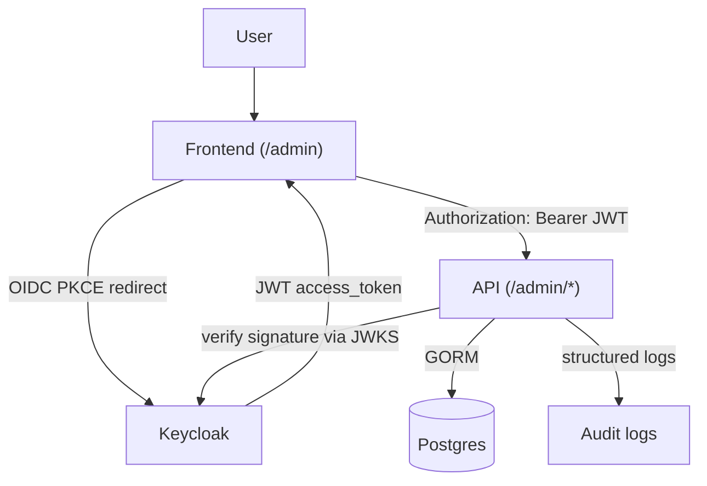

# Quick Start

> Do `git clone` à stack rodando com uma chamada admin autenticada — em menos de 10 minutos.
> Onboarding operacional. Pule para [§9 Próximos passos](#9-próximos-passos) para docs mais profundos, ou veja [`docs/INDEX.md`](../INDEX.md) para o mapa completo.

---

## Índice

1. [O que este projeto faz](#1-o-que-este-projeto-faz)
2. [Pré-requisitos](#2-pré-requisitos)
3. [Instalação rápida](#3-instalação-rápida)
4. [Variáveis importantes (dia um)](#4-variáveis-importantes-dia-um)
5. [O que cada `make` faz](#5-o-que-cada-make-faz)
6. [Primeiro login](#6-primeiro-login)
7. [Fluxo diário](#7-fluxo-diário)
8. [Problemas comuns](#8-problemas-comuns)
9. [Próximos passos](#9-próximos-passos)
10. [Como funciona internamente](#10-como-funciona-internamente)

---

## 1. O que este projeto faz

Backend Go reutilizável com identidade delegada ao Keycloak (OIDC). Entrega uma superfície HTTP `/admin/*` (usuários, papéis, sessões, convites), uma SPA admin estática em `/admin`, e uma stack de dev de 5 containers via `docker-compose`. Nenhum tratamento de senha em Go — Keycloak cuida disso. Versão atual: v0.2.0 "Identity Management".

---

## 2. Pré-requisitos

| Ferramenta       | Obrigatório | Versão      | Uso                                |
|------------------|-------------|-------------|------------------------------------|
| Go               | sim         | 1.25+       | Build do binário da API            |
| Docker           | sim         | 24+         | Rodar a stack                      |
| docker compose   | sim         | plugin v2   | `docker-compose.yml`               |
| Make             | sim         | GNU make    | Orquestrar todos os fluxos         |
| Git              | sim         | qualquer    | Clone + seu próprio fluxo          |
| curl + jq        | sim         | qualquer    | `make auth-test` + smoke calls     |

Verifique tudo num único comando: `make doctor`. Ele testa cada binário, confirma que o Docker está rodando, inspeciona o estado atual da stack e avisa sobre conflitos de porta em `8080 / 8081 / 5432 / 5433 / 8025 / 1025`. Seguro — apenas leitura.

---

## 3. Instalação rápida

| Comando | O que faz | Resultado esperado |
|---------|-----------|--------------------|
| `git clone <url-do-seu-fork> my-saas && cd my-saas` | Clone + cd para a working tree. | Você está em `my-saas/`. |
| `make doctor` | Testa toolchain + Docker + conflitos de porta. | `OK` em cada linha, sem conflito de porta. |
| `make init` | Interativo — escreve `config/project.json` + `.env`. | Prompts respondidos; `.env` existe na raiz do repo. |
| `make up` | Builda a imagem da api, baixa Keycloak, sobe 5 containers. | ~60s no primeiro run (~10s depois). `docker ps` mostra 5 serviços healthy. |
| `make auth-test` | Pega um token + chama `/me`. | HTTP 200 + JSON `{id, keycloak_sub, email, ...}`. |

Se `make auth-test` retornar 200, a instalação está pronta. Abra `http://localhost:8080/admin` para entrar no console admin.

---

## 4. Variáveis importantes (dia um)

O `.env` fica na raiz do repo (gitignored), regenerado a partir de `config/project.json`. Edite `project.json` para valores **não-secretos**. Edite `.env` diretamente para **secrets** — preservados entre chamadas de `make regen`.

| Variável | Uso | Exemplo | Obrigatória? | Impacto se errada |
|---|---|---|---|---|
| `KEYCLOAK_URL` | URL pública do Keycloak que os clientes acessam; a API deriva o `iss` esperado dela. | `http://localhost:8081` | sim | Todo token rejeitado com `invalid issuer`. |
| `KEYCLOAK_REALM` | Realm em que a API confia. | `saas` | sim | Validação de token falha. |
| `KEYCLOAK_CLIENT_ID` | Cliente OIDC primário; bate com `realm-export.json`. | `saas-backend` | sim | Fluxos de login falham. |
| `KEYCLOAK_CLIENT_SECRET` | Secret do cliente confidencial. **Rotacione antes de produção.** | `saas-backend-secret` (DEV) | sim | Token exchange falha. |
| `KEYCLOAK_ALLOWED_CLIENT_IDS` | Whitelist CSV comparada contra a claim `azp`. | `saas-backend,saas-dev-playground` | sim | Token rejeitado `azp ... is not in the allowed-client set`. |
| `DB_URL` | DSN do Postgres. Dentro da docker network o container da api sobrescreve para `postgres:5432`. | `localhost:5432` (host) | sim | API quebra no boot. |
| `DEV_PLAYGROUND_ENABLED` | Monta `/dev/auth` + o console `/admin`. | `true` (DEV) / `false` (PROD) | não | `/admin` e `/dev/auth` retornam 404 quando `false`. |
| `KEYCLOAK_ADMIN_PASSWORD` | Senha do admin bootstrap do KC. **Rotacione antes de produção.** | `admin` (SOMENTE DEV) | sim | Não dá para acessar o admin UI do KC em `http://localhost:8081`. |

Referência completa (toda variável + todo default): [`KEYCLOAK_SETUP.md §2`](KEYCLOAK_SETUP.md).

---

## 5. O que cada `make` faz

| Comando | Descrição | Quando usar | Perigoso? |
|---|---|---|---|
| `make doctor` | Testa toolchain + Docker + conflitos de porta. Apenas leitura. | Antes de qualquer coisa, ou quando algo está estranho. | seguro |
| `make init` | Interativo — escreve `config/project.json` + `.env`. | Primeiro clone, ou ao reestruturar a config. | seguro |
| `make regen` | Não-interativo — regenera `.env`, `realm-export.json`, schema JSON a partir de `project.json`. | Depois de editar `config/project.json`. | seguro |
| `make up` | Builda api, sobe a stack completa de 5 containers. | Diário — começar a trabalhar. | seguro (preserva volumes) |
| `make up-infra` | Sobe tudo **exceto** a API. | Ao iterar código Go localmente com `go run ./cmd/api`. | seguro |
| `make stop` | Pausa containers; retoma com `make start`. | Pausar sem perder estado. | seguro |
| `make start` | Retoma de `make stop`. | Depois de `make stop`. | seguro |
| `make down` | Para + remove containers; volumes sobrevivem. | Liberar RAM/CPU entre sessões; dados preservados. | seguro |
| `make auth-test` | Pega um token + chama `/me`. Puro smoke. | Verificar saúde da stack end-to-end. | seguro |
| `make test` / `test-race` / `test-cover` | Unit tests do Go (plain / `-race` / coverage). | Antes do commit. | seguro |
| `make ci` | `fmt-check + vet + build + test + swagger-check`. | Espelhar CI localmente antes de push. | seguro |
| `make logs` | Tail dos logs de todos os serviços (Ctrl-C para sair). | Investigação. | seguro |
| `make realm-reset` | Limpa o DB do Keycloak; KC re-importa o realm no próximo boot. | Depois de editar campos de `project.json` ligados ao realm. | ⚠ **destrutivo — usuários/sessões do KC perdidos** |
| `make purge` | Limpa containers + volumes + network + imagem da api + `bin/`. Pede y/N. | Reset nuclear. | ⚠ **PERDA DE DADOS** |
| `make reset-dev` | `purge` + rebuild + start. Pede y/N. | Stack travada além do que o `make doctor` resolve. | ⚠ **PERDA DE DADOS** |

---

## 6. Primeiro login

Dois usuários são plantados pela importação do realm:

| Usuário     | Senha      | Papéis do realm  |
|-------------|------------|------------------|
| `testuser`  | `password` | `user`           |
| `adminuser` | `password` | `admin`, `user`  |

`adminuser` é seu primeiro admin — sem passo extra.

**Testar via curl:**

```bash
TOKEN=$(curl -fsS -X POST http://localhost:8081/realms/saas/protocol/openid-connect/token \
  -d 'client_id=saas-backend' -d 'client_secret=saas-backend-secret' \
  -d 'grant_type=password' -d 'username=adminuser' -d 'password=password' \
  | jq -r .access_token)

curl -fsS http://localhost:8080/admin/users -H "Authorization: Bearer $TOKEN" | jq
```

Esperado: HTTP 200 + lista paginada de usuários.

**Ou pelo UI do console admin:** abra `http://localhost:8080/admin` → Sign in (Playground) como `adminuser/password` → Users → CRUD completo disponível.

**Promover outro usuário a admin:** via esta API (`Users → clique no usuário → Roles → atribua admin`) ou via admin UI do Keycloak em `http://localhost:8081 → realm "saas" → Users → escolha o usuário → Role mapping → Assign role → admin`.

---

## 7. Fluxo diário

**Loop padrão** — stack completa no Docker:

```bash
make up           # idempotente; rebuilda imagem da api, reinicia container
make logs         # tail de tudo; Ctrl-C para sair
# ... edite o código ...
make up           # aplica mudanças
make auth-test    # smoke
```

**Iteração Go mais rápida** — API no host, infra no Docker:

```bash
make up-infra                  # postgres + keycloak + mailpit
go run ./cmd/api               # API no host, edit-reload instantâneo
```

Nesse modo o `DB_URL` em `.env` aponta para `localhost:5432` (o port binding do host) automaticamente, sem precisar de override no compose.

**Chamadas comuns de verificação** (com `$TOKEN` da §6):

| Endpoint | Uso |
|----------|-----|
| `GET /health` | Probe de liveness (sem auth, sem ping de DB). |
| `GET /me` | Sua linha local de usuário (criada JIT na primeira chamada protegida). |
| `GET /auth/debug` | O que a API vê no seu token. **Somente DEV** (gated por `DEV_PLAYGROUND_ENABLED`). |
| `GET /admin/users` | Admin lista usuários. |
| `GET /swagger/index.html` | Especificação interativa da API. |

---

## 8. Problemas comuns

| Erro | Causa provável | Como resolver |
|---|---|---|
| `make up` sai — porta já em uso | Outra coisa em `8080/8081/5432/5433/8025/1025`. | `make doctor` mostra qual porta. Pare o processo conflitante. |
| Logs da API: `invalid issuer` | `iss` do token ≠ `KEYCLOAK_URL` da API. | Defina `KEYCLOAK_URL` como o que **clientes** digitam no browser. Reinicie a api. |
| Logs da API: `azp 'xyz' is not in the allowed-client set` | Cliente do token não está na whitelist. | Adicione `xyz` em `KEYCLOAK_ALLOWED_CLIENT_IDS`. Reinicie a api. |
| Logs da API: `failed to fetch JWKS` | API não alcança o KC. | No Docker, `KEYCLOAK_JWKS_URL` precisa apontar para `http://keycloak:8080/...`. `make logs`. |
| `make auth-test` → 401 `invalid_grant` | Senha errada, ou Direct Access Grants desabilitado em `saas-backend`. | Cheque `.env.SEED_USER_PASSWORD`; no admin do KC → `saas-backend` → ative Direct Access Grants. |
| `/admin/*` retorna 403 com token válido | Usuário não tem o papel `admin` do realm. | Admin do KC → usuário → Role mapping → atribua `admin`. |
| Mudanças em `project.json` não fazem efeito | KC só importa no **primeiro** boot de um DB novo. | `make realm-reset` (limpa o DB do KC, re-importa). |
| Token valida mas `/me` retorna 500 | DB inacessível ou migration falhou. | `make logs` → erros do GORM. `make reset-dev` limpa o DB se puder perder dados. |
| Stack "travada" | Realm + JWKS + volume corrompido. | `make reset-dev` (pede y/N antes). |

Cauda longa: [`KEYCLOAK_SETUP.md §9`](KEYCLOAK_SETUP.md).

---

## 9. Próximos passos

| Tópico | Doc |
|--------|-----|
| Setup completo do Keycloak, referência de env vars, hardening de produção | [`getting-started/KEYCLOAK_SETUP.md`](KEYCLOAK_SETUP.md) |
| Design do bootstrap — config como fonte da verdade, mecânica do `make regen` | [`architecture/bootstrap.md`](../architecture/bootstrap.md) |
| Runbook operacional: backup, restore, recuperação de desastre | [`operations/BACKUP_AND_RECOVERY.md`](../operations/BACKUP_AND_RECOVERY.md) |
| Monitoramento + alertas + formato dos logs | [`operations/MONITORING.md`](../operations/MONITORING.md) |
| Procedimentos de upgrade e rollback | [`operations/UPGRADE_AND_ROLLBACK.md`](../operations/UPGRADE_AND_ROLLBACK.md) |
| Subsistema de auditoria — eventos, wiring, runbook "quem fez o quê" | [`audit/AUDIT_OPERATIONS.md`](../audit/AUDIT_OPERATIONS.md) |
| Gerenciamento de secrets em produção + rotação | [`security/SECRETS_MANAGEMENT.md`](../security/SECRETS_MANAGEMENT.md) |
| Gaps de segurança ativos + modelo de ameaça | [`security/SECURITY_GAPS.md`](../security/SECURITY_GAPS.md) |
| Release notes da v0.2.0 | [`release/RELEASE_v0.2.md`](../release/RELEASE_v0.2.md) |
| Mapa completo de documentos | [`INDEX.md`](../INDEX.md) |

---

## 10. Como funciona internamente



**Duas identidades, uma fronteira.** Keycloak é dono da identidade de autenticação (`sub`, UUID opaco); a sua API é dona da identidade de negócio (`users.id`, uint). Elas se conectam por `users.keycloak_sub` (unique-indexed). Na primeira requisição protegida para um dado `sub`, a API cria a linha local via JIT; requisições seguintes retornam o mesmo `users.id`. Foreign keys ficam estáveis para sempre.

**Fonte da verdade.** `config/project.json` regenera `.env`, `realm-export.json` e o schema JSON via `make regen`. O Keycloak re-importa o realm no primeiro boot de um DB novo. Nenhum código de negócio na API Go vê senha — a API valida assinaturas JWT via JWKS e confia nas claims.

Design completo + mecânica de regeneração: [`architecture/bootstrap.md`](../architecture/bootstrap.md).
