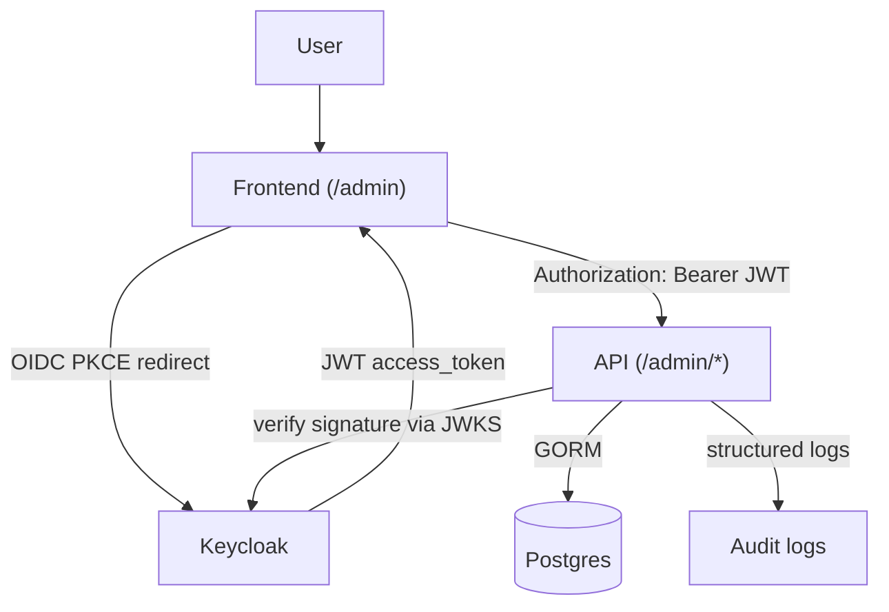

# Quick Start

> **Público:** engenheiros clonando este repositório para usá-lo como
> base de seu próprio produto SaaS. Objetivo: do zero a uma stack
> rodando, um token no terminal e uma chamada admin autenticada em
> `/admin/users` — em ~10 minutos.
>
> Este documento é o **caminho linear**. Para profundidade, siga os
> cross-links para [`getting-started/KEYCLOAK_SETUP.md`](KEYCLOAK_SETUP.md),
> [`architecture/bootstrap.md`](../architecture/bootstrap.md) e o restante de
> [`INDEX.md`](../INDEX.md).

---

## Table of contents

1. [What this project is](#1-what-this-project-is)
2. [Architecture](#2-architecture)
3. [Requirements](#3-requirements)
4. [Installation](#4-installation)
5. [Environment variables](#5-environment-variables)
6. [Docker](#6-docker)
7. [Keycloak](#7-keycloak)
8. [Bootstrap](#8-bootstrap)
9. [First admin](#9-first-admin)
10. [Running locally](#10-running-locally)
11. [Deploying to a VPS](#11-deploying-to-a-vps)
12. [Integrating another frontend](#12-integrating-another-frontend)
13. [Troubleshooting](#13-troubleshooting)
14. [Security notes](#14-security-notes)

---

## 1. What this project is

Uma fundação reutilizável em Go para produtos do tipo SaaS, com
**identidade delegada ao Keycloak** (ou qualquer provedor OIDC futuro —
veja [`getting-started/KEYCLOAK_SETUP.md §1`](KEYCLOAK_SETUP.md#1-overview)).

**Já incluído:**

- Go 1.25 + API HTTP em Gin.
- PostgreSQL 15 (DB da aplicação) + um segundo PostgreSQL para o Keycloak.
- Keycloak 26 — realm, client, roles, usuários-semente, todos importados
  na primeira boot de
  [`deploy/keycloak/realm-export.json`](../../deploy/keycloak/realm-export.json).
- Mailpit — catch-all SMTP de dev para os fluxos de convite /
  verify-email / password-reset (interface web em
  `http://localhost:8025`).
- Superfície HTTP admin-only `/admin/*` (usuários, roles, sessões,
  convites) que encapsula a Admin API do Keycloak.
- Console admin SPA estático em `http://localhost:8080/admin` (com
  gate de dev).
- Bootstrap `make init` + `make regen` que mantém `.env`, o realm
  export e o JSON schema em sincronia com
  [`config/project.json`](../../config/project.json).

**Fora do escopo (por design):**

- Sem endpoints `/login` ou `/register` — o Keycloak é dono da
  identidade.
- Sem manipulação de senha, MFA, bcrypt, ou plumbing de email para
  reset de senha em Go — tudo isso pertence ao Keycloak.
- Sem primitivas de multi-tenancy ligadas ainda (a feature flag
  `multi_tenant` está reservada para uso futuro).

**Para quem é isto:** você quer uma API em Go com OIDC hoje, com uma
plano de admin e uma história sã de dev local, que possa ser clonada,
renomeada e crescer junto com seu produto. Não é um IAM hospedado
turnkey — é um starter kit do qual você é dono de ponta a ponta.

---

## 2. Architecture

**Fluxo da requisição — o caminho que uma única chamada admin percorre:**



**Topologia de deploy — como os containers efetivamente ficam na rede docker:**

```
                 ┌──────────────────────────────────────────────┐
                 │                                              │
   ┌────────┐    │   ┌─────────────┐         ┌──────────────┐   │
   │ Client │────┼──►│  Keycloak   │◄────────│ keycloak-pg  │   │
   │ (curl, │    │   │  :8081      │  realm  │ :5433        │   │
   │  SPA,  │    │   └─────┬───────┘   DB    └──────────────┘   │
   │  CLI)  │    │         │ JWT                                │
   └───┬────┘    │         │ (RS256)                            │
       │         │         ▼                                    │
       │  Bearer │   ┌─────────────┐         ┌──────────────┐   │
       └─────────┼──►│  Go API     │────────►│  postgres    │   │
                 │   │  :8080      │  GORM   │  :5432       │   │
                 │   │             │         └──────────────┘   │
                 │   │  /me        │                            │
                 │   │  /admin/*   │         ┌──────────────┐   │
                 │   │             │ SMTP   ─│  mailpit     │   │
                 │   │             │ ────►   │  :1025/:8025 │   │
                 │   └─────────────┘         └──────────────┘   │
                 │                                              │
                 │       docker-compose network                 │
                 └──────────────────────────────────────────────┘
```

**Dois conceitos de identidade, uma fronteira:**

| Conceito                | Pertencente a | Identificador             | Vive em                  |
|-------------------------|---------------|---------------------------|--------------------------|
| Identidade de auth      | Keycloak      | `sub` (UUID, opaco)       | DB do realm Keycloak     |
| Identidade de negócio   | Sua API       | `users.id` (uint)         | Tabela `users` (DB app)  |

O elo é uma coluna: `users.keycloak_sub` (com índice único). Na primeira
requisição protegida para um dado `sub`, a API cria a linha local
JIT. Requisições subsequentes retornam o mesmo `users.id` — suas foreign
keys permanecem estáveis para sempre.

Diagrama completo + racional: [`getting-started/KEYCLOAK_SETUP.md §1`](KEYCLOAK_SETUP.md#1-overview).

---

## 3. Requirements

| Ferramenta      | Versão            | Usada para                       |
|-----------------|-------------------|----------------------------------|
| Go              | 1.25+             | Compilar o binário da API.       |
| Docker          | 24+               | Executar a stack.                |
| docker compose  | plugin v2         | `docker-compose.yml`.            |
| curl            | qualquer          | `make auth-test`, smoke tests.   |
| jq              | qualquer          | `make auth-test`, smoke tests.   |
| make            | GNU make          | Conduzir tudo.                   |
| git             | qualquer          | Clonar + seu próprio workflow.   |

Verifique seu toolchain em um único comando:

```bash
make doctor
```

Isso sonda cada binário acima, checa que o Docker está rodando,
inspeciona o estado atual da stack e avisa sobre conflitos de porta
(8080, 8081, 5432, 5433, 1025, 8025). Não inicia nada — é seguro
executar a qualquer momento.

---

## 4. Installation

A partir de um clone fresco:

```bash
git clone <your-fork-url> my-saas-backend
cd my-saas-backend
make doctor                # verify toolchain
make init                  # interactive — writes config/project.json + .env
make up                    # build api, pull keycloak, start the stack
```

`make up` leva ~60 segundos na primeira execução (pulls de imagem +
import do realm Keycloak). Boots subsequentes levam ~10 segundos.

**Verifique que funcionou:**

```bash
make auth-test
```

Saída esperada: um token é obtido do Keycloak via password grant contra
o `testuser` semeado e, em seguida, `GET /me` retorna:

```json
{
  "id": 1,
  "keycloak_sub": "fbe56e3a-3bd2-4ed3-8ff1-37c655f3fbdc",
  "email": "testuser@test.com",
  "username": "testuser",
  "created_at": "2026-05-21T08:14:48Z",
  "updated_at": "2026-05-21T08:14:48Z"
}
```

Se isso retornou 200, a instalação está concluída. Abra
`http://localhost:8080/admin` para entrar no console admin.

**Se algo falhou,** pule para a [§13 Troubleshooting](#13-troubleshooting)
ou rode `make doctor` novamente — ele imprime os próximos passos para as
falhas mais comuns.

---

## 5. Environment variables

A configuração mora em `.env` (gitignored) e é regerada a partir de
[`config/project.json`](../../config/project.json) por `make init` /
`make regen`.

Edite `config/project.json` para descrição **não-secreta** do projeto
(nome, realm, client id, portas, usuários-semente). Edite o `.env`
diretamente para **secrets** (`KEYCLOAK_CLIENT_SECRET`,
`KEYCLOAK_ADMIN_PASSWORD`, `SEED_USER_PASSWORD`) — eles são preservados
através das regerações.

**O mínimo que você precisa entender no primeiro dia:**

| Variável                  | O que controla                                                       | Default                       |
|---------------------------|----------------------------------------------------------------------|-------------------------------|
| `KEYCLOAK_URL`            | URL pública do Keycloak — define o `iss` esperado no token.          | `http://localhost:8081`       |
| `KEYCLOAK_REALM`          | Nome do realm em que a API confia.                                   | `saas`                        |
| `KEYCLOAK_CLIENT_ID`      | Seu client OIDC primário. Combina com `realm-export.json`.           | `saas-backend`                |
| `KEYCLOAK_CLIENT_SECRET`  | Secret de client confidencial. **Rotacione antes de produção.**      | `saas-backend-secret` (DEV)   |
| `KEYCLOAK_ALLOWED_CLIENT_IDS` | Whitelist separada por vírgula, comparada contra a claim `azp`.  | `saas-backend,saas-dev-playground` |
| `DB_URL`                  | DSN do Postgres. Dentro da rede docker, o container da api sobrescreve para usar `postgres:5432`. | `localhost:5432` (host) |
| `DEV_PLAYGROUND_ENABLED`  | Monta o playground `/dev/auth` e o console `/admin`.                 | `true` (local) / `false` (prod) |
| `KEYCLOAK_ADMIN_PASSWORD` | Senha de bootstrap do admin Keycloak. **Rotacione antes de prod.**   | `admin` (APENAS DEV)          |

**Referência completa (cada variável, cada default, risco-se-errado):**
[`getting-started/KEYCLOAK_SETUP.md §2`](KEYCLOAK_SETUP.md#2-environment-variables).

> ⚠ `KEYCLOAK_URL` é a URL que **clientes** usam para alcançar o
> Keycloak. A API usa-a para derivar a claim `iss` esperada em cada
> token. Se clientes veem `localhost:8081` mas você define
> `KEYCLOAK_URL=http://keycloak:8080` na API, cada token será rejeitado
> com `invalid issuer`. O `docker-compose.yml` provido trata
> corretamente essa separação — só se preocupe se mudar as URLs.

---

## 6. Docker

Cinco containers, um arquivo compose
([`docker-compose.yml`](../../docker-compose.yml)):

| Container                  | Imagem                     | Porta host     | Propósito                                |
|----------------------------|----------------------------|----------------|------------------------------------------|
| `saas-api`                 | construído de `./Dockerfile` | `8080`       | API Go.                                  |
| `saas-postgres`            | `postgres:15-alpine`       | `5432`         | DB da app (seus dados de negócio).       |
| `saas-keycloak`            | `quay.io/keycloak/keycloak:26.0` | `8081`   | Provedor de identidade.                  |
| `saas-keycloak-postgres`   | `postgres:15-alpine`       | `5433`         | DB interno do Keycloak.                  |
| `saas-mailpit`             | `axllent/mailpit:v1.20`    | `8025`, `1025` | Catch-all SMTP de dev + interface web.   |

**Comandos do ciclo de vida** — escolha pela intenção, não pela força do
hábito. Eles se posicionam em um espectro de preservação:

| Comando           | Efeito                                                  | Dados |
|-------------------|---------------------------------------------------------|-------|
| `make up`         | Build + start da stack completa.                        | preserva volumes |
| `make up-infra`   | Inicia tudo **exceto** a API (rode Go no host).         | preserva volumes |
| `make stop`       | Pausa containers; retome com `make start`.              | preserva tudo |
| `make start`      | Retoma a partir de `make stop`.                         | preserva tudo |
| `make down`       | Para + remove containers; volumes sobrevivem.           | preserva dados |
| `make purge`      | Apaga containers, volumes, network, imagem api, `bin/`. | **PERDA DE DADOS** (pergunta y/N) |
| `make reset-dev`  | One-shot: `purge` + rebuild + start.                    | **PERDA DE DADOS** (pergunta y/N) |
| `make logs`       | Acompanha logs de todos os serviços.                    | — |

Quando algo quebra: `make doctor` primeiro, depois `make reset-dev` se
nada mais ajudar. Tabela completa do ciclo de vida:
[`architecture/bootstrap.md`](../architecture/bootstrap.md#stack-lifecycle-commands).

**Mailpit:** abra `http://localhost:8025` para ver cada email que o
Keycloak envia — mensagens de convite, password resets, links de
verify-email. Não há servidor SMTP a configurar para dev local; o
realm export aponta o Keycloak para `mailpit:1025` automaticamente.

---

## 7. Keycloak

**Interface Admin:** `http://localhost:8081`
**Login admin default:** `admin` / `admin` (rotacione antes de produção
— veja [§14](#14-security-notes)).

**O que é auto-importado** na primeira boot, a partir de
[`deploy/keycloak/realm-export.json`](../../deploy/keycloak/realm-export.json):

```
realm "saas"
├── clients
│   ├── saas-backend           (confidential — your API's client)
│   ├── saas-backend-admin     (service-account — used by /admin/*)
│   └── saas-dev-playground    (public + PKCE — for the dev playground)
├── realm roles
│   ├── admin                  (gates /admin/* in the API)
│   └── user                   (default role for new sign-ups)
├── seed users
│   ├── testuser  / password   → roles: [user]
│   └── adminuser / password   → roles: [admin, user]
└── SMTP server: mailpit:1025
```

**De onde isso vem:**
[`config/project.json`](../../config/project.json) é a fonte de verdade.
Edite-o, rode `make regen`, e o `realm-export.json` é reconstruído. O
Keycloak re-importa o export no start do container com
`--import-realm`. Para forçar uma reimportação fresca:
`make realm-reset` (apaga o DB do Keycloak).

**Fluxo de token** em termos simples:

```
client ───POST /realms/saas/protocol/openid-connect/token──► keycloak
client ◄─── access_token (JWT, RS256, signed by realm key) ─── keycloak
client ───GET /me  Authorization: Bearer <jwt>─────────────► api
api    ───fetches JWKS once, caches, refreshes on kid miss──► keycloak
api    ◄── 200 { id, keycloak_sub, email, ... } ────────── client
```

Nenhum código de negócio na API em Go jamais vê uma senha. A API apenas
verifica assinaturas e confia em claims.

---

## 8. Bootstrap

A camada de bootstrap transforma `config/project.json` em:

```
config/project.json
        │
        ├──► .env                              (gitignored)
        ├──► .env.example                      (committed, annotated)
        ├──► config/project.schema.json        (JSON Schema mirror)
        └──► deploy/keycloak/realm-export.json (committed)
```

**Comandos:**

```bash
make init                     # interactive — prompts then regenerates
make regen                    # non-interactive — uses current project.json
```

**Exemplo prático — renomeando o realm de `saas` para `acme`:**

```bash
# 1. Edit config/project.json
#    auth.realm: "saas"  →  "acme"
#    auth.client.id:     keep "saas-backend"  (or rename too)

# 2. Regenerate every derived file
make regen

# 3. Force Keycloak to pick up the new realm (DELETES old realm data)
make realm-reset

# 4. Bring the stack up
make up

# 5. Verify
make auth-test     # uses .env.KEYCLOAK_REALM under the hood
```

**Anti-padrões** a evitar (estes serão silenciosamente sobrescritos por
`make regen`):

- Editar `.env` à mão para valores não-secretos — mude o
  `project.json` no lugar.
- Editar `realm-export.json` à mão — mude o `project.json` +
  regenerate.
- Editar `.env.example` à mão — ele é gerado.

Design completo + receitas de customização: [`architecture/bootstrap.md`](../architecture/bootstrap.md).

---

## 9. First admin

Após `make up`, dois usuários semeados existem:

| Username    | Password   | Roles do realm |
|-------------|------------|----------------|
| `testuser`  | `password` | `user`         |
| `adminuser` | `password` | `admin, user`  |

`adminuser` é seu primeiro admin — nenhum passo extra é necessário.

**Verifique o acesso admin:**

```bash
# 1. Get an admin token
TOKEN=$(curl -fsS -X POST http://localhost:8081/realms/saas/protocol/openid-connect/token \
  -H "Content-Type: application/x-www-form-urlencoded" \
  -d 'client_id=saas-backend' \
  -d 'client_secret=saas-backend-secret' \
  -d 'grant_type=password' \
  -d 'username=adminuser' \
  -d 'password=password' \
  | jq -r .access_token)

# 2. Hit /admin/users — should return 200 with a paged list
curl -fsS http://localhost:8080/admin/users \
  -H "Authorization: Bearer $TOKEN" | jq
```

**Ou use a interface do console admin:**

1. Abra `http://localhost:8080/admin`.
2. Clique em *Sign in* (Playground), faça login como
   `adminuser` / `password`.
3. Navegue para *Users* — CRUD completo está disponível.

**Promovendo outro usuário a admin** (duas formas):

- **Console admin (sua API):** `Users → clique no usuário → Roles →
  atribua admin`.
- **Interface admin do Keycloak:** `http://localhost:8081 → realm "saas"
  → Users → escolha o usuário → Role mapping → Assign role → admin`.

Para um tenant novinho onde ainda não há admins, edite
[`config/project.json`](../../config/project.json) para adicionar o
usuário-semente e rode `make regen && make realm-reset`. Após isso,
cada boot fresca terá seu admin.

---

## 10. Running locally

**Loop diário padrão** — stack completa em Docker:

```bash
make up           # bring the stack up (idempotent)
make logs         # tail everything; Ctrl-C to exit
# ... edit code ...
make up           # rebuilds the api image, restarts the api container
make auth-test    # smoke test
```

**Loop de dev Go mais rápido** — rode a API no host, infra no Docker:

```bash
make up-infra                                  # postgres + keycloak + mailpit
go run ./cmd/api                               # API on the host, picks up edits instantly
# ... edit code, Ctrl-C, re-run ...
```

Nesse modo, o `DB_URL` no `.env` aponta para `localhost:5432` (o
binding do host), então nenhum override de compose é necessário.

**Chamadas comuns de verificação:**

```bash
# Liveness
curl -fsS http://localhost:8080/health

# Your local user row
curl -fsS http://localhost:8080/me -H "Authorization: Bearer $TOKEN" | jq

# Auth-debug snapshot (what the API sees in your token).
# DEV-ONLY: this endpoint exists only when DEV_PLAYGROUND_ENABLED=true.
curl -fsS http://localhost:8080/auth/debug -H "Authorization: Bearer $TOKEN" | jq

# Admin list users
curl -fsS http://localhost:8080/admin/users -H "Authorization: Bearer $TOKEN" | jq

# Open API spec — interactive
open http://localhost:8080/swagger/index.html
```

**Tests:**

```bash
make test          # all unit tests
make test-race     # with -race
make test-cover    # coverage report
make ci            # full CI gate: fmt-check + vet + build + test + swagger-check
```

---

## 11. Deploying to a VPS

Isto é o **piso**, não um runbook de prod abençoado. Trate cada item
aqui como ponto de partida, não linha de chegada. Checklist completo de
endurecimento:
[`getting-started/KEYCLOAK_SETUP.md §10`](KEYCLOAK_SETUP.md#10-production-considerations).

**Mudanças mínimas em relação aos defaults de dev local:**

1. **Rotacione cada secret de dev.** No store de segredos / `.env` do
   seu VPS:
   - `KEYCLOAK_ADMIN_PASSWORD` (não mais `admin`).
   - `KEYCLOAK_CLIENT_SECRET` (não mais o default de dev).
   - `KEYCLOAK_ADMIN_CLIENT_SECRET` (service account para `/admin/*`).
   - `SEED_USER_PASSWORD` — e remova totalmente os usuários semeados
     (retire `seed_users` de `config/project.json`, regenere,
     realm-reset antes do primeiro boot em prod).
   - `POSTGRES_PASSWORD`, `KC_DB_PASSWORD`.

2. **Desabilite superfícies de dev:**

   ```dotenv
   DEV_PLAYGROUND_ENABLED=false
   ```

   Isso remove `/dev/auth` **e** o console `/admin` no nível de rota.
   A superfície HTTP `/admin/*` permanece — ela é protegida apenas pela
   realm role `admin`.

3. **Desabilite Direct Access Grants** no `saas-backend` no Keycloak (o
   grant de password que seu `make auth-test` local usa). Navegadores
   usam Authorization Code + PKCE; servidores usam client credentials.
   Nada legítimo precisa de DAG em produção.

4. **Defina `KEYCLOAK_URL` para o hostname real** (a URL que clientes
   usam):

   ```dotenv
   KEYCLOAK_URL=https://auth.example.com
   ```

   E atualize `KEYCLOAK_ALLOWED_CLIENT_IDS` para retirar
   `saas-dev-playground`.

5. **Rode o Keycloak em modo `start` (não `start-dev`)** e pré-builde a
   imagem com `start --optimized`. Edite `docker-compose.yml` →
   `keycloak.command`. Defina `KC_HOSTNAME=auth.example.com` e remova
   `KC_HOSTNAME_STRICT=false`.

6. **Termine TLS na frente.** Snippet de exemplo do Caddy:

   ```
   api.example.com   { reverse_proxy localhost:8080 }
   auth.example.com  { reverse_proxy localhost:8081 }
   ```

7. **Backups.** Os dois volumes do postgres (`postgres_data`,
   `keycloak_postgres_data`) contêm tudo. Faça snapshot deles com a
   ferramenta do seu provedor, ou `pg_dump` em um schedule.

8. **Descarte o Mailpit.** Ele é dev-only. Aponte o SMTP do Keycloak
   para um provedor real (Postmark, SES, Resend) via a configuração de
   SMTP do realm — ou sobrescreva no realm export e `make regen`.

9. **Limites de recurso.** Adicione blocos `deploy.resources.limits`
   por serviço nos seus manifestos de compose / k8s. O Keycloak 26
   quer ≥1 GB de RAM.

**O que NÃO embarcar:**

- `seed_users[]` populado.
- `DEV_PLAYGROUND_ENABLED=true`.
- A flag Direct Access Grants do realm no `saas-backend`.
- Credenciais de bootstrap `admin` / `admin` do Keycloak.
- Qualquer valor de `.env` que ainda combine com os defaults de dev de
  [`.env.example`](../../.env.example).

---

## 12. Integrating another frontend

Se você está adicionando um app React / Vue / Svelte / nativo que
precisa chamar esta API:

**1. Registre um novo client público** no Keycloak com PKCE:

   - Abra `http://localhost:8081 → realm "saas" → Clients →
     Create client`.
   - `Client ID`: ex. `my-spa-frontend`.
   - `Client authentication`: **off** (client público).
   - `Valid redirect URIs`: a URL de callback do seu SPA — ex.
     `http://localhost:3000/auth/callback`.
   - `Web origins`: `http://localhost:3000` (para preflight CORS).
   - `Authentication flow`: Standard flow **on**, Direct access grants
     **off**.
   - `Advanced → Proof Key for Code Exchange`: `S256`.

**2. Coloque o novo client id na whitelist** para que esta API aceite os
seus tokens:

   ```dotenv
   # .env
   KEYCLOAK_ALLOWED_CLIENT_IDS=saas-backend,saas-dev-playground,my-spa-frontend
   ```

   Ou, de forma mais durável, configure uma única vez em
   `config/project.json` sob `auth.allowed_client_ids` e
   `make regen`. A claim `azp` de cada token tem que aparecer nesta
   lista — não há **wildcard**.

**3. Implemente o fluxo PKCE no seu frontend.** O OIDC discovery está
   em:

   ```
   http://localhost:8081/realms/saas/.well-known/openid-configuration
   ```

   A maioria das bibliotecas (`oidc-client-ts`, `keycloak-js`,
   `@auth0/auth0-spa-js` apontando para um provedor OIDC genérico)
   trata o PKCE automaticamente dado:

   - Authority: `http://localhost:8081/realms/saas`
   - Client ID: `my-spa-frontend`
   - Redirect URI: `http://localhost:3000/auth/callback`
   - Scope: `openid profile email`

**4. Chame esta API com o token:**

   ```js
   // After your OIDC library returns an access_token:
   const res = await fetch("http://localhost:8080/me", {
     headers: { Authorization: `Bearer ${accessToken}` },
   });
   const me = await res.json();
   ```

**5. Cuidado com cross-origin — leia antes de plugar um SPA em outro
   origin.**

> ⚠ **Este repositório não embarca middleware de CORS na API Go.**
> Um SPA servido de `http://localhost:3000` (origem diferente da API em
> `http://localhost:8080`) vai disparar um preflight do navegador que
> a API não responderá com `Access-Control-Allow-Origin`, e o `fetch`
> acima falhará com erro CORS no console do navegador.
>
> Até o CORS ser plugado, escolha uma das opções:
>
> - **Mesmo origin.** Sirva seu bundle SPA construído a partir de um
>   caminho dentro da própria API (espelhando o que o console `/admin`
>   já faz a partir de `web/admin/`). Sem necessidade de CORS — toda
>   requisição é mesma-origem.
> - **Reverse proxy.** Coloque Caddy / nginx / Traefik na frente e
>   roteie tanto `/api/*` quanto `/` para o mesmo hostname público.
>   Mesma-origem da perspectiva do navegador.
> - **Adicione middleware de CORS à API.** Uma mudança pequena em
>   [`internal/server/router.go`](../../internal/server/router.go); escolha
>   uma lib gin-cors, faça scope dos `AllowOrigins` para as origens do
>   SPA. Fora do escopo desse Quick Start — é mudança de código, não
>   de configuração.
>
> O lado Keycloak precisa de CORS configurado (o campo "Web origins" no
> passo 1 acima) para que a chamada de troca de token do seu SPA para
> `http://localhost:8081/realms/saas/...` tenha sucesso. Essa parte é
> uma config da Admin UI do Keycloak, não mudança de código na API Go.

**Implementações de referência** neste repositório:

- O console `/admin` — fluxo PKCE completo contra
  `saas-dev-playground`, servido mesma-origem a partir da API Go:
  [`web/admin/static/js/lib/auth.js`](../../web/admin/static/js/lib/auth.js).
- O playground dev standalone em `/dev/auth` (também mesma-origem):
  [`docs/ui/DEV_AUTH_PLAYGROUND.md`](../ui/DEV_AUTH_PLAYGROUND.md).

---

## 13. Troubleshooting

Sintomas mais frequentes — pegue o seu, rode a correção. Para a cauda
longa, veja
[`getting-started/KEYCLOAK_SETUP.md §9`](KEYCLOAK_SETUP.md#9-troubleshooting).

| Sintoma                                              | Causa provável                                          | Correção                                                                  |
|------------------------------------------------------|---------------------------------------------------------|---------------------------------------------------------------------------|
| `make up` sai — porta já em uso                      | Algo mais em 8080/8081/5432/5433/8025/1025              | `make doctor` te dirá qual porta; pare o processo em conflito, tente de novo. |
| Logs da API: `invalid issuer`                        | `iss` do token ≠ `KEYCLOAK_URL` da API.                 | Defina `KEYCLOAK_URL` para o que **clientes** digitam no navegador. Reinicie a api. |
| Logs da API: `azp 'xyz' is not in the allowed-client set` | Cliente do token não está na whitelist.             | Adicione `xyz` a `KEYCLOAK_ALLOWED_CLIENT_IDS` no `.env`. Reinicie a api. |
| Logs da API: `failed to fetch JWKS`                  | API não consegue alcançar o Keycloak (URL errada ou KC não pronto). | No Docker, `KEYCLOAK_JWKS_URL` tem que apontar para `http://keycloak:8080/...`. Confira `make logs`. |
| `make auth-test` → 401 `invalid_grant`               | Usuário/senha errados, ou DAG desabilitado no client.   | Confira `.env.SEED_USER_PASSWORD`. Admin do Keycloak → `saas-backend` → habilite Direct Access Grants (dev). |
| `/admin/*` retorna 403 com token válido              | Usuário não tem a realm role `admin`.                   | Promova-o: admin do Keycloak → user → Role mapping → atribua `admin`. Veja [§9](#9-first-admin). |
| Mudanças no realm via `project.json` não tomam efeito | O Keycloak só importa na **primeira** boot de um DB fresco. | `make realm-reset` (apaga o DB do Keycloak e re-importa).               |
| Token valida mas `/me` retorna 500                   | DB inalcançável ou migração falhou.                     | `make logs` → procure erros do GORM. `make reset-dev` apaga o DB se você pode arcar com perda de dados. |
| Emails de convite/reset nunca chegam                 | Mailpit não alcançável a partir do Keycloak.            | `docker ps` mostra o mailpit healthy? Navegue para `http://localhost:8025`. Reinicie a stack do compose. |
| Stack está "travada" e nada mais funciona            | Realm Keycloak velho + JWKS velho + volume corrompido.  | `make reset-dev` (pergunta y/N antes — apaga tudo, depois rebuilds).      |
| Console do navegador: `CORS policy: No 'Access-Control-Allow-Origin'` chamando `/me` de um SPA em outra origem | Sem middleware CORS na API Go. | Veja [§12 passo 5](#12-integrating-another-frontend) — sirva o SPA mesma-origem, adicione reverse proxy, ou adicione middleware CORS. |

Se `make doctor` está verde e você continua travado, capture
`make logs > /tmp/logs.txt` e abra uma issue.

---

## 14. Security notes

Estes são defaults **somente para dev** que embarcam no repositório
para que `make up` funcione fora da caixa. Cada um deles precisa da sua
atenção antes de qualquer deploy não-local.

- **Bootstrap `admin` / `admin` do Keycloak.** Rotacione
  `KEYCLOAK_ADMIN_PASSWORD` e, idealmente, renomeie o usuário também.
- **Secret de client `saas-backend-secret`.** Rotacione
  `KEYCLOAK_CLIENT_SECRET` *e* atualize o valor na admin UI do Keycloak
  (`Clients → saas-backend → Credentials → Regenerate`).
- **Direct Access Grants** está habilitado no `saas-backend` para o
  `make auth-test`. Desabilite em produção — nenhum fluxo de
  navegador precisa disso.
- **Usuários semeados** (`testuser`, `adminuser`) com senha `password`.
  Retire-os de `config/project.json` antes de qualquer regen +
  realm-reset em prod.
- **`DEV_PLAYGROUND_ENABLED=true`** monta `/dev/auth` e o console
  `/admin`. Os dois não desviam nada — ainda são gated por token — mas
  a superfície não deve existir em produção.
- **TLS:** a stack de dev é só HTTP. Produção deve terminar TLS na
  frente tanto de `:8080` (API) quanto de `:8081` (Keycloak).
- **`start-dev` do Keycloak** é o launcher de dev. Produção quer
  `start --optimized` com uma imagem pré-construída e `KC_HOSTNAME`
  definido para seu hostname real.
- **Mailpit captura todo email de saída** em dev — links de convite,
  resets de senha, tokens de verify-email. Não é um SMTP real. Troque o
  SMTP do realm do Keycloak para um provedor real antes de qualquer
  fluxo de email user-visible rodar em prod.
- **CORS é permissivo** em dev (`http://localhost:*`). Produção tem que
  fazer scope para os origins reais do seu frontend.
- **Credenciais de service account** (`saas-backend-admin`, usadas pela
  `/admin/*` para chamar a Admin API do Keycloak) — rotacione
  `KEYCLOAK_ADMIN_CLIENT_SECRET`.

**Trilha de auditoria de segurança existente:**
[`security/FINAL_SECURITY.md`](../security/FINAL_SECURITY.md) sintetiza 23
sondagens de guarda black-box e 4 lacunas documentadas (uma corrigida,
três abertas com severidades declaradas). Leia antes de se convencer
de que a camada de auth está "pronta".

**Checklist completo de prod:**
[`getting-started/KEYCLOAK_SETUP.md §10`](KEYCLOAK_SETUP.md#10-production-considerations).

---

## Next steps

- Releia [`README.md`](../../README.md) — agora que você tem contexto, o
  layout e as tabelas de ciclo de vida fazem sentido.
- Navegue a API no Swagger: `http://localhost:8080/swagger/index.html`.
- Para um deep-dive na superfície admin:
  [`release/RELEASE_v0.2.md §2.1`](../release/RELEASE_v0.2.md).
- Para lacunas conhecidas + o backlog de endurecimento pós-tag:
  [`roadmap/HARDENING_REPORT.md`](../roadmap/HARDENING_REPORT.md).
- Para o mapa por-documento deste repositório: [`INDEX.md`](../INDEX.md).

Bem-vindo a bordo.
